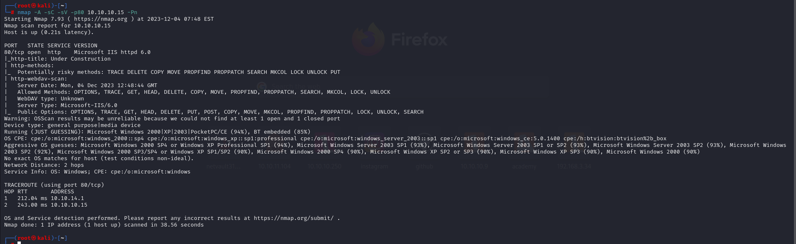

# [Granny](https://app.hackthebox.com/machines/granny)

```bash
nmap -p- --min-rate 10000  10.10.10.15 -Pn
```


After knowing open port (80), we can do more greater nmap scan.

```bash
nmap -A -sC -sV -p80 10.10.10.15 -Pn 
```




I see that it's also 'Webdav' , that's why let's test which type of files we can upload.

For this , I use `davtest` command.


I see that, .txt files are allowed, let's try ourselves.

```bash
echo "Dr4ks is here" > test.txt
curl -X PUT http://10.10.10.15/test.txt -d @test.txt
curl http://10.10.10.15/test.txt
```


From allowed methods, I see that `MOVE` HTTP method is allowed, that's why I can replace any txt file with my malicious reverse shell whose extension is `.aspx`.


First, let's generate our malicious reverse shell with aspx file extension.


Then, we upload our malicous file as legitimate.


Then, we do 'MOVE' method for resolving real .aspx file.


We got reverse shell from listener while we browse our malicious file via `curl` command.


While doing enumeration, I see that I need to do privilege escalation, from `systeminfo` command result.

This machine is vulnerable to `MS14-058` vulnerability.

Let's stay our reverse shell session on background via `Ctrl+Z` command use this exploit.

```bash
Ctrl+ Z
use exploit/windows/local/ms14_058_track_popup_menu 
set session 1
run
```


user.txt


root.txt


