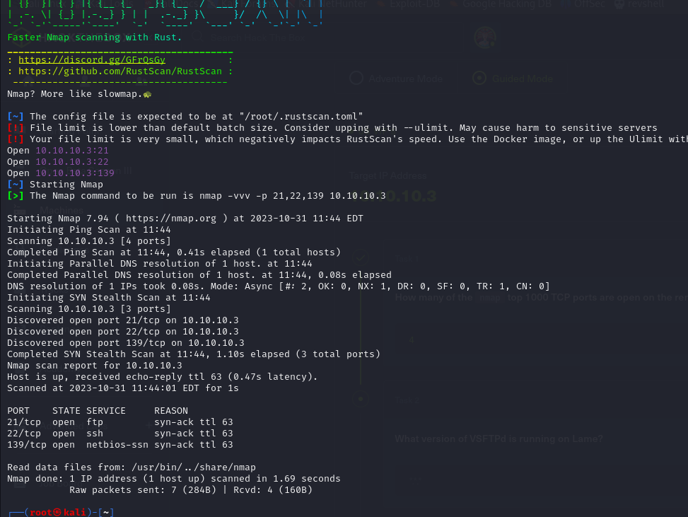
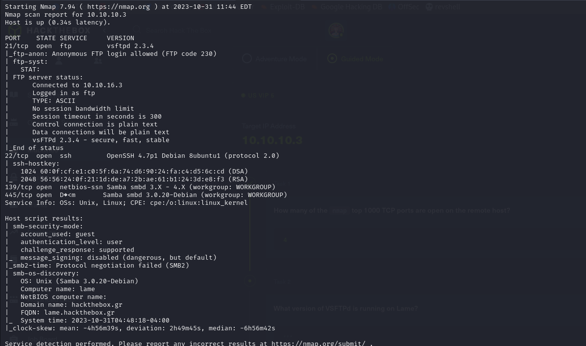
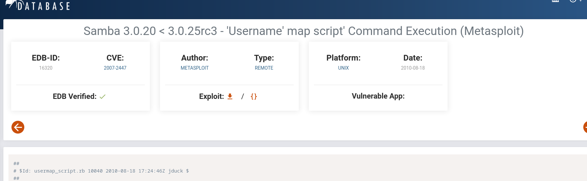
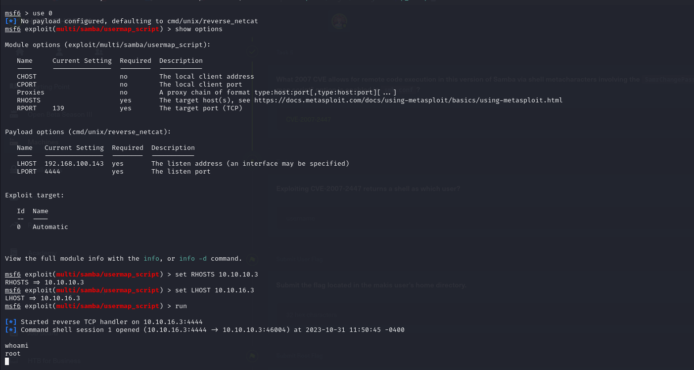
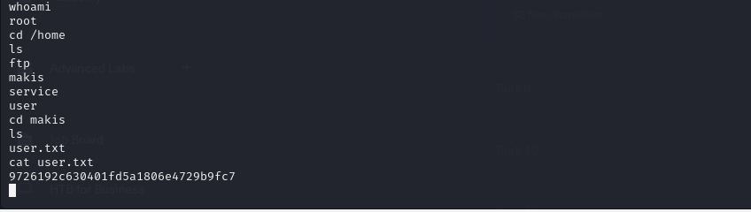
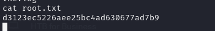

# [Lame](https://app.hackthebox.com/machines/Lame)

```bash
rustscan 10.10.10.3 
```



After knowing the ports (21,22,139,445), let's run nmap
```bash
nmap -p21,22,139,445 -sC -sV 10.10.10.3
```



Samba 3.0.20-Debian



Use this vuln on metasploit.



user.txt




root.txt


