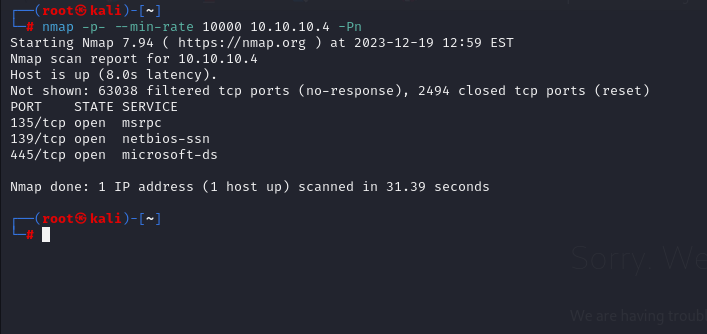
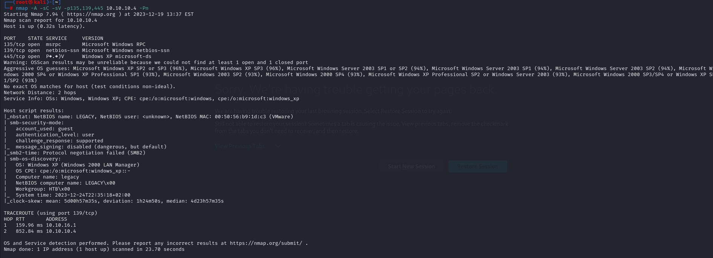
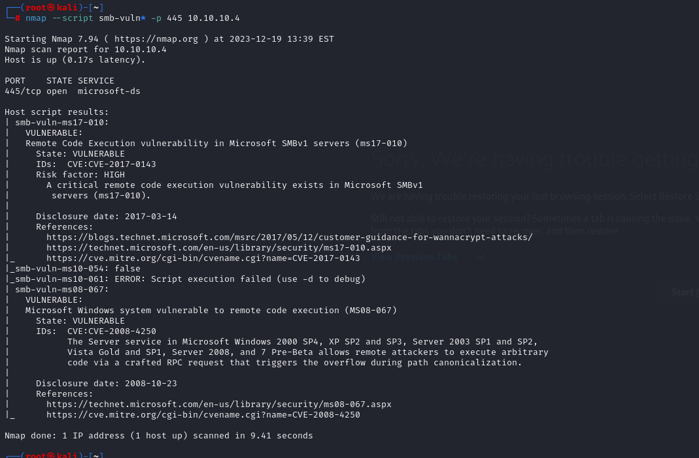
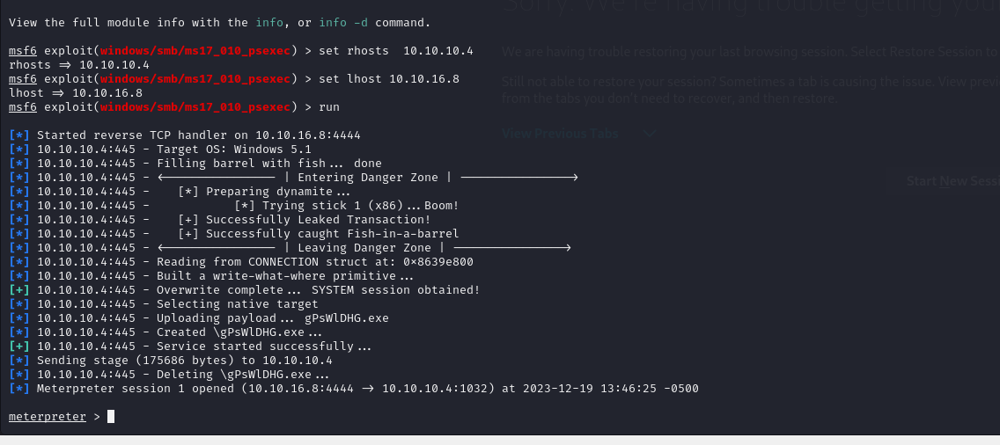
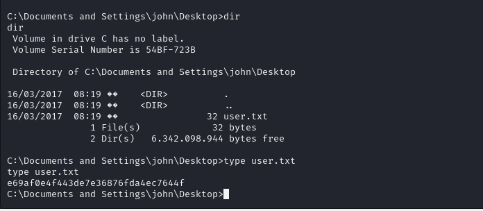
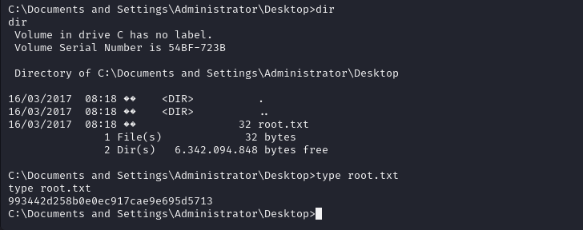

# [Legacy](https://app.hackthebox.com/machines/legacy)

```bash
nmap -p- --min-rate 10000 10.10.10.4 -Pn 
```




After knowing open ports (135,139,445), let's do greater nmap scan.

```bash
nmap -A -sC -sV -p135,139,445 10.10.10.4 -Pn 
```



I also checks the SMB vulnerabilities of target.

```bash
nmap --script smb-vuln* -p 445 10.10.10.4
```




I see that my target is vulnerable to 'MS-17-010', that's why
I will use `msfconsole` to hack machine.

For this, I just use '**exploit/windows/smb/ms17_010_psexec**' exploit.



user.txt




root.txt

