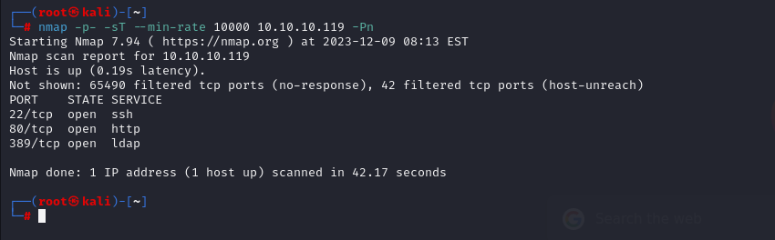
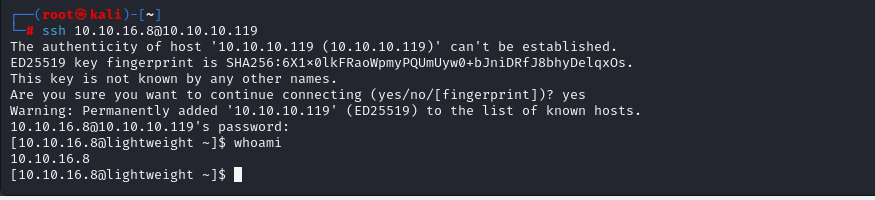

# [Lightweight](https://app.hackthebox.com/machines/Lightweight)

```bash
nmap -p- -sT --min-rate 10000 10.10.10.119 -Pn
```




After knowing open ports(22,80,389), let's do greater nmap scan.

```bash
nmap -A -sC -sV -p22,80,389 10.10.10.119 -Pn
```


Let's try to access port (80) and do more enumeration.

There , I find 'user.php' file says to me interesting fact,  let's do this.


Hola, it worked




Let's look at the users of this machine.


Maybe 'ldapuser1' and 'ldapuser2' is important for us.


Let's dump traffic and read as because it is not encryped , and we can read by using dumping via `tcpdump` tool.

```bash
tcpdump -i lo -nnXs 0 'port 389'
```

While sniffing , we need to browse **'status.php' on website.**


I grab credentials from sniffing.

ldapuser2:8bc8251332abe1d7f105d3e53ad39ac2


I login via above credentials.


user.txt


There is file called 'backup.7z', let's download this into our attackbox machine.

For this, I tried as many as methods, but none of them worked.

That's why I need to use `base64` for transfer.

```bash
base64 backup.7z
```


Then, we decode this output on our machine.

```bash
base64 -d backup.7z.b64 > backup.7z
```


I will try to extract this, but it asks password from me.


For cracking password, I will use such [script](https://github.com/FreddieOliveira/bruteZip/blob/master/bruteZip.sh) from Github.

```bash
./bruteZip.sh backup.7z /usr/share/wordlists/rockyou.txt
```


Once we know that password is 'delete'. Let's extract this.

```bash
7z x backup.7z
```

I find file called `status.php`, while reading this, it gives me password of 'ldapuser1'.


ldapuser1: f3ca9d298a553da117442deeb6fa932d


I see that this user has bin files called 'openssl' and 'tcpdump' and have privileges to execute this.


I just searched privilege escalation for 'openssl' command and find exploit on [Gtfobins](https://gtfobins.github.io/gtfobins/openssl/#file-read)


```bash
LFILE=file_to_read
openssl enc -in "$LFILE"
```


root.txt


